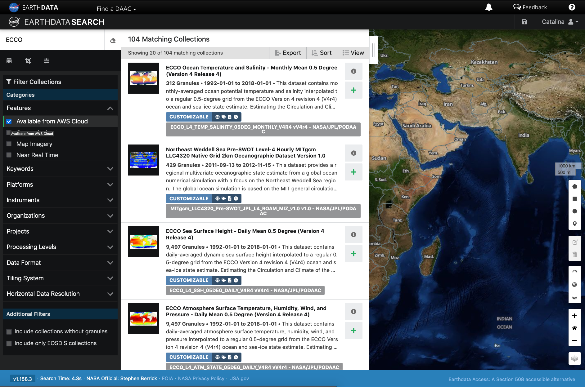
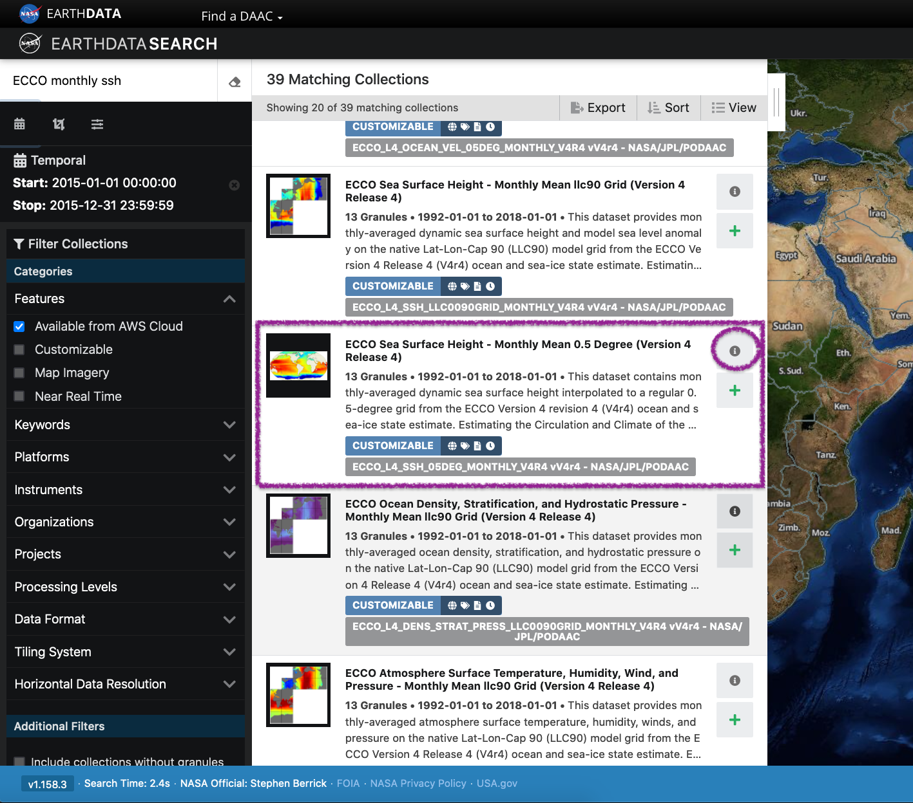
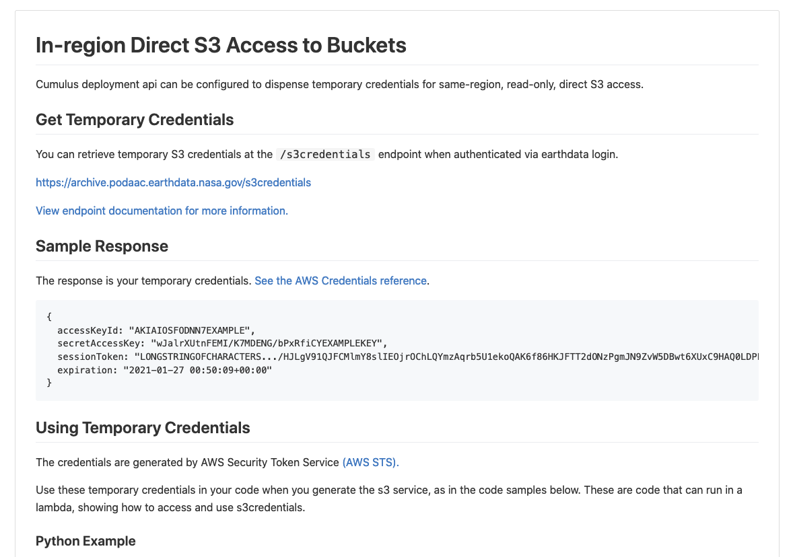
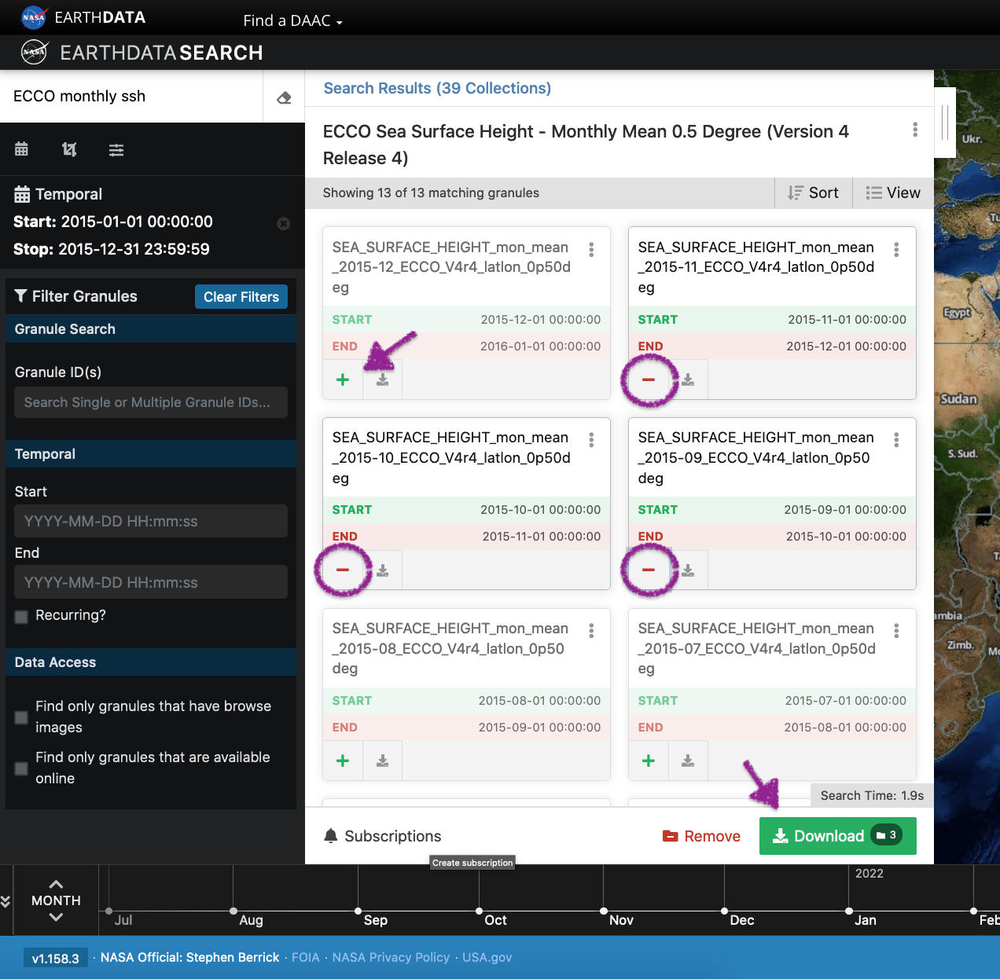
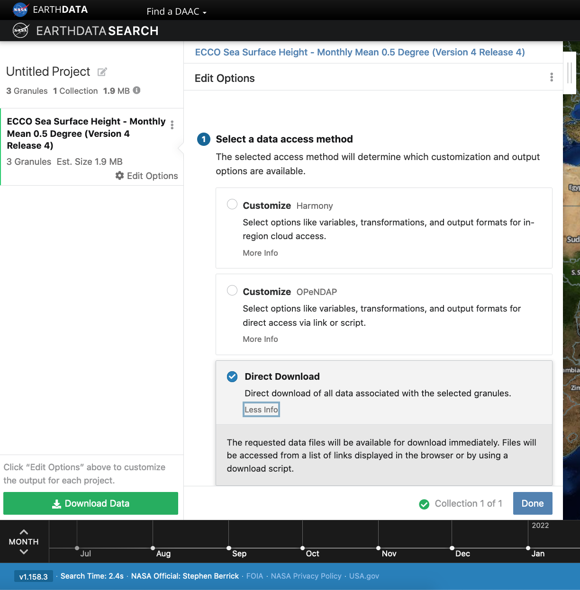
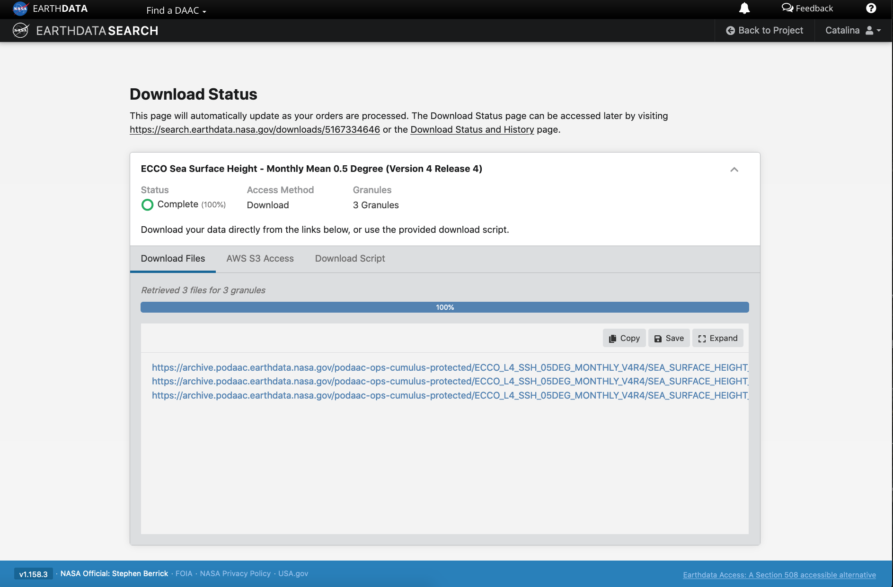
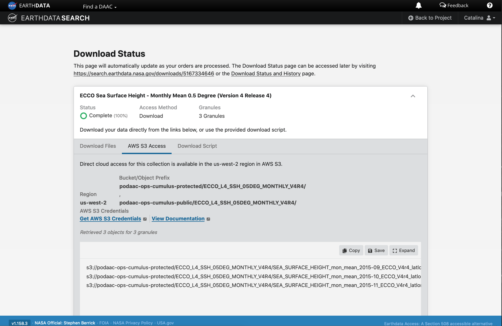
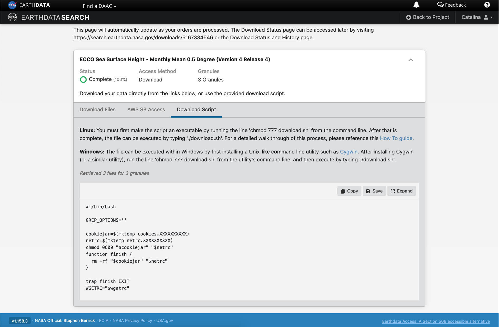
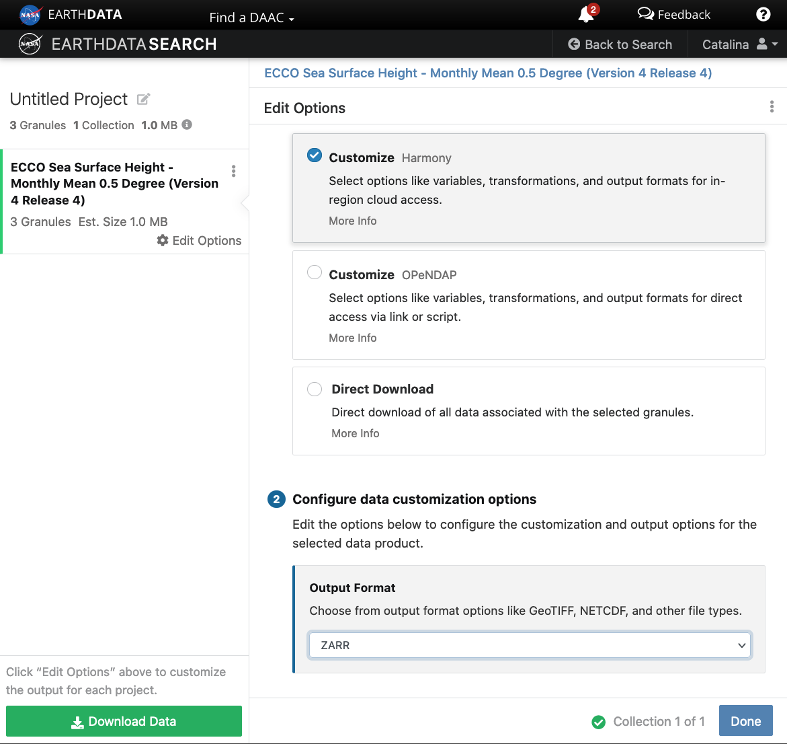

*The original source for this document is <https://nasa-openscapes.github.io/2021-Cloud-Workshop-AGU/tutorials/01_Earthdata_Search.html>*

This tutorial guides you through how to use [Earthdata Search](https://search.earthdata.nasa.gov/) for NASA Earth observations search and discovery, and how to connect the search output (e.g. download or access links) to a programmatic workflow (locally or from within the cloud). 

### Step 1. Go to Earthdata Search and Login

Go to Earthdata Search <https://search.earthdata.nasa.gov> and use your Earthdata login credentials to log in. If you do not have an Earthdata account, please see the [Workshop Prerequisites](https://nasa-openscapes.github.io/2021-Cloud-Workshop-AGU/logistics/prerequisites.html) for guidance.

### Step 2. Search for dataset of interest

Use the search box in the upper left to type key words. In this example we are interested in the ECCO dataset, [hosted by the PO.DAAC](https://podaac.jpl.nasa.gov/datasetlist?search=ECCO). This dataset is available from the NASA Earthdata Cloud archive hosted in AWS cloud. 

Click on the _**"Available from AWS Cloud"**_ filter option on the left. Here, 104 matching collections were found with the basic `ECCO` search.

Let's refine our search further. Let's search for `ECCO monthly SSH` in the search box (which will produce 39 matching collections), and for the **time period** for year 2015. The latter can be done using the *calendar* icon on the left under the search box. 

Scroll down the list of returned matches until we see the dataset of interest, in this case *ECCO Sea Surface Height - Monthly Mean 0.5 Degree (Version 4 Release 4)*.

We can click on the (i) icon for the dataset to read more details, including the **dataset shortname** (helpful for programmatic workflows) just below the dataset name; here `ECCO_L4_SSH_05DEG_MONTHLY_V4R4`.

### Step 3. Explore the dataset details, including Cloud Access information

Once we clicked the (i), scrolling down the info page for the dataset we will see Cloud Access information, such as:

- whether the dataset is available in the cloud 
- the cloud **Region** (all NASA Earthdata Cloud data is/will be in `us-west-2` region) 
- the S3 storage **bucket** and **object prefix** where this data is located
- link that generates **AWS S3 Credentials** for in-cloud data access (we will cover this in the Direct Data Access Tutorials)
- link to **documentation** describing the In-region Direct S3 Access to Buckets. *Note*: these will be unique depending on the DAAC where the data is archived. (We will show examples of direct in-region access in Tutorial 3.)

**Pro Tip**: Clicking on "For Developers" to exapnd will provide programmatic endpoints such as those for the CMR API, and more. CMR API and CMR STAC API tutorials can be found on the [2021 Cloud Hackathon website](https://nasa-openscapes.github.io/2021-Cloud-Hackathon/tutorials/).

For now, let's say we are intersted in getting download link(s) or access link(s) for specific data files (granules) within this collection.

At the top of the dataset info section, click on *Search Results*, which will take us back to the list of datasets matching our search parameters. Clicking on the dataset (here again it's the same *ECCO Sea Surface Height - Monthly Mean 0.5 Degree (Version 4 Release 4)*) we now see a list of files (granules) that are part of the dataset (collection). 

### Step 4. Customize the download or data access

Click on the green **+** symbol to add a few files to our project. Here we added the first 3 listed for 2015. Then click on the green button towards the bottom that says "Download". This will take us to another page with options to customize our download or access link(s).

#### 4.a. Entire file content

Let's stay we are interested in the entire file content, so we select the **"Direct Download"** option (as opposed to other options to subset or transform the data):

Clicking the green Download Data button again, will take us to the final page for instructions to download and links for data access in the cloud. You should see three tabs: `Download Files`, `AWS S3 Access`, `Download Script`:

The *Download Files* tab provides the `https://` links for downloading the files locally. E.g.:
`https://archive.podaac.earthdata.nasa.gov/podaac-ops-cumulus-protected/ECCO_L4_SSH_05DEG_MONTHLY_V4R4/SEA_SURFACE_HEIGHT_mon_mean_2015-09_ECCO_V4r4_latlon_0p50deg.nc`

The *AWS S3 Access* tab provides the `S3://` links, which is what we would use to access the data directly in-region (us-west-2) within the AWS cloud (an example will be shown in Tutorial 3). E.g.:
`s3://podaac-ops-cumulus-protected/ECCO_L4_SSH_05DEG_MONTHLY_V4R4/SEA_SURFACE_HEIGHT_mon_mean_2015-09_ECCO_V4r4_latlon_0p50deg.nc`
where `s3` indicates data is stored in AWS S3 storage, `podaac-ops-cumulus-protected` is the *bucket*, and `ECCO_L4_SSH_05DEG_MONTHLY_V4R4` is the *object prefix* (the latter two are also listed in the dataset collection information under Cloud Access (step 3 above)).

**Tip**: Another quicker way to find the *bucket* and *object prefix* is from the list of data files the search returns. Next to the **+** green button is a grey *donwload* symbol. Click on that to see the *Download Files* `https://` links or on the *AWS S3 Access* to get the direct `S3://` access links, which contain the  *bucket* and *object prefix* where data is stored.

#### 4.b. Subset or transform before download or access

DAAC tools and services are also being migrated or developed in the cloud, next to that data. These include the **[Harmony API](https://harmony.earthdata.nasa.gov/)** and **OPeNDAP in the cloud**, as a few examples. 

We can leverage these cloud-based services on cloud-archived data to reduce or transform the data (depending on need) before getting the access links *regardless* of whether we prefer to download the data and work on a local machine or whether we want to access the data in the cloud (from a cloud workspace). These can be useful data reduction services that support a faster time to science. 

**Harmony**

[Harmony](https://harmony.earthdata.nasa.gov/) allows you to seamlessly analyze Earth observation data from different NASA data centers. These services (API endpoints) provide data reduction (e.g. subsetting) and transfromation services (e.g. convert netCDF data to Zarr cloud optimized format). 

When you click the final green *Download* button, the links provided are to data that had been transformed based on our selections on the previous screen (here chosing to use the Harmony service to reformat the data to Zarr). These data are staged for us in an S3 bucket in AWS, and we can use the `s3://` links to access those specific data. This service also provides `STAC` access links. This particular example is applicable if your workflow is in the AWS us-west-2 region.

### Step 5. Integrate file links into programmatic workflow, locally or in the AWS cloud. 

In tutorial 3 *Direct Data Access*, we will work programmatically in the cloud to access datasets of interest, to get us set up for further scientific analysis of choice. There are several ways to do this. One way to connect the search part of the workflow we just did in Earthdata Search to our next steps working in the cloud is to simply copy/paste the `s3://` links provides in Step 4 above into a JupyterHub notebook or script in our cloud workspace, and continue the data analysis from there. 

One could also copy/paste the `s3://` links and save them in a text file, then open and read the text file in the notebook or script in the JupyterHub in the cloud. 

Tutorial 3 will pick up from here and cover these next steps in more detail. 
