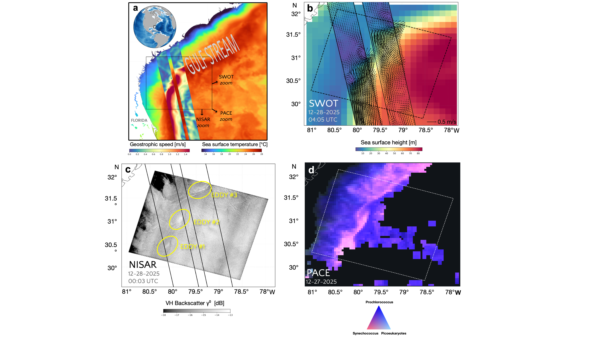
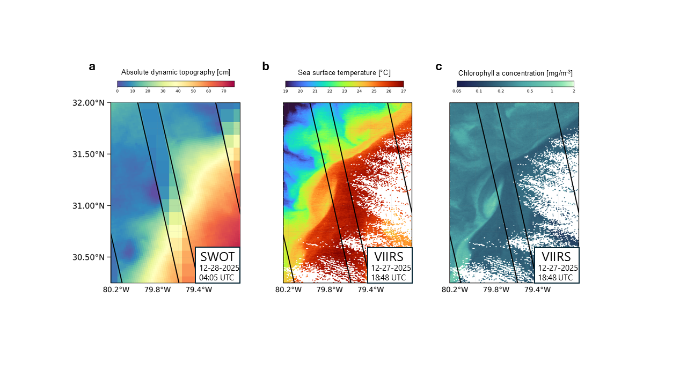

# SWOT PACE NISAR Data in Action Figures

Author: Jacob Spier ([@Originaljsx](https://github.com/Originaljsx)) - JPL Summer Intern 2026, NYU Courant Institute School of Mathematics, Computing, and Data Science

Original repository: [https://github.com/Originaljsx/SWOT-Data-in-Action-Figures](https://github.com/Originaljsx/SWOT-Data-in-Action-Figures); Last Accessed 09/03/2026

Repository in PO.DAAC Github: https://github.com/podaac/tutorials/tree/master/notebooks/DataStories/Sea_Surface_to_Sea_Life 

---

The following guide details reproducible figure code for two figures from the [From Sea Surface to Sea Life: SWOT, PACE, and NISAR Watch Gulf Stream Frontal Eddies Together](https://www.earthdata.nasa.gov/learn/data-in-action/from-sea-surface-sea-life-swot-pace-nisar-watch-gulf-stream-frontal-eddie) Data in Action, covering a coincident SWOT / NISAR / VIIRS / PACE overpass off the U.S. Southeast coast on 2025-12-28 (SWOT cycle_pass 043_410, NISAR GCOV 008_170).


## Figure 1 — SWOT x NISAR x MUR x PACE mosaic (2x2)

[`Data in Action Figure 1/`](https://github.com/podaac/tutorials/tree/master/notebooks/DataStories/Sea_Surface_to_Sea_Life/Data%20in%20Action%20Figure%201)

<nop/> <div style="width: 700px;"></div>

| Panel | Content |
|---|---|
| [a](https://github.com/podaac/tutorials/blob/master/notebooks/DataStories/Sea_Surface_to_Sea_Life/Data%20in%20Action%20Figure%201/Figure1_panelA.ipynb) | MUR L4 SST background + SWOT L3 geostrophic speed swath + NISAR footprint box |
| [b](https://github.com/podaac/tutorials/blob/master/notebooks/DataStories/Sea_Surface_to_Sea_Life/Data%20in%20Action%20Figure%201/Figure1_panelB.ipynb) | MIOST v3 ADT background + SWOT ADT swath + swath-edge bars + geostrophic velocity quiver |
| [c](https://github.com/podaac/tutorials/blob/master/notebooks/DataStories/Sea_Surface_to_Sea_Life/Data%20in%20Action%20Figure%201/Figure1_panelC.ipynb) | NISAR L2 GCOV VH (VHVH) gamma-naught backscatter, grayscale |
| [d](https://github.com/podaac/tutorials/blob/master/notebooks/DataStories/Sea_Surface_to_Sea_Life/Data%20in%20Action%20Figure%201/Figure1_panelD.ipynb) | PACE OCI MOANA picophytoplankton ternary composite |


## Figure 2 — SWOT L2 ADT x VIIRS SST & chlorophyll triptych (1x3)

[`Data in Action Figure 2/`](https://github.com/podaac/tutorials/tree/master/notebooks/DataStories/Sea_Surface_to_Sea_Life/Data%20in%20Action%20Figure%202)

<nop/> <div style="width: 700px;"></div>

| Panel | Content |
|---|---|
| [a](https://github.com/podaac/tutorials/blob/master/notebooks/DataStories/Sea_Surface_to_Sea_Life/Data%20in%20Action%20Figure%202/Figure2_panelA.ipynb) | SWOT JPL L2 ADT swath over MIOST v3 ADT (also rendered without the background) |
| [b](https://github.com/podaac/tutorials/blob/master/notebooks/DataStories/Sea_Surface_to_Sea_Life/Data%20in%20Action%20Figure%202/Figure2_panelB.ipynb) | VIIRS SST, masked to the chlorophyll panel's valid pixels |
| [c](https://github.com/podaac/tutorials/blob/master/notebooks/DataStories/Sea_Surface_to_Sea_Life/Data%20in%20Action%20Figure%202/Figure2_panelC.ipynb) | VIIRS log10(chlorophyll a), colorbar ticked in mg m<sup>-3</sup> |

SWOT ADT is formed from the L2 LR SSH Expert product as
`(ssha_karin + height_cor_xover) + mean_dynamic_topography`

## Setup

Install the Python dependencies (numpy, xarray, netCDF4, h5py, scipy, matplotlib,
cartopy, rasterio). `cartopy` and `rasterio` need system libraries (GEOS / PROJ /
GDAL) and install most reliably with conda:

```bash
conda env create -f environment.yml
conda activate swot-dia
```

Or with pip (see the note in `requirements.txt` if cartopy/rasterio fail to build):

```bash
pip install -r requirements.txt
```

## Data

The satellite data is **not** included — you download it yourself (free NASA
Earthdata and AVISO accounts). See **[DATA.md](DATA.md)** for exactly what to
download and where to get it, then place the files in the shared data root
(`~/Data/<source>/...`, outside the repo):

- SWOT L3 LR SSH Expert (AVISO/DUACS) and SWOT L2 LR SSH Expert (JPL PO.DAAC)
- NISAR L2 GCOV (ASF DAAC)
- MUR L4 SST (JPL PO.DAAC GHRSST)
- MIOST v3 gridded ADT (AVISO)
- PACE OCI L4 MOANA picophytoplankton (NASA OB.DAAC)
- SNPP VIIRS L2 SST and Ocean Color (NASA OB.DAAC)
- ETOPO 2022 30 arc-second surface elevation (NOAA NCEI) — streamed at run time, no download

Files are located by glob pattern within each dataset's shared-root sub-folder
(searched recursively), so exact filenames are flexible. The shared root defaults
to `~/Data`; override it with the `DATA_ROOT` environment variable (legacy
`SWOT_DIA_DATA_DIR` still works).

## Quickstart

```bash
cd "Data in Action Figure 1"
python Figure1.py            # full composite + all pieces -> ./pieces/
python Figure1_panelC.py     # or just one panel
```

Each script writes its output PNGs into that figure's `pieces/` folder. If a data
file is missing, the script stops with a clear message naming the expected file
and pointing to DATA.md. Run the `.ipynb` equivalents instead if you prefer
notebooks.

## Layout

Each figure directory contains:

```
FigureN.py / .ipynb            composite(s) + every piece
FigureN_panelX.py / .ipynb     one panel on its own, with its pieces
figureN_common.py              shared config, loaders, draw primitives, piece renderer
FigureN_composite*.png         layout reference
pieces/                        the exported figure elements
```

The `.py` and `.ipynb` versions of each script are equivalent (jupytext percent
format); run either.