# Mapping Sea Surface Temperature Anomalies in QGIS

Author: Julie Sanchez, NASA JPL PO.DAAC

## Summary
- El Niño-Southern Oscillation (ENSO) is a climate pattern in the Pacific Ocean that has two phases: El Niño (warm/wet phase) and La Niña (cold/dry phase). ENSO has global impacts on wildfires, weather, and ecosystems. We have been experiencing La Niña conditions for the last 2 and a half years. The last El Niño event occurred in 2015/2016 and a weak El Niño event was also experienced during the winter of 2018/2019.

- This tutorial uses the SST anomaly variable derived from a MUR climatology dataset - MUR25-JPL-L4-GLOB-v04.2 (average between 2003 and 2014). This tutorial uses QGIS to visulaize the the sea surface temperature anomalies (SSTA) over the Pacific Ocean for April 24, 2023.

# Data needed for tutorial:
- Download QGIS if not already downloaded: [https://www.qgis.org/en/site/forusers/download.html](https://www.qgis.org/en/site/forusers/download.html)
- World Boarders shape file: [https://thematicmapping.org/downloads/world_borders.php](https://thematicmapping.org/downloads/world_borders.php)
- GHRSST data from April 24, 2023: [https://podaac.jpl.nasa.gov/dataset/MUR25-JPL-L4-GLOB-v04.2#](https://podaac.jpl.nasa.gov/dataset/MUR25-JPL-L4-GLOB-v04.2#)

# How to use **GHRSST Sea Surface Temperature in** QGIS

- Click on the Open Data Source Manager:
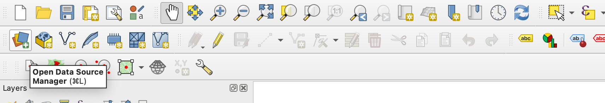
    
- Click on Vector on the left hand side of the panel. Click on the three dots that says 'Vector Dataset(s) and add the World boarders shapefile. Make sure you click ‘Add’ on the bottom right and then ‘Close’.
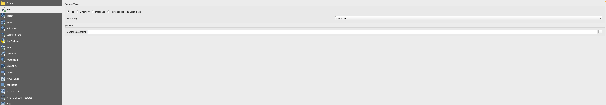

- Next, add the GHRSST SSTA raster file by clicking the Open Data Source Manager, but this time choose the ‘Raster’ option. Click on the three dots that says 'Raster Dataset(s) and add the GHRSST SSTA data.
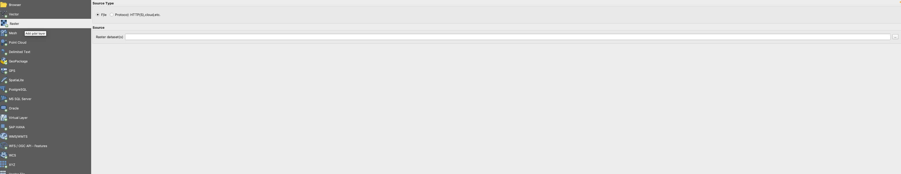

- When you click ‘Add’ another window will open click on ‘Add Layers’ and then close the window. When you click ‘Add’ another window will open click on ‘sst_anomaly’, click on ‘Add Layers’, and then close the window.
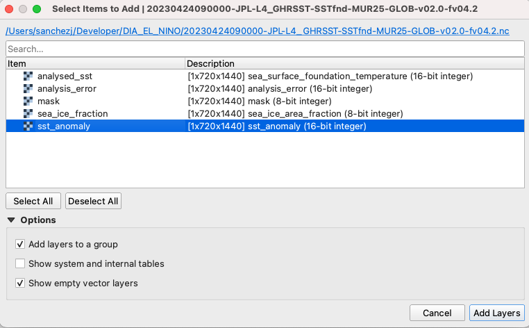
    
- Your layers should look like this:
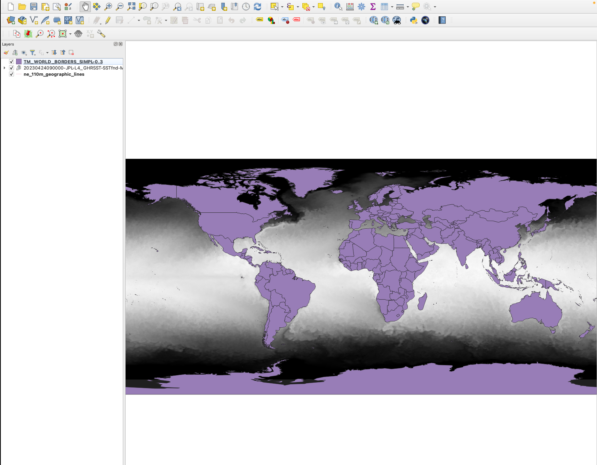
    
- We are now going to change the projection to focus on the El Niño region. Click on ‘Settings’ and click on “Custom Projections...’
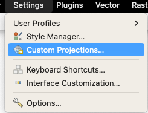

- Click on the green plus on the right hand corner, provide a Name, and on the ‘Parameters’ section, copy and paste this formula: +proj=ortho +lat_0=10 +lon_0=-150 +x_0=0 +y_0=0 +a=6371000 +b=6371000 +units=m +no_defs . Then click 'OK'. 
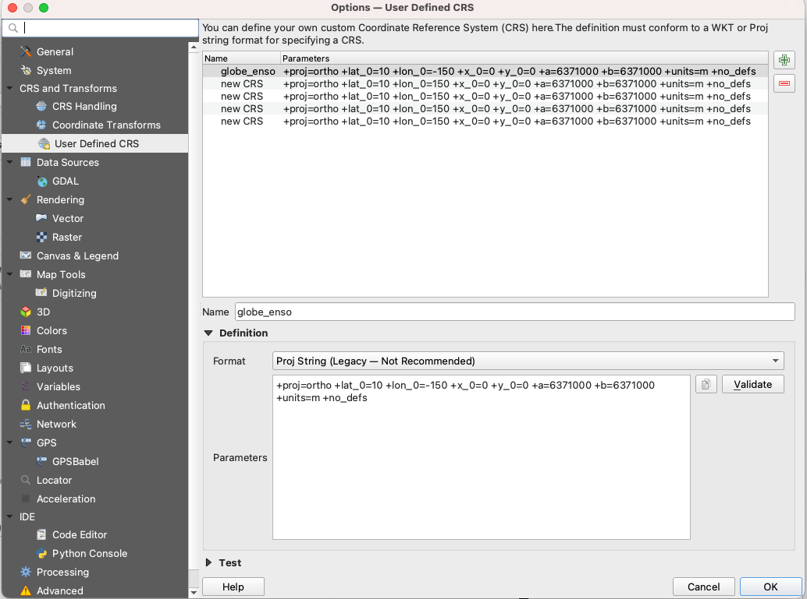
    

- On the bottom right of the map where it says 'EPSG:4326' change it to whatever you have named it.
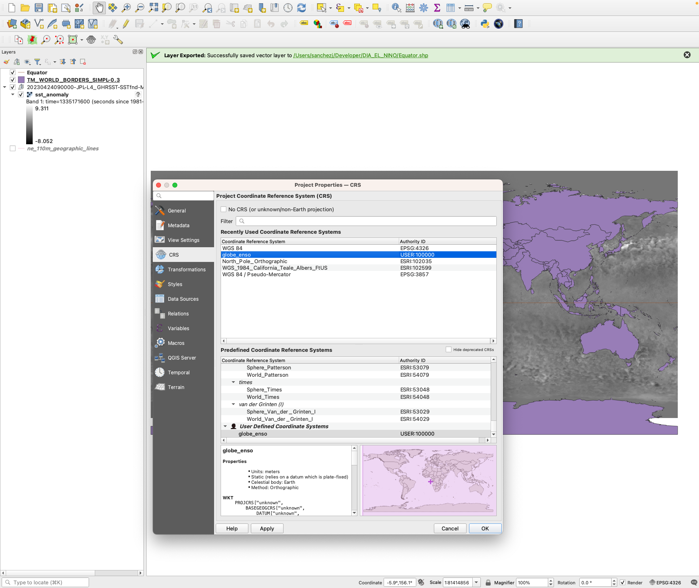
    

- Right click on the sst_anomaly’ layer and click on ‘Properties’.
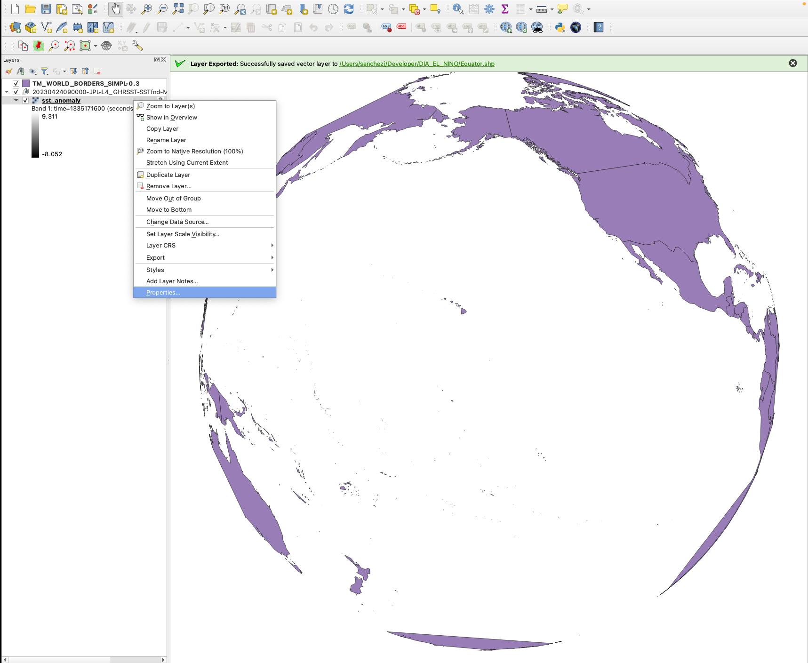
    

- Select ‘Single pseudocolor’ and change the max to -2 to 2. Add the classes and change the colors.
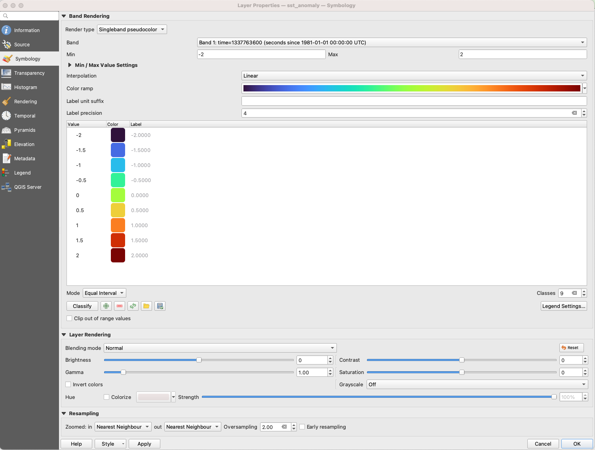
    

- Here is the final image. You can further change the background, add labels, etc: [https://docs.qgis.org/3.4/en/docs/training_manual/map_composer/map_composer.html](https://docs.qgis.org/3.4/en/docs/training_manual/map_composer/map_composer.html)
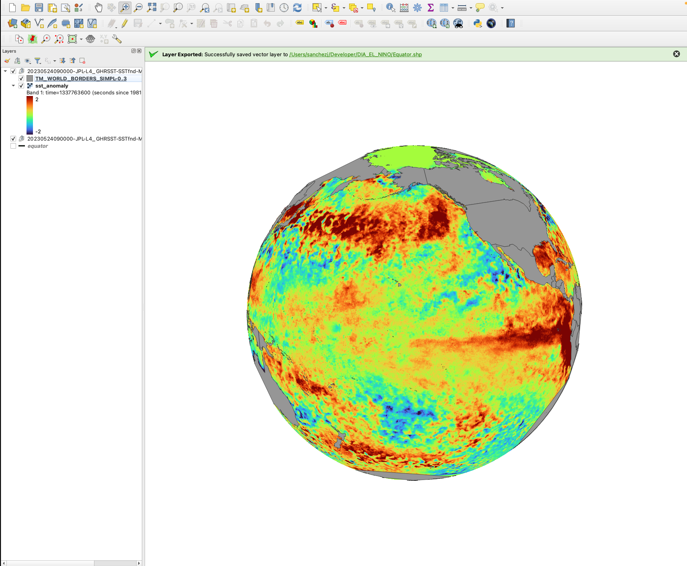