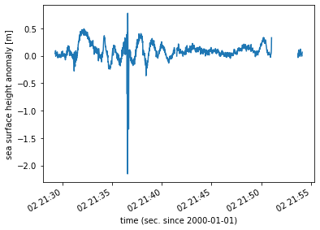

# Harmony EOSS L2SS API Tutorial

## Before you start
Before you beginning this tutorial, make sure you have an account in the Earthdata Login UAT environment, which 
will be used for this notebook by visiting [https://uat.urs.earthdata.nasa.gov](https://uat.urs.earthdata.nasa.gov).
These accounts, as all Earthdata Login accounts, are free to create and only take a moment to set up.

## Set Up Authentication

We need some boilerplate up front to log in to Earthdata Login.  The function below will allow Python
scripts to log into any Earthdata Login application programmatically.  To avoid being prompted for
credentials every time you run and also allow clients such as curl to log in, you can add the following
to a `.netrc` (`_netrc` on Windows) file in your home directory:

```
machine uat.urs.earthdata.nasa.gov
    login <your username>
    password <your password>
```

Make sure that this file is only readable by the current user or you will receive an error stating
"netrc access too permissive."

`$ chmod 0600 ~/.netrc` 


```python
from urllib import request
from http.cookiejar import CookieJar
import getpass
import netrc

def setup_earthdata_login_auth(endpoint):
    """
    Set up the request library so that it authenticates against the given Earthdata Login
    endpoint and is able to track cookies between requests.  This looks in the .netrc file 
    first and if no credentials are found, it prompts for them.

    Valid endpoints include:
        uat.urs.earthdata.nasa.gov - Earthdata Login UAT (Harmony's current default)
        urs.earthdata.nasa.gov - Earthdata Login production
    """
    try:
        username, _, password = netrc.netrc().authenticators(endpoint)
    except (FileNotFoundError, TypeError):
        # FileNotFound = There's no .netrc file
        # TypeError = The endpoint isn't in the netrc file, causing the above to try unpacking None
        print('Please provide your Earthdata Login credentials to allow data access')
        print('Your credentials will only be passed to %s and will not be exposed in Jupyter' % (endpoint))
        username = input('Username:')
        password = getpass.getpass()

    manager = request.HTTPPasswordMgrWithDefaultRealm()
    manager.add_password(None, endpoint, username, password)
    auth = request.HTTPBasicAuthHandler(manager)

    jar = CookieJar()
    processor = request.HTTPCookieProcessor(jar)
    opener = request.build_opener(auth, processor)
    request.install_opener(opener)

```

Now call the above function to set up Earthdata Login for subsequent requests


```python
setup_earthdata_login_auth('uat.urs.earthdata.nasa.gov')
```

### Find a granule for subsetting

Below we call out a specific granule (G1226018995-POCUMULUS) on which we will use the podaac L2 subsetter. Finding this information would complicate the tutorial- but po.daac has a tutorial available for using the CMR API to find collections and granules of interest. Please see the following tutorial for that information:

PODAAC_CMR.ipynb


##  Subset of a PO.DAAC Granule

We can now build onto the root URL in order to actually perform a transformation.  The first transformation is a subset of a selected granule.  _At this time, this requires discovering the granule id from CMR_.  That information can then be appended to the root URL and used to call Harmony with the help of the `request` library.

Above we show how to find a granule id for processing.

**Notes:**
  The L2 subsetter current streams the data back to the user, and does not stage data in S3 for redirects. This is functionality we will be adding over time.
  It doesn't work with URS backed files, which is coming in the next few weeks
  it only works on the show dataset, but 
    


```python
harmony_root = 'https://harmony.uat.earthdata.nasa.gov'
bboxSubsetConfig = {
    'collection_id': 'C1234208436-POCLOUD',
    'ogc-api-coverages_version': '1.0.0',
    'variable': 'all',
    'granuleid': 'G1234405731-POCLOUD',
    'lat': '(-45.75:45)',
    'lon': '(-90:90)'
}
bbox_url = harmony_root+'/{collection_id}/ogc-api-coverages/{ogc-api-coverages_version}/collections/{variable}/coverage/rangeset?granuleid={granuleid}&subset=lat{lat}&subset=lon{lon}'.format(**bboxSubsetConfig)
print('Request URL', bbox_url)

```

    Request URL https://harmony.uat.earthdata.nasa.gov/C1234208436-POCLOUD/ogc-api-coverages/1.0.0/collections/all/coverage/rangeset?granuleid=G1234405731-POCLOUD&subset=lat(-45.75:45)&subset=lon(-90:90)


```python
import shutil
with request.urlopen(bbox_url) as response, open('ogc_temp.nc', 'wb') as out_file:
    print('Content Size:', response.headers['Content-length'])
    shutil.copyfileobj(response, out_file)
    print("Downloaded request to ogc_temp.nc")
```

    Content Size: 3023897
    Downloaded request to ogc_temp.nc


```python
import xarray as xa
ds = xa.open_dataset('ogc_temp.nc')
ds
```


<div><svg style="position: absolute; width: 0; height: 0; overflow: hidden">
<defs>
<symbol id="icon-database" viewBox="0 0 32 32">
<title>Show/Hide data repr</title>
<path d="M16 0c-8.837 0-16 2.239-16 5v4c0 2.761 7.163 5 16 5s16-2.239 16-5v-4c0-2.761-7.163-5-16-5z"></path>
<path d="M16 17c-8.837 0-16-2.239-16-5v6c0 2.761 7.163 5 16 5s16-2.239 16-5v-6c0 2.761-7.163 5-16 5z"></path>
<path d="M16 26c-8.837 0-16-2.239-16-5v6c0 2.761 7.163 5 16 5s16-2.239 16-5v-6c0 2.761-7.163 5-16 5z"></path>
</symbol>
<symbol id="icon-file-text2" viewBox="0 0 32 32">
<title>Show/Hide attributes</title>
<path d="M28.681 7.159c-0.694-0.947-1.662-2.053-2.724-3.116s-2.169-2.030-3.116-2.724c-1.612-1.182-2.393-1.319-2.841-1.319h-15.5c-1.378 0-2.5 1.121-2.5 2.5v27c0 1.378 1.122 2.5 2.5 2.5h23c1.378 0 2.5-1.122 2.5-2.5v-19.5c0-0.448-0.137-1.23-1.319-2.841zM24.543 5.457c0.959 0.959 1.712 1.825 2.268 2.543h-4.811v-4.811c0.718 0.556 1.584 1.309 2.543 2.268zM28 29.5c0 0.271-0.229 0.5-0.5 0.5h-23c-0.271 0-0.5-0.229-0.5-0.5v-27c0-0.271 0.229-0.5 0.5-0.5 0 0 15.499-0 15.5 0v7c0 0.552 0.448 1 1 1h7v19.5z"></path>
<path d="M23 26h-14c-0.552 0-1-0.448-1-1s0.448-1 1-1h14c0.552 0 1 0.448 1 1s-0.448 1-1 1z"></path>
<path d="M23 22h-14c-0.552 0-1-0.448-1-1s0.448-1 1-1h14c0.552 0 1 0.448 1 1s-0.448 1-1 1z"></path>
<path d="M23 18h-14c-0.552 0-1-0.448-1-1s0.448-1 1-1h14c0.552 0 1 0.448 1 1s-0.448 1-1 1z"></path>
</symbol>
</defs>
</svg>
<style>/* CSS stylesheet for displaying xarray objects in jupyterlab.
 *
 */

:root {
  --xr-font-color0: var(--jp-content-font-color0, rgba(0, 0, 0, 1));
  --xr-font-color2: var(--jp-content-font-color2, rgba(0, 0, 0, 0.54));
  --xr-font-color3: var(--jp-content-font-color3, rgba(0, 0, 0, 0.38));
  --xr-border-color: var(--jp-border-color2, #e0e0e0);
  --xr-disabled-color: var(--jp-layout-color3, #bdbdbd);
  --xr-background-color: var(--jp-layout-color0, white);
  --xr-background-color-row-even: var(--jp-layout-color1, white);
  --xr-background-color-row-odd: var(--jp-layout-color2, #eeeeee);
}

.xr-wrap {
  min-width: 300px;
  max-width: 700px;
}

.xr-header {
  padding-top: 6px;
  padding-bottom: 6px;
  margin-bottom: 4px;
  border-bottom: solid 1px var(--xr-border-color);
}

.xr-header > div,
.xr-header > ul {
  display: inline;
  margin-top: 0;
  margin-bottom: 0;
}

.xr-obj-type,
.xr-array-name {
  margin-left: 2px;
  margin-right: 10px;
}

.xr-obj-type {
  color: var(--xr-font-color2);
}

.xr-sections {
  padding-left: 0 !important;
  display: grid;
  grid-template-columns: 150px auto auto 1fr 20px 20px;
}

.xr-section-item {
  display: contents;
}

.xr-section-item input {
  display: none;
}

.xr-section-item input + label {
  color: var(--xr-disabled-color);
}

.xr-section-item input:enabled + label {
  cursor: pointer;
  color: var(--xr-font-color2);
}

.xr-section-item input:enabled + label:hover {
  color: var(--xr-font-color0);
}

.xr-section-summary {
  grid-column: 1;
  color: var(--xr-font-color2);
  font-weight: 500;
}

.xr-section-summary > span {
  display: inline-block;
  padding-left: 0.5em;
}

.xr-section-summary-in:disabled + label {
  color: var(--xr-font-color2);
}

.xr-section-summary-in + label:before {
  display: inline-block;
  content: '►';
  font-size: 11px;
  width: 15px;
  text-align: center;
}

.xr-section-summary-in:disabled + label:before {
  color: var(--xr-disabled-color);
}

.xr-section-summary-in:checked + label:before {
  content: '▼';
}

.xr-section-summary-in:checked + label > span {
  display: none;
}

.xr-section-summary,
.xr-section-inline-details {
  padding-top: 4px;
  padding-bottom: 4px;
}

.xr-section-inline-details {
  grid-column: 2 / -1;
}

.xr-section-details {
  display: none;
  grid-column: 1 / -1;
  margin-bottom: 5px;
}

.xr-section-summary-in:checked ~ .xr-section-details {
  display: contents;
}

.xr-array-wrap {
  grid-column: 1 / -1;
  display: grid;
  grid-template-columns: 20px auto;
}

.xr-array-wrap > label {
  grid-column: 1;
  vertical-align: top;
}

.xr-preview {
  color: var(--xr-font-color3);
}

.xr-array-preview,
.xr-array-data {
  padding: 0 5px !important;
  grid-column: 2;
}

.xr-array-data,
.xr-array-in:checked ~ .xr-array-preview {
  display: none;
}

.xr-array-in:checked ~ .xr-array-data,
.xr-array-preview {
  display: inline-block;
}

.xr-dim-list {
  display: inline-block !important;
  list-style: none;
  padding: 0 !important;
  margin: 0;
}

.xr-dim-list li {
  display: inline-block;
  padding: 0;
  margin: 0;
}

.xr-dim-list:before {
  content: '(';
}

.xr-dim-list:after {
  content: ')';
}

.xr-dim-list li:not(:last-child):after {
  content: ',';
  padding-right: 5px;
}

.xr-has-index {
  font-weight: bold;
}

.xr-var-list,
.xr-var-item {
  display: contents;
}

.xr-var-item > div,
.xr-var-item label,
.xr-var-item > .xr-var-name span {
  background-color: var(--xr-background-color-row-even);
  margin-bottom: 0;
}

.xr-var-item > .xr-var-name:hover span {
  padding-right: 5px;
}

.xr-var-list > li:nth-child(odd) > div,
.xr-var-list > li:nth-child(odd) > label,
.xr-var-list > li:nth-child(odd) > .xr-var-name span {
  background-color: var(--xr-background-color-row-odd);
}

.xr-var-name {
  grid-column: 1;
}

.xr-var-dims {
  grid-column: 2;
}

.xr-var-dtype {
  grid-column: 3;
  text-align: right;
  color: var(--xr-font-color2);
}

.xr-var-preview {
  grid-column: 4;
}

.xr-var-name,
.xr-var-dims,
.xr-var-dtype,
.xr-preview,
.xr-attrs dt {
  white-space: nowrap;
  overflow: hidden;
  text-overflow: ellipsis;
  padding-right: 10px;
}

.xr-var-name:hover,
.xr-var-dims:hover,
.xr-var-dtype:hover,
.xr-attrs dt:hover {
  overflow: visible;
  width: auto;
  z-index: 1;
}

.xr-var-attrs,
.xr-var-data {
  display: none;
  background-color: var(--xr-background-color) !important;
  padding-bottom: 5px !important;
}

.xr-var-attrs-in:checked ~ .xr-var-attrs,
.xr-var-data-in:checked ~ .xr-var-data {
  display: block;
}

.xr-var-data > table {
  float: right;
}

.xr-var-name span,
.xr-var-data,
.xr-attrs {
  padding-left: 25px !important;
}

.xr-attrs,
.xr-var-attrs,
.xr-var-data {
  grid-column: 1 / -1;
}

dl.xr-attrs {
  padding: 0;
  margin: 0;
  display: grid;
  grid-template-columns: 125px auto;
}

.xr-attrs dt, dd {
  padding: 0;
  margin: 0;
  float: left;
  padding-right: 10px;
  width: auto;
}

.xr-attrs dt {
  font-weight: normal;
  grid-column: 1;
}

.xr-attrs dt:hover span {
  display: inline-block;
  background: var(--xr-background-color);
  padding-right: 10px;
}

.xr-attrs dd {
  grid-column: 2;
  white-space: pre-wrap;
  word-break: break-all;
}

.xr-icon-database,
.xr-icon-file-text2 {
  display: inline-block;
  vertical-align: middle;
  width: 1em;
  height: 1.5em !important;
  stroke-width: 0;
  stroke: currentColor;
  fill: currentColor;
}
</style><div class='xr-wrap'><div class='xr-header'><div class='xr-obj-type'>xarray.Dataset</div></div><ul class='xr-sections'><li class='xr-section-item'><input id='section-c92d7edb-4eec-470f-865b-983a300cad06' class='xr-section-summary-in' type='checkbox' disabled ><label for='section-c92d7edb-4eec-470f-865b-983a300cad06' class='xr-section-summary'  title='Expand/collapse section'>Dimensions:</label><div class='xr-section-inline-details'><ul class='xr-dim-list'><li><span class='xr-has-index'>meas_ind</span>: 20</li><li><span class='xr-has-index'>time</span>: 1657</li></ul></div><div class='xr-section-details'></div></li><li class='xr-section-item'><input id='section-c49622ee-1f6f-45c2-9a3a-b337998677ef' class='xr-section-summary-in' type='checkbox'  checked><label for='section-c49622ee-1f6f-45c2-9a3a-b337998677ef' class='xr-section-summary' >Coordinates: <span>(6)</span></label><div class='xr-section-inline-details'></div><div class='xr-section-details'><ul class='xr-var-list'><li class='xr-var-item'><div class='xr-var-name'><span>lat</span></div><div class='xr-var-dims'>(time)</div><div class='xr-var-dtype'>float64</div><div class='xr-var-preview xr-preview'>...</div><input id='attrs-44f64f96-0260-45b7-b250-74e43c874c14' class='xr-var-attrs-in' type='checkbox' ><label for='attrs-44f64f96-0260-45b7-b250-74e43c874c14' title='Show/Hide attributes'><svg class='icon xr-icon-file-text2'><use xlink:href='#icon-file-text2'></use></svg></label><input id='data-201feebb-be42-42fb-aa3d-dcf0d8424293' class='xr-var-data-in' type='checkbox'><label for='data-201feebb-be42-42fb-aa3d-dcf0d8424293' title='Show/Hide data repr'><svg class='icon xr-icon-database'><use xlink:href='#icon-database'></use></svg></label><div class='xr-var-attrs'><dl class='xr-attrs'><dt><span>long_name :</span></dt><dd>latitude</dd><dt><span>standard_name :</span></dt><dd>latitude</dd><dt><span>units :</span></dt><dd>degrees_north</dd><dt><span>quality_flag :</span></dt><dd>orb_state_flag_rest</dd><dt><span>comment :</span></dt><dd>Positive latitude is North latitude, negative latitude is South latitude. See Jason-1 User Handbook.</dd></dl></div><pre class='xr-var-data'>array([-45.74856 , -45.704265, -45.659952, ...,  44.885976,  44.930615,
        44.975237])</pre></li><li class='xr-var-item'><div class='xr-var-name'><span>lon</span></div><div class='xr-var-dims'>(time)</div><div class='xr-var-dtype'>float64</div><div class='xr-var-preview xr-preview'>...</div><input id='attrs-dfd5805c-5d30-4ce6-9d71-9756f7c79515' class='xr-var-attrs-in' type='checkbox' ><label for='attrs-dfd5805c-5d30-4ce6-9d71-9756f7c79515' title='Show/Hide attributes'><svg class='icon xr-icon-file-text2'><use xlink:href='#icon-file-text2'></use></svg></label><input id='data-b75676e5-91a6-4f54-bf66-628785270ecc' class='xr-var-data-in' type='checkbox'><label for='data-b75676e5-91a6-4f54-bf66-628785270ecc' title='Show/Hide data repr'><svg class='icon xr-icon-database'><use xlink:href='#icon-database'></use></svg></label><div class='xr-var-attrs'><dl class='xr-attrs'><dt><span>long_name :</span></dt><dd>longitude</dd><dt><span>standard_name :</span></dt><dd>longitude</dd><dt><span>units :</span></dt><dd>degrees_east</dd><dt><span>quality_flag :</span></dt><dd>orb_state_flag_rest</dd><dt><span>comment :</span></dt><dd>East longitude relative to Greenwich meridian. See Jason-1 User Handbook.</dd></dl></div><pre class='xr-var-data'>array([24.547928, 24.588744, 24.629489, ..., 69.661213, 69.70077 , 69.740395])</pre></li><li class='xr-var-item'><div class='xr-var-name'><span>lon_20hz</span></div><div class='xr-var-dims'>(time, meas_ind)</div><div class='xr-var-dtype'>float64</div><div class='xr-var-preview xr-preview'>...</div><input id='attrs-33f63bd7-3270-45c7-82eb-b7119efc8c8f' class='xr-var-attrs-in' type='checkbox' ><label for='attrs-33f63bd7-3270-45c7-82eb-b7119efc8c8f' title='Show/Hide attributes'><svg class='icon xr-icon-file-text2'><use xlink:href='#icon-file-text2'></use></svg></label><input id='data-fb1bd771-3da9-412f-bfe8-626b4b9709f0' class='xr-var-data-in' type='checkbox'><label for='data-fb1bd771-3da9-412f-bfe8-626b4b9709f0' title='Show/Hide data repr'><svg class='icon xr-icon-database'><use xlink:href='#icon-database'></use></svg></label><div class='xr-var-attrs'><dl class='xr-attrs'><dt><span>long_name :</span></dt><dd>20 Hz longitude</dd><dt><span>standard_name :</span></dt><dd>longitude</dd><dt><span>units :</span></dt><dd>degrees_east</dd><dt><span>comment :</span></dt><dd>East longitude relative to Greenwich meridian. See Jason-1 User Handbook</dd></dl></div><pre class='xr-var-data'>array([[24.528515, 24.530559, 24.532603, ..., 24.563242, 24.565283, 24.567324],
       [24.569365, 24.571405, 24.573446, ..., 24.604031, 24.606069, 24.608106],
       [24.610143, 24.612181, 24.614217, ..., 24.64475 , 24.646784, 24.648818],
       ...,
       [69.642447, 69.644421, 69.646396, ..., 69.676038, 69.678016, 69.679994],
       [69.681971, 69.68395 , 69.685928, ..., 69.715621, 69.717602, 69.719583],
       [69.721564, 69.723546, 69.725527, ..., 69.755271, 69.757256, 69.75924 ]])</pre></li><li class='xr-var-item'><div class='xr-var-name'><span>lat_20hz</span></div><div class='xr-var-dims'>(time, meas_ind)</div><div class='xr-var-dtype'>float64</div><div class='xr-var-preview xr-preview'>...</div><input id='attrs-df26d247-b9fd-4e9e-9ed4-0b0caa54b9df' class='xr-var-attrs-in' type='checkbox' ><label for='attrs-df26d247-b9fd-4e9e-9ed4-0b0caa54b9df' title='Show/Hide attributes'><svg class='icon xr-icon-file-text2'><use xlink:href='#icon-file-text2'></use></svg></label><input id='data-354fc7d1-ca6a-42f3-aadb-b8412dfc819b' class='xr-var-data-in' type='checkbox'><label for='data-354fc7d1-ca6a-42f3-aadb-b8412dfc819b' title='Show/Hide data repr'><svg class='icon xr-icon-database'><use xlink:href='#icon-database'></use></svg></label><div class='xr-var-attrs'><dl class='xr-attrs'><dt><span>long_name :</span></dt><dd>20 Hz latitude</dd><dt><span>standard_name :</span></dt><dd>latitude</dd><dt><span>units :</span></dt><dd>degrees_north</dd><dt><span>comment :</span></dt><dd>Positive latitude is North latitude, negative latitude is South latitude. See Jason-1 User Handbook</dd></dl></div><pre class='xr-var-data'>array([[-45.769593, -45.767379, -45.765166, ..., -45.731951, -45.729736,
        -45.727522],
       [-45.725307, -45.723092, -45.720877, ..., -45.687649, -45.685434,
        -45.683218],
       [-45.681002, -45.678787, -45.676571, ..., -45.643329, -45.641113,
        -45.638897],
       ...,
       [ 44.864766,  44.866999,  44.869231, ...,  44.902717,  44.904949,
         44.907181],
       [ 44.909413,  44.911645,  44.913877, ...,  44.94735 ,  44.949581,
         44.951812],
       [ 44.954043,  44.956274,  44.958505, ...,  44.991965,  44.994196,
         44.996426]])</pre></li><li class='xr-var-item'><div class='xr-var-name'><span class='xr-has-index'>time</span></div><div class='xr-var-dims'>(time)</div><div class='xr-var-dtype'>datetime64[ns]</div><div class='xr-var-preview xr-preview'>2012-03-02T21:29:16.547886144 ... 2012-03-02T22:01:05.732273088</div><input id='attrs-0bc4f2c4-f813-4dcb-816b-c3b442b8e112' class='xr-var-attrs-in' type='checkbox' ><label for='attrs-0bc4f2c4-f813-4dcb-816b-c3b442b8e112' title='Show/Hide attributes'><svg class='icon xr-icon-file-text2'><use xlink:href='#icon-file-text2'></use></svg></label><input id='data-248b76b0-2a28-4989-adbc-0c230fdd6590' class='xr-var-data-in' type='checkbox'><label for='data-248b76b0-2a28-4989-adbc-0c230fdd6590' title='Show/Hide data repr'><svg class='icon xr-icon-database'><use xlink:href='#icon-database'></use></svg></label><div class='xr-var-attrs'><dl class='xr-attrs'><dt><span>long_name :</span></dt><dd>time (sec. since 2000-01-01)</dd><dt><span>standard_name :</span></dt><dd>time</dd><dt><span>tai_utc_difference :</span></dt><dd>34.0</dd><dt><span>leap_second :</span></dt><dd>0000-00-00 00:00:00</dd><dt><span>comment :</span></dt><dd>[tai_utc_difference] is the difference between TAI - UTC (i.e., leap seconds) for the first measurement of the data set. [leap_second] is the UTC time at which a leap second occurs in the data set, if any. After this UTC time, the [tai_utc_difference] is increased by 1 second. time variable is corrected from datation bias. See Jason-1 User handbook.</dd></dl></div><pre class='xr-var-data'>array([&#x27;2012-03-02T21:29:16.547886144&#x27;, &#x27;2012-03-02T21:29:17.567460992&#x27;,
       &#x27;2012-03-02T21:29:18.587038016&#x27;, ..., &#x27;2012-03-02T22:01:03.693119744&#x27;,
       &#x27;2012-03-02T22:01:04.712697984&#x27;, &#x27;2012-03-02T22:01:05.732273088&#x27;],
      dtype=&#x27;datetime64[ns]&#x27;)</pre></li><li class='xr-var-item'><div class='xr-var-name'><span class='xr-has-index'>meas_ind</span></div><div class='xr-var-dims'>(meas_ind)</div><div class='xr-var-dtype'>int8</div><div class='xr-var-preview xr-preview'>0 1 2 3 4 5 6 ... 14 15 16 17 18 19</div><input id='attrs-66447b09-40d2-41f1-a8cb-8571f4d3a9f1' class='xr-var-attrs-in' type='checkbox' ><label for='attrs-66447b09-40d2-41f1-a8cb-8571f4d3a9f1' title='Show/Hide attributes'><svg class='icon xr-icon-file-text2'><use xlink:href='#icon-file-text2'></use></svg></label><input id='data-51e6c188-58f6-4f0b-a3ab-77a36daa3c3c' class='xr-var-data-in' type='checkbox'><label for='data-51e6c188-58f6-4f0b-a3ab-77a36daa3c3c' title='Show/Hide data repr'><svg class='icon xr-icon-database'><use xlink:href='#icon-database'></use></svg></label><div class='xr-var-attrs'><dl class='xr-attrs'><dt><span>long_name :</span></dt><dd>elementary measurement index</dd><dt><span>units :</span></dt><dd>count</dd><dt><span>comment :</span></dt><dd>Set to be compliant with the CF-1.1 convention</dd></dl></div><pre class='xr-var-data'>array([ 0,  1,  2,  3,  4,  5,  6,  7,  8,  9, 10, 11, 12, 13, 14, 15, 16, 17,
       18, 19], dtype=int8)</pre></li></ul></div></li><li class='xr-section-item'><input id='section-3e3326c2-c8dc-4816-8979-b048aa10a605' class='xr-section-summary-in' type='checkbox'  ><label for='section-3e3326c2-c8dc-4816-8979-b048aa10a605' class='xr-section-summary' >Data variables: <span>(141)</span></label><div class='xr-section-inline-details'></div><div class='xr-section-details'><ul class='xr-var-list'><li class='xr-var-item'><div class='xr-var-name'><span>time_20hz</span></div><div class='xr-var-dims'>(time, meas_ind)</div><div class='xr-var-dtype'>datetime64[ns]</div><div class='xr-var-preview xr-preview'>...</div><input id='attrs-a8eb32d2-f50c-4a35-a618-fc1e5993d937' class='xr-var-attrs-in' type='checkbox' ><label for='attrs-a8eb32d2-f50c-4a35-a618-fc1e5993d937' title='Show/Hide attributes'><svg class='icon xr-icon-file-text2'><use xlink:href='#icon-file-text2'></use></svg></label><input id='data-314126ec-5c15-4ea2-9374-64511a806ef4' class='xr-var-data-in' type='checkbox'><label for='data-314126ec-5c15-4ea2-9374-64511a806ef4' title='Show/Hide data repr'><svg class='icon xr-icon-database'><use xlink:href='#icon-database'></use></svg></label><div class='xr-var-attrs'><dl class='xr-attrs'><dt><span>long_name :</span></dt><dd>time 20 Hz (sec. since 2000-01-01)</dd><dt><span>standard_name :</span></dt><dd>time</dd><dt><span>tai_utc_difference :</span></dt><dd>34.0</dd><dt><span>leap_second :</span></dt><dd>0000-00-00 00:00:00</dd><dt><span>comment :</span></dt><dd>[tai_utc_difference] is the difference between TAI - UTC (i.e., leap seconds) for the first measurement of the data set. [leap_second] is the UTC time at which a leap second occurs in the data set, if any. After this UTC time, the [tai_utc_difference] is increased by 1 second. time_20hz variable is corrected from datation bias. See Jason-1 User handbook.</dd></dl></div><pre class='xr-var-data'>array([[&#x27;2012-03-02T21:29:16.063587456&#x27;, &#x27;2012-03-02T21:29:16.114566208&#x27;,
        &#x27;2012-03-02T21:29:16.165545024&#x27;, ..., &#x27;2012-03-02T21:29:16.930227200&#x27;,
        &#x27;2012-03-02T21:29:16.981206080&#x27;, &#x27;2012-03-02T21:29:17.032184832&#x27;],
       [&#x27;2012-03-02T21:29:17.083162304&#x27;, &#x27;2012-03-02T21:29:17.134141056&#x27;,
        &#x27;2012-03-02T21:29:17.185119936&#x27;, ..., &#x27;2012-03-02T21:29:17.949802112&#x27;,
        &#x27;2012-03-02T21:29:18.000780928&#x27;, &#x27;2012-03-02T21:29:18.051759744&#x27;],
       [&#x27;2012-03-02T21:29:18.102739328&#x27;, &#x27;2012-03-02T21:29:18.153718144&#x27;,
        &#x27;2012-03-02T21:29:18.204696960&#x27;, ..., &#x27;2012-03-02T21:29:18.969379136&#x27;,
        &#x27;2012-03-02T21:29:19.020357952&#x27;, &#x27;2012-03-02T21:29:19.071336768&#x27;],
       ...,
       [&#x27;2012-03-02T22:01:03.208821056&#x27;, &#x27;2012-03-02T22:01:03.259799808&#x27;,
        &#x27;2012-03-02T22:01:03.310778688&#x27;, ..., &#x27;2012-03-02T22:01:04.075460864&#x27;,
        &#x27;2012-03-02T22:01:04.126439680&#x27;, &#x27;2012-03-02T22:01:04.177418496&#x27;],
       [&#x27;2012-03-02T22:01:04.228399296&#x27;, &#x27;2012-03-02T22:01:04.279378048&#x27;,
        &#x27;2012-03-02T22:01:04.330356864&#x27;, ..., &#x27;2012-03-02T22:01:05.095039040&#x27;,
        &#x27;2012-03-02T22:01:05.146017920&#x27;, &#x27;2012-03-02T22:01:05.196996672&#x27;],
       [&#x27;2012-03-02T22:01:05.247974400&#x27;, &#x27;2012-03-02T22:01:05.298953152&#x27;,
        &#x27;2012-03-02T22:01:05.349932032&#x27;, ..., &#x27;2012-03-02T22:01:06.114614208&#x27;,
        &#x27;2012-03-02T22:01:06.165593024&#x27;, &#x27;2012-03-02T22:01:06.216571776&#x27;]],
      dtype=&#x27;datetime64[ns]&#x27;)</pre></li><li class='xr-var-item'><div class='xr-var-name'><span>surface_type</span></div><div class='xr-var-dims'>(time)</div><div class='xr-var-dtype'>float32</div><div class='xr-var-preview xr-preview'>...</div><input id='attrs-9b5205dd-b767-4705-933d-9189b33558b9' class='xr-var-attrs-in' type='checkbox' ><label for='attrs-9b5205dd-b767-4705-933d-9189b33558b9' title='Show/Hide attributes'><svg class='icon xr-icon-file-text2'><use xlink:href='#icon-file-text2'></use></svg></label><input id='data-90540d62-a81a-413e-bff5-4e85e69d6ca0' class='xr-var-data-in' type='checkbox'><label for='data-90540d62-a81a-413e-bff5-4e85e69d6ca0' title='Show/Hide data repr'><svg class='icon xr-icon-database'><use xlink:href='#icon-database'></use></svg></label><div class='xr-var-attrs'><dl class='xr-attrs'><dt><span>long_name :</span></dt><dd>surface type</dd><dt><span>flag_values :</span></dt><dd>[0 1 2 3]</dd><dt><span>flag_meanings :</span></dt><dd>ocean lake_enclosed_sea ice land</dd><dt><span>comment :</span></dt><dd>Computed using a DTM2000 file: 0 = open oceans or semi-enclosed seas; 1 = enclosed seas or lakes; 2 = continental ice; 3 = land. See Jason-1 User Handbook</dd></dl></div><pre class='xr-var-data'>array([0., 0., 0., ..., 3., 3., 3.], dtype=float32)</pre></li><li class='xr-var-item'><div class='xr-var-name'><span>surface_type_globcover</span></div><div class='xr-var-dims'>(time)</div><div class='xr-var-dtype'>float32</div><div class='xr-var-preview xr-preview'>...</div><input id='attrs-a1fee3d1-7717-4913-9b89-6905142b3d0d' class='xr-var-attrs-in' type='checkbox' ><label for='attrs-a1fee3d1-7717-4913-9b89-6905142b3d0d' title='Show/Hide attributes'><svg class='icon xr-icon-file-text2'><use xlink:href='#icon-file-text2'></use></svg></label><input id='data-1607a694-d16a-4e05-933b-83d934dae7b0' class='xr-var-data-in' type='checkbox'><label for='data-1607a694-d16a-4e05-933b-83d934dae7b0' title='Show/Hide data repr'><svg class='icon xr-icon-database'><use xlink:href='#icon-database'></use></svg></label><div class='xr-var-attrs'><dl class='xr-attrs'><dt><span>long_name :</span></dt><dd>surface type globcover</dd><dt><span>flag_values :</span></dt><dd>0b, 1b, 2b, 3b, 4b, 5b, 6b</dd><dt><span>flag_meanings :</span></dt><dd>open_ocean land continental_water aquatic_vegetation continental_ice_snow floating_ice salted_basin</dd><dt><span>comment :</span></dt><dd>Computed from a mask built with MODIS and GlobCover data, 0 = Open ocean; 1 = Land; 2 = Continental waters; 3 = Aquatic vegetation; 4 = Continental ice and snow; 5 = Floating ice; 6 = Salted basin. See Jason-1 User Handbook</dd></dl></div><pre class='xr-var-data'>array([0., 0., 0., ..., 1., 1., 1.], dtype=float32)</pre></li><li class='xr-var-item'><div class='xr-var-name'><span>alt_echo_type</span></div><div class='xr-var-dims'>(time)</div><div class='xr-var-dtype'>float32</div><div class='xr-var-preview xr-preview'>...</div><input id='attrs-49744425-3688-4506-8b74-9ce9fc332314' class='xr-var-attrs-in' type='checkbox' ><label for='attrs-49744425-3688-4506-8b74-9ce9fc332314' title='Show/Hide attributes'><svg class='icon xr-icon-file-text2'><use xlink:href='#icon-file-text2'></use></svg></label><input id='data-ab18fa46-6137-412a-8855-4f052c215455' class='xr-var-data-in' type='checkbox'><label for='data-ab18fa46-6137-412a-8855-4f052c215455' title='Show/Hide data repr'><svg class='icon xr-icon-database'><use xlink:href='#icon-database'></use></svg></label><div class='xr-var-attrs'><dl class='xr-attrs'><dt><span>long_name :</span></dt><dd>altimeter echo type</dd><dt><span>flag_values :</span></dt><dd>[0 1]</dd><dt><span>flag_meanings :</span></dt><dd>ocean_like non_ocean_like</dd><dt><span>comment :</span></dt><dd>The altimeter echo type is determined by testing the rms of the high rate range measurements against a threshold as well as the number of valid high rate range measurements against a minimum value</dd></dl></div><pre class='xr-var-data'>array([0., 0., 0., ..., 1., 1., 1.], dtype=float32)</pre></li><li class='xr-var-item'><div class='xr-var-name'><span>rad_surf_type</span></div><div class='xr-var-dims'>(time)</div><div class='xr-var-dtype'>float32</div><div class='xr-var-preview xr-preview'>...</div><input id='attrs-13da9be6-874f-41f2-8a24-0fdef31ba50c' class='xr-var-attrs-in' type='checkbox' ><label for='attrs-13da9be6-874f-41f2-8a24-0fdef31ba50c' title='Show/Hide attributes'><svg class='icon xr-icon-file-text2'><use xlink:href='#icon-file-text2'></use></svg></label><input id='data-4faabb07-86fa-487d-958a-f4c65e5d39fe' class='xr-var-data-in' type='checkbox'><label for='data-4faabb07-86fa-487d-958a-f4c65e5d39fe' title='Show/Hide data repr'><svg class='icon xr-icon-database'><use xlink:href='#icon-database'></use></svg></label><div class='xr-var-attrs'><dl class='xr-attrs'><dt><span>long_name :</span></dt><dd>radiometer surface type</dd><dt><span>flag_values :</span></dt><dd>[0 1 2]</dd><dt><span>flag_meanings :</span></dt><dd>open_ocean near_coast land</dd><dt><span>comment :</span></dt><dd> The radiometer surface type flag is applicable to the radiometer wet troposphere path delays provided by rad_wet_tropo_corr. A value of 0 indicates that open ocean processing is used to compute the path delay, 1 indicates coastal processing is used, and 2 indicates the path delay is invalid due to land</dd></dl></div><pre class='xr-var-data'>array([0., 0., 0., ..., 2., 2., 2.], dtype=float32)</pre></li><li class='xr-var-item'><div class='xr-var-name'><span>rad_distance_to_land</span></div><div class='xr-var-dims'>(time)</div><div class='xr-var-dtype'>float64</div><div class='xr-var-preview xr-preview'>...</div><input id='attrs-5e692579-cefd-4b96-b6a7-27b7caeec1b9' class='xr-var-attrs-in' type='checkbox' ><label for='attrs-5e692579-cefd-4b96-b6a7-27b7caeec1b9' title='Show/Hide attributes'><svg class='icon xr-icon-file-text2'><use xlink:href='#icon-file-text2'></use></svg></label><input id='data-84523d12-ac8e-43b6-a3eb-c3ce58bb1d5b' class='xr-var-data-in' type='checkbox'><label for='data-84523d12-ac8e-43b6-a3eb-c3ce58bb1d5b' title='Show/Hide data repr'><svg class='icon xr-icon-database'><use xlink:href='#icon-database'></use></svg></label><div class='xr-var-attrs'><dl class='xr-attrs'><dt><span>long_name :</span></dt><dd>radiometer radial distance to land</dd><dt><span>units :</span></dt><dd>m</dd><dt><span>comment :</span></dt><dd>Shortest distance between nadir sub-satellite point and land</dd></dl></div><pre class='xr-var-data'>array([3600000., 3600000., 3600000., ...,       0.,       0.,       0.])</pre></li><li class='xr-var-item'><div class='xr-var-name'><span>qual_alt_1hz_range_ku</span></div><div class='xr-var-dims'>(time)</div><div class='xr-var-dtype'>float32</div><div class='xr-var-preview xr-preview'>...</div><input id='attrs-a68c6008-ecdf-4dc4-9544-8d3a3057bbbe' class='xr-var-attrs-in' type='checkbox' ><label for='attrs-a68c6008-ecdf-4dc4-9544-8d3a3057bbbe' title='Show/Hide attributes'><svg class='icon xr-icon-file-text2'><use xlink:href='#icon-file-text2'></use></svg></label><input id='data-0f8fdeb2-6857-42f6-9f92-d0ac388da28e' class='xr-var-data-in' type='checkbox'><label for='data-0f8fdeb2-6857-42f6-9f92-d0ac388da28e' title='Show/Hide data repr'><svg class='icon xr-icon-database'><use xlink:href='#icon-database'></use></svg></label><div class='xr-var-attrs'><dl class='xr-attrs'><dt><span>long_name :</span></dt><dd>quality flag for 1 Hz altimeter data: Ku band range</dd><dt><span>flag_values :</span></dt><dd>[0 1]</dd><dt><span>flag_meanings :</span></dt><dd>good bad</dd></dl></div><pre class='xr-var-data'>array([0., 0., 0., ..., 1., 1., 1.], dtype=float32)</pre></li><li class='xr-var-item'><div class='xr-var-name'><span>qual_alt_1hz_range_c</span></div><div class='xr-var-dims'>(time)</div><div class='xr-var-dtype'>float32</div><div class='xr-var-preview xr-preview'>...</div><input id='attrs-5a3165ec-dc25-450a-98a2-ac435e49b05f' class='xr-var-attrs-in' type='checkbox' ><label for='attrs-5a3165ec-dc25-450a-98a2-ac435e49b05f' title='Show/Hide attributes'><svg class='icon xr-icon-file-text2'><use xlink:href='#icon-file-text2'></use></svg></label><input id='data-d62d13cc-8e9c-4681-9dfb-598dec7012e9' class='xr-var-data-in' type='checkbox'><label for='data-d62d13cc-8e9c-4681-9dfb-598dec7012e9' title='Show/Hide data repr'><svg class='icon xr-icon-database'><use xlink:href='#icon-database'></use></svg></label><div class='xr-var-attrs'><dl class='xr-attrs'><dt><span>long_name :</span></dt><dd>quality flag for 1 Hz altimeter data: C band range</dd><dt><span>flag_values :</span></dt><dd>[0 1]</dd><dt><span>flag_meanings :</span></dt><dd>good bad</dd></dl></div><pre class='xr-var-data'>array([0., 0., 0., ..., 1., 1., 1.], dtype=float32)</pre></li><li class='xr-var-item'><div class='xr-var-name'><span>qual_alt_1hz_swh_ku</span></div><div class='xr-var-dims'>(time)</div><div class='xr-var-dtype'>float32</div><div class='xr-var-preview xr-preview'>...</div><input id='attrs-37cd0882-dd1f-4023-ab89-81ed36e7e94f' class='xr-var-attrs-in' type='checkbox' ><label for='attrs-37cd0882-dd1f-4023-ab89-81ed36e7e94f' title='Show/Hide attributes'><svg class='icon xr-icon-file-text2'><use xlink:href='#icon-file-text2'></use></svg></label><input id='data-b112fcd6-2fca-437a-a023-31de5783909b' class='xr-var-data-in' type='checkbox'><label for='data-b112fcd6-2fca-437a-a023-31de5783909b' title='Show/Hide data repr'><svg class='icon xr-icon-database'><use xlink:href='#icon-database'></use></svg></label><div class='xr-var-attrs'><dl class='xr-attrs'><dt><span>long_name :</span></dt><dd>quality flag for 1 Hz altimeter data: Ku band SWH</dd><dt><span>flag_values :</span></dt><dd>[0 1]</dd><dt><span>flag_meanings :</span></dt><dd>good bad</dd></dl></div><pre class='xr-var-data'>array([0., 0., 0., ..., 1., 1., 1.], dtype=float32)</pre></li><li class='xr-var-item'><div class='xr-var-name'><span>qual_alt_1hz_swh_c</span></div><div class='xr-var-dims'>(time)</div><div class='xr-var-dtype'>float32</div><div class='xr-var-preview xr-preview'>...</div><input id='attrs-2e463eb0-19ef-41c2-bc79-ddee242d6c34' class='xr-var-attrs-in' type='checkbox' ><label for='attrs-2e463eb0-19ef-41c2-bc79-ddee242d6c34' title='Show/Hide attributes'><svg class='icon xr-icon-file-text2'><use xlink:href='#icon-file-text2'></use></svg></label><input id='data-39159840-0fe4-49f8-bf16-b31259ea8369' class='xr-var-data-in' type='checkbox'><label for='data-39159840-0fe4-49f8-bf16-b31259ea8369' title='Show/Hide data repr'><svg class='icon xr-icon-database'><use xlink:href='#icon-database'></use></svg></label><div class='xr-var-attrs'><dl class='xr-attrs'><dt><span>long_name :</span></dt><dd>quality flag for 1 Hz altimeter data: C band SWH</dd><dt><span>flag_values :</span></dt><dd>[0 1]</dd><dt><span>flag_meanings :</span></dt><dd>good bad</dd></dl></div><pre class='xr-var-data'>array([0., 0., 0., ..., 1., 1., 1.], dtype=float32)</pre></li><li class='xr-var-item'><div class='xr-var-name'><span>qual_alt_1hz_sig0_ku</span></div><div class='xr-var-dims'>(time)</div><div class='xr-var-dtype'>float32</div><div class='xr-var-preview xr-preview'>...</div><input id='attrs-da60ead7-99dd-466e-a86c-936c245901c4' class='xr-var-attrs-in' type='checkbox' ><label for='attrs-da60ead7-99dd-466e-a86c-936c245901c4' title='Show/Hide attributes'><svg class='icon xr-icon-file-text2'><use xlink:href='#icon-file-text2'></use></svg></label><input id='data-81183498-004a-471a-aa38-ae0d47419a03' class='xr-var-data-in' type='checkbox'><label for='data-81183498-004a-471a-aa38-ae0d47419a03' title='Show/Hide data repr'><svg class='icon xr-icon-database'><use xlink:href='#icon-database'></use></svg></label><div class='xr-var-attrs'><dl class='xr-attrs'><dt><span>long_name :</span></dt><dd>quality flag for 1 Hz altimeter data: Ku band backscatter coefficient</dd><dt><span>flag_values :</span></dt><dd>[0 1]</dd><dt><span>flag_meanings :</span></dt><dd>good bad</dd></dl></div><pre class='xr-var-data'>array([0., 0., 0., ..., 1., 1., 1.], dtype=float32)</pre></li><li class='xr-var-item'><div class='xr-var-name'><span>qual_alt_1hz_sig0_c</span></div><div class='xr-var-dims'>(time)</div><div class='xr-var-dtype'>float32</div><div class='xr-var-preview xr-preview'>...</div><input id='attrs-d0c5c68b-b1d6-4ae4-8115-a0fe44512877' class='xr-var-attrs-in' type='checkbox' ><label for='attrs-d0c5c68b-b1d6-4ae4-8115-a0fe44512877' title='Show/Hide attributes'><svg class='icon xr-icon-file-text2'><use xlink:href='#icon-file-text2'></use></svg></label><input id='data-f1eddd53-70fe-474d-b88e-9a027cf8ab29' class='xr-var-data-in' type='checkbox'><label for='data-f1eddd53-70fe-474d-b88e-9a027cf8ab29' title='Show/Hide data repr'><svg class='icon xr-icon-database'><use xlink:href='#icon-database'></use></svg></label><div class='xr-var-attrs'><dl class='xr-attrs'><dt><span>long_name :</span></dt><dd>quality flag for 1 Hz altimeter data: C band backscatter coefficient</dd><dt><span>flag_values :</span></dt><dd>[0 1]</dd><dt><span>flag_meanings :</span></dt><dd>good bad</dd></dl></div><pre class='xr-var-data'>array([0., 0., 0., ..., 1., 1., 1.], dtype=float32)</pre></li><li class='xr-var-item'><div class='xr-var-name'><span>qual_alt_1hz_off_nadir_angle_wf_ku</span></div><div class='xr-var-dims'>(time)</div><div class='xr-var-dtype'>float32</div><div class='xr-var-preview xr-preview'>...</div><input id='attrs-db212c63-6a7c-4e6f-8ab7-500ab1642409' class='xr-var-attrs-in' type='checkbox' ><label for='attrs-db212c63-6a7c-4e6f-8ab7-500ab1642409' title='Show/Hide attributes'><svg class='icon xr-icon-file-text2'><use xlink:href='#icon-file-text2'></use></svg></label><input id='data-194ea885-6af9-4091-ad98-fb1a76fb8f35' class='xr-var-data-in' type='checkbox'><label for='data-194ea885-6af9-4091-ad98-fb1a76fb8f35' title='Show/Hide data repr'><svg class='icon xr-icon-database'><use xlink:href='#icon-database'></use></svg></label><div class='xr-var-attrs'><dl class='xr-attrs'><dt><span>long_name :</span></dt><dd>quality flag for 1 Hz altimeter data: off nadir angle from Ku band</dd><dt><span>flag_values :</span></dt><dd>[0 1]</dd><dt><span>flag_meanings :</span></dt><dd>good bad</dd></dl></div><pre class='xr-var-data'>array([0., 0., 0., ..., 1., 1., 1.], dtype=float32)</pre></li><li class='xr-var-item'><div class='xr-var-name'><span>qual_inst_corr_1hz_range_ku</span></div><div class='xr-var-dims'>(time)</div><div class='xr-var-dtype'>float32</div><div class='xr-var-preview xr-preview'>...</div><input id='attrs-66626911-d69f-4ae9-ac26-d8bb05064daa' class='xr-var-attrs-in' type='checkbox' ><label for='attrs-66626911-d69f-4ae9-ac26-d8bb05064daa' title='Show/Hide attributes'><svg class='icon xr-icon-file-text2'><use xlink:href='#icon-file-text2'></use></svg></label><input id='data-ae62c6bd-8f4f-4c76-a6d7-184a540634a0' class='xr-var-data-in' type='checkbox'><label for='data-ae62c6bd-8f4f-4c76-a6d7-184a540634a0' title='Show/Hide data repr'><svg class='icon xr-icon-database'><use xlink:href='#icon-database'></use></svg></label><div class='xr-var-attrs'><dl class='xr-attrs'><dt><span>long_name :</span></dt><dd>quality flag for 1 Hz instrumental correction: Ku band range</dd><dt><span>flag_values :</span></dt><dd>[0 1]</dd><dt><span>flag_meanings :</span></dt><dd>good bad</dd></dl></div><pre class='xr-var-data'>array([0., 0., 0., ..., 1., 1., 1.], dtype=float32)</pre></li><li class='xr-var-item'><div class='xr-var-name'><span>qual_inst_corr_1hz_range_c</span></div><div class='xr-var-dims'>(time)</div><div class='xr-var-dtype'>float32</div><div class='xr-var-preview xr-preview'>...</div><input id='attrs-47d6f6ea-44ad-485f-90e4-0ab455725b91' class='xr-var-attrs-in' type='checkbox' ><label for='attrs-47d6f6ea-44ad-485f-90e4-0ab455725b91' title='Show/Hide attributes'><svg class='icon xr-icon-file-text2'><use xlink:href='#icon-file-text2'></use></svg></label><input id='data-1c52236f-d73e-4920-8974-f100a2a4cc15' class='xr-var-data-in' type='checkbox'><label for='data-1c52236f-d73e-4920-8974-f100a2a4cc15' title='Show/Hide data repr'><svg class='icon xr-icon-database'><use xlink:href='#icon-database'></use></svg></label><div class='xr-var-attrs'><dl class='xr-attrs'><dt><span>long_name :</span></dt><dd>quality flag for 1 Hz instrumental correction: C band range</dd><dt><span>flag_values :</span></dt><dd>[0 1]</dd><dt><span>flag_meanings :</span></dt><dd>good bad</dd></dl></div><pre class='xr-var-data'>array([0., 0., 0., ..., 1., 1., 1.], dtype=float32)</pre></li><li class='xr-var-item'><div class='xr-var-name'><span>qual_inst_corr_1hz_swh_ku</span></div><div class='xr-var-dims'>(time)</div><div class='xr-var-dtype'>float32</div><div class='xr-var-preview xr-preview'>...</div><input id='attrs-30f133d4-a10a-4886-aad2-c37b48560d12' class='xr-var-attrs-in' type='checkbox' ><label for='attrs-30f133d4-a10a-4886-aad2-c37b48560d12' title='Show/Hide attributes'><svg class='icon xr-icon-file-text2'><use xlink:href='#icon-file-text2'></use></svg></label><input id='data-dc7364ca-672f-43fa-ac6d-375678a2a48b' class='xr-var-data-in' type='checkbox'><label for='data-dc7364ca-672f-43fa-ac6d-375678a2a48b' title='Show/Hide data repr'><svg class='icon xr-icon-database'><use xlink:href='#icon-database'></use></svg></label><div class='xr-var-attrs'><dl class='xr-attrs'><dt><span>long_name :</span></dt><dd>quality flag for 1 Hz instrumental correction: Ku band SWH</dd><dt><span>flag_values :</span></dt><dd>[0 1]</dd><dt><span>flag_meanings :</span></dt><dd>good bad</dd></dl></div><pre class='xr-var-data'>array([0., 0., 0., ..., 1., 1., 1.], dtype=float32)</pre></li><li class='xr-var-item'><div class='xr-var-name'><span>qual_inst_corr_1hz_swh_c</span></div><div class='xr-var-dims'>(time)</div><div class='xr-var-dtype'>float32</div><div class='xr-var-preview xr-preview'>...</div><input id='attrs-a1969811-a9f9-405e-b6f7-9be9149c0236' class='xr-var-attrs-in' type='checkbox' ><label for='attrs-a1969811-a9f9-405e-b6f7-9be9149c0236' title='Show/Hide attributes'><svg class='icon xr-icon-file-text2'><use xlink:href='#icon-file-text2'></use></svg></label><input id='data-21adfc54-30a6-4f7d-9ba0-409e4b9c28b2' class='xr-var-data-in' type='checkbox'><label for='data-21adfc54-30a6-4f7d-9ba0-409e4b9c28b2' title='Show/Hide data repr'><svg class='icon xr-icon-database'><use xlink:href='#icon-database'></use></svg></label><div class='xr-var-attrs'><dl class='xr-attrs'><dt><span>long_name :</span></dt><dd>quality flag for 1 Hz instrumental correction: C band SWH</dd><dt><span>flag_values :</span></dt><dd>[0 1]</dd><dt><span>flag_meanings :</span></dt><dd>good bad</dd></dl></div><pre class='xr-var-data'>array([0., 0., 0., ..., 1., 1., 1.], dtype=float32)</pre></li><li class='xr-var-item'><div class='xr-var-name'><span>qual_inst_corr_1hz_sig0_ku</span></div><div class='xr-var-dims'>(time)</div><div class='xr-var-dtype'>float32</div><div class='xr-var-preview xr-preview'>...</div><input id='attrs-ee883d0d-d18b-4f7f-b326-33c7cf957ec1' class='xr-var-attrs-in' type='checkbox' ><label for='attrs-ee883d0d-d18b-4f7f-b326-33c7cf957ec1' title='Show/Hide attributes'><svg class='icon xr-icon-file-text2'><use xlink:href='#icon-file-text2'></use></svg></label><input id='data-61ca2db2-c5e3-4f02-ac2c-7b0df69ee920' class='xr-var-data-in' type='checkbox'><label for='data-61ca2db2-c5e3-4f02-ac2c-7b0df69ee920' title='Show/Hide data repr'><svg class='icon xr-icon-database'><use xlink:href='#icon-database'></use></svg></label><div class='xr-var-attrs'><dl class='xr-attrs'><dt><span>long_name :</span></dt><dd>quality flag for 1 Hz instrumental correction: Ku band backscatter coefficient</dd><dt><span>flag_values :</span></dt><dd>[0 1]</dd><dt><span>flag_meanings :</span></dt><dd>good bad</dd></dl></div><pre class='xr-var-data'>array([0., 0., 0., ..., 1., 1., 1.], dtype=float32)</pre></li><li class='xr-var-item'><div class='xr-var-name'><span>qual_inst_corr_1hz_sig0_c</span></div><div class='xr-var-dims'>(time)</div><div class='xr-var-dtype'>float32</div><div class='xr-var-preview xr-preview'>...</div><input id='attrs-aa487838-99f3-4492-9add-ec98fef8494b' class='xr-var-attrs-in' type='checkbox' ><label for='attrs-aa487838-99f3-4492-9add-ec98fef8494b' title='Show/Hide attributes'><svg class='icon xr-icon-file-text2'><use xlink:href='#icon-file-text2'></use></svg></label><input id='data-f8fedbd7-26c7-4b6b-b2e5-b38f7a61baf5' class='xr-var-data-in' type='checkbox'><label for='data-f8fedbd7-26c7-4b6b-b2e5-b38f7a61baf5' title='Show/Hide data repr'><svg class='icon xr-icon-database'><use xlink:href='#icon-database'></use></svg></label><div class='xr-var-attrs'><dl class='xr-attrs'><dt><span>long_name :</span></dt><dd>quality flag for 1 Hz instrumental correction: C band backscatter coefficient</dd><dt><span>flag_values :</span></dt><dd>[0 1]</dd><dt><span>flag_meanings :</span></dt><dd>good bad</dd></dl></div><pre class='xr-var-data'>array([0., 0., 0., ..., 1., 1., 1.], dtype=float32)</pre></li><li class='xr-var-item'><div class='xr-var-name'><span>qual_rad_1hz_tb187</span></div><div class='xr-var-dims'>(time)</div><div class='xr-var-dtype'>float32</div><div class='xr-var-preview xr-preview'>...</div><input id='attrs-8a78aee5-b9c5-4996-b458-aa704be8a093' class='xr-var-attrs-in' type='checkbox' ><label for='attrs-8a78aee5-b9c5-4996-b458-aa704be8a093' title='Show/Hide attributes'><svg class='icon xr-icon-file-text2'><use xlink:href='#icon-file-text2'></use></svg></label><input id='data-fecf2769-d00a-4107-b6d5-482f316f2234' class='xr-var-data-in' type='checkbox'><label for='data-fecf2769-d00a-4107-b6d5-482f316f2234' title='Show/Hide data repr'><svg class='icon xr-icon-database'><use xlink:href='#icon-database'></use></svg></label><div class='xr-var-attrs'><dl class='xr-attrs'><dt><span>long_name :</span></dt><dd>quality flag for 1 Hz radiometer data: 18.7 GHz brightness temperature</dd><dt><span>flag_values :</span></dt><dd>[0 1]</dd><dt><span>flag_meanings :</span></dt><dd>good bad</dd></dl></div><pre class='xr-var-data'>array([0., 0., 0., ..., 0., 0., 0.], dtype=float32)</pre></li><li class='xr-var-item'><div class='xr-var-name'><span>qual_rad_1hz_tb238</span></div><div class='xr-var-dims'>(time)</div><div class='xr-var-dtype'>float32</div><div class='xr-var-preview xr-preview'>...</div><input id='attrs-cca47b12-d009-40c8-a1cf-5877f0f90f9a' class='xr-var-attrs-in' type='checkbox' ><label for='attrs-cca47b12-d009-40c8-a1cf-5877f0f90f9a' title='Show/Hide attributes'><svg class='icon xr-icon-file-text2'><use xlink:href='#icon-file-text2'></use></svg></label><input id='data-4c1ab7e4-db1a-48a2-8b8d-479c4262b8b0' class='xr-var-data-in' type='checkbox'><label for='data-4c1ab7e4-db1a-48a2-8b8d-479c4262b8b0' title='Show/Hide data repr'><svg class='icon xr-icon-database'><use xlink:href='#icon-database'></use></svg></label><div class='xr-var-attrs'><dl class='xr-attrs'><dt><span>long_name :</span></dt><dd>quality flag for 1 Hz radiometer data: 23.8 GHz brightness temperature</dd><dt><span>flag_values :</span></dt><dd>[0 1]</dd><dt><span>flag_meanings :</span></dt><dd>good bad</dd></dl></div><pre class='xr-var-data'>array([0., 0., 0., ..., 0., 0., 0.], dtype=float32)</pre></li><li class='xr-var-item'><div class='xr-var-name'><span>qual_rad_1hz_tb340</span></div><div class='xr-var-dims'>(time)</div><div class='xr-var-dtype'>float32</div><div class='xr-var-preview xr-preview'>...</div><input id='attrs-8a5d8d1b-3246-4d5b-9149-2f2ae2597619' class='xr-var-attrs-in' type='checkbox' ><label for='attrs-8a5d8d1b-3246-4d5b-9149-2f2ae2597619' title='Show/Hide attributes'><svg class='icon xr-icon-file-text2'><use xlink:href='#icon-file-text2'></use></svg></label><input id='data-27418442-afc6-4f76-b683-86934e027c36' class='xr-var-data-in' type='checkbox'><label for='data-27418442-afc6-4f76-b683-86934e027c36' title='Show/Hide data repr'><svg class='icon xr-icon-database'><use xlink:href='#icon-database'></use></svg></label><div class='xr-var-attrs'><dl class='xr-attrs'><dt><span>long_name :</span></dt><dd>quality flag for 1 Hz radiometer data: 34.0 GHz brightness temperature</dd><dt><span>flag_values :</span></dt><dd>[0 1]</dd><dt><span>flag_meanings :</span></dt><dd>good bad</dd></dl></div><pre class='xr-var-data'>array([0., 0., 0., ..., 0., 0., 0.], dtype=float32)</pre></li><li class='xr-var-item'><div class='xr-var-name'><span>rad_averaging_flag</span></div><div class='xr-var-dims'>(time)</div><div class='xr-var-dtype'>float32</div><div class='xr-var-preview xr-preview'>...</div><input id='attrs-fb5c0a38-e7bd-4ae2-afec-524ec3cd0897' class='xr-var-attrs-in' type='checkbox' ><label for='attrs-fb5c0a38-e7bd-4ae2-afec-524ec3cd0897' title='Show/Hide attributes'><svg class='icon xr-icon-file-text2'><use xlink:href='#icon-file-text2'></use></svg></label><input id='data-7cc364da-604c-4d1f-a9eb-d36651a60857' class='xr-var-data-in' type='checkbox'><label for='data-7cc364da-604c-4d1f-a9eb-d36651a60857' title='Show/Hide data repr'><svg class='icon xr-icon-database'><use xlink:href='#icon-database'></use></svg></label><div class='xr-var-attrs'><dl class='xr-attrs'><dt><span>long_name :</span></dt><dd>radiometer along-track averaging flag</dd><dt><span>flag_values :</span></dt><dd>[0 1]</dd><dt><span>flag_meanings :</span></dt><dd>good bad</dd></dl></div><pre class='xr-var-data'>array([0., 0., 0., ..., 0., 0., 0.], dtype=float32)</pre></li><li class='xr-var-item'><div class='xr-var-name'><span>rad_land_frac_187</span></div><div class='xr-var-dims'>(time)</div><div class='xr-var-dtype'>float32</div><div class='xr-var-preview xr-preview'>...</div><input id='attrs-18574e01-3527-4580-b8db-d7708bfa3caf' class='xr-var-attrs-in' type='checkbox' ><label for='attrs-18574e01-3527-4580-b8db-d7708bfa3caf' title='Show/Hide attributes'><svg class='icon xr-icon-file-text2'><use xlink:href='#icon-file-text2'></use></svg></label><input id='data-512383fe-bea5-4e9e-abca-b9e265a7864e' class='xr-var-data-in' type='checkbox'><label for='data-512383fe-bea5-4e9e-abca-b9e265a7864e' title='Show/Hide data repr'><svg class='icon xr-icon-database'><use xlink:href='#icon-database'></use></svg></label><div class='xr-var-attrs'><dl class='xr-attrs'><dt><span>long_name :</span></dt><dd>radiometer 18.7 GHz antenna gain weighted land fraction in main beam</dd><dt><span>units :</span></dt><dd>%</dd></dl></div><pre class='xr-var-data'>array([0., 0., 0., ..., 1., 1., 1.], dtype=float32)</pre></li><li class='xr-var-item'><div class='xr-var-name'><span>rad_land_frac_238</span></div><div class='xr-var-dims'>(time)</div><div class='xr-var-dtype'>float32</div><div class='xr-var-preview xr-preview'>...</div><input id='attrs-e2bc82ca-9563-489d-9f5c-364369a54938' class='xr-var-attrs-in' type='checkbox' ><label for='attrs-e2bc82ca-9563-489d-9f5c-364369a54938' title='Show/Hide attributes'><svg class='icon xr-icon-file-text2'><use xlink:href='#icon-file-text2'></use></svg></label><input id='data-c6fcb875-0006-4a26-af21-bab10a379a80' class='xr-var-data-in' type='checkbox'><label for='data-c6fcb875-0006-4a26-af21-bab10a379a80' title='Show/Hide data repr'><svg class='icon xr-icon-database'><use xlink:href='#icon-database'></use></svg></label><div class='xr-var-attrs'><dl class='xr-attrs'><dt><span>long_name :</span></dt><dd>radiometer 23.8 GHz antenna gain weighted land fraction in main beam</dd><dt><span>units :</span></dt><dd>%</dd></dl></div><pre class='xr-var-data'>array([0., 0., 0., ..., 1., 1., 1.], dtype=float32)</pre></li><li class='xr-var-item'><div class='xr-var-name'><span>rad_land_frac_340</span></div><div class='xr-var-dims'>(time)</div><div class='xr-var-dtype'>float32</div><div class='xr-var-preview xr-preview'>...</div><input id='attrs-266d1ca4-d1c8-4225-8c3f-2caff9c1d528' class='xr-var-attrs-in' type='checkbox' ><label for='attrs-266d1ca4-d1c8-4225-8c3f-2caff9c1d528' title='Show/Hide attributes'><svg class='icon xr-icon-file-text2'><use xlink:href='#icon-file-text2'></use></svg></label><input id='data-232130dd-922a-4cd3-b036-01fba01bfc0a' class='xr-var-data-in' type='checkbox'><label for='data-232130dd-922a-4cd3-b036-01fba01bfc0a' title='Show/Hide data repr'><svg class='icon xr-icon-database'><use xlink:href='#icon-database'></use></svg></label><div class='xr-var-attrs'><dl class='xr-attrs'><dt><span>long_name :</span></dt><dd>radiometer 34.0 GHz antenna gain weighted land fraction in main beam</dd><dt><span>units :</span></dt><dd>%</dd></dl></div><pre class='xr-var-data'>array([0., 0., 0., ..., 1., 1., 1.], dtype=float32)</pre></li><li class='xr-var-item'><div class='xr-var-name'><span>alt_state_flag_oper</span></div><div class='xr-var-dims'>(time)</div><div class='xr-var-dtype'>float32</div><div class='xr-var-preview xr-preview'>...</div><input id='attrs-e5b4cc9a-c4b5-4876-ac6e-bfadbd66438a' class='xr-var-attrs-in' type='checkbox' ><label for='attrs-e5b4cc9a-c4b5-4876-ac6e-bfadbd66438a' title='Show/Hide attributes'><svg class='icon xr-icon-file-text2'><use xlink:href='#icon-file-text2'></use></svg></label><input id='data-19772456-c26e-4c2e-9ac0-14334e3c8fc2' class='xr-var-data-in' type='checkbox'><label for='data-19772456-c26e-4c2e-9ac0-14334e3c8fc2' title='Show/Hide data repr'><svg class='icon xr-icon-database'><use xlink:href='#icon-database'></use></svg></label><div class='xr-var-attrs'><dl class='xr-attrs'><dt><span>long_name :</span></dt><dd>altimeter state flag: altimeter operating</dd><dt><span>flag_values :</span></dt><dd>[0 1]</dd><dt><span>flag_meanings :</span></dt><dd>SideA SideB</dd><dt><span>comment :</span></dt><dd>Side A = nominal; Side B = redondancy</dd></dl></div><pre class='xr-var-data'>array([0., 0., 0., ..., 0., 0., 0.], dtype=float32)</pre></li><li class='xr-var-item'><div class='xr-var-name'><span>alt_state_flag_c_band</span></div><div class='xr-var-dims'>(time)</div><div class='xr-var-dtype'>float32</div><div class='xr-var-preview xr-preview'>...</div><input id='attrs-dd43dee2-414e-466d-a615-92098ccf7456' class='xr-var-attrs-in' type='checkbox' ><label for='attrs-dd43dee2-414e-466d-a615-92098ccf7456' title='Show/Hide attributes'><svg class='icon xr-icon-file-text2'><use xlink:href='#icon-file-text2'></use></svg></label><input id='data-17f67c78-d9da-477a-b602-f4e20fcdebdb' class='xr-var-data-in' type='checkbox'><label for='data-17f67c78-d9da-477a-b602-f4e20fcdebdb' title='Show/Hide data repr'><svg class='icon xr-icon-database'><use xlink:href='#icon-database'></use></svg></label><div class='xr-var-attrs'><dl class='xr-attrs'><dt><span>long_name :</span></dt><dd>altimeter state flag: C bandwidth used</dd><dt><span>flag_values :</span></dt><dd>[0 1]</dd><dt><span>flag_meanings :</span></dt><dd>320MHz 100MHz</dd></dl></div><pre class='xr-var-data'>array([0., 0., 0., ..., 0., 0., 0.], dtype=float32)</pre></li><li class='xr-var-item'><div class='xr-var-name'><span>alt_state_flag_band_seq</span></div><div class='xr-var-dims'>(time)</div><div class='xr-var-dtype'>float32</div><div class='xr-var-preview xr-preview'>...</div><input id='attrs-dba95b96-984c-40d2-93ae-b76c0a696ab1' class='xr-var-attrs-in' type='checkbox' ><label for='attrs-dba95b96-984c-40d2-93ae-b76c0a696ab1' title='Show/Hide attributes'><svg class='icon xr-icon-file-text2'><use xlink:href='#icon-file-text2'></use></svg></label><input id='data-1fdedb69-6a89-4255-a725-95e7988c12bf' class='xr-var-data-in' type='checkbox'><label for='data-1fdedb69-6a89-4255-a725-95e7988c12bf' title='Show/Hide data repr'><svg class='icon xr-icon-database'><use xlink:href='#icon-database'></use></svg></label><div class='xr-var-attrs'><dl class='xr-attrs'><dt><span>long_name :</span></dt><dd>altimeter state flag: Ku/C band sequencing</dd><dt><span>flag_values :</span></dt><dd>[0 1]</dd><dt><span>flag_meanings :</span></dt><dd>3Ku_1C_3Ku 2Ku_1C_2Ku</dd></dl></div><pre class='xr-var-data'>array([0., 0., 0., ..., 0., 0., 0.], dtype=float32)</pre></li><li class='xr-var-item'><div class='xr-var-name'><span>alt_state_flag_ku_band_status</span></div><div class='xr-var-dims'>(time)</div><div class='xr-var-dtype'>float32</div><div class='xr-var-preview xr-preview'>...</div><input id='attrs-9e6d0f3c-4a0c-4e0b-931b-5f0e42affd66' class='xr-var-attrs-in' type='checkbox' ><label for='attrs-9e6d0f3c-4a0c-4e0b-931b-5f0e42affd66' title='Show/Hide attributes'><svg class='icon xr-icon-file-text2'><use xlink:href='#icon-file-text2'></use></svg></label><input id='data-f851bcbe-a929-4328-908f-6acb00e061fb' class='xr-var-data-in' type='checkbox'><label for='data-f851bcbe-a929-4328-908f-6acb00e061fb' title='Show/Hide data repr'><svg class='icon xr-icon-database'><use xlink:href='#icon-database'></use></svg></label><div class='xr-var-attrs'><dl class='xr-attrs'><dt><span>long_name :</span></dt><dd>altimeter state flag: Ku band status</dd><dt><span>flag_values :</span></dt><dd>[0 1]</dd><dt><span>flag_meanings :</span></dt><dd>On Off</dd></dl></div><pre class='xr-var-data'>array([0., 0., 0., ..., 0., 0., 0.], dtype=float32)</pre></li><li class='xr-var-item'><div class='xr-var-name'><span>alt_state_flag_c_band_status</span></div><div class='xr-var-dims'>(time)</div><div class='xr-var-dtype'>float32</div><div class='xr-var-preview xr-preview'>...</div><input id='attrs-6bc0dbf0-5163-4786-a75f-bb1ddbdcfcae' class='xr-var-attrs-in' type='checkbox' ><label for='attrs-6bc0dbf0-5163-4786-a75f-bb1ddbdcfcae' title='Show/Hide attributes'><svg class='icon xr-icon-file-text2'><use xlink:href='#icon-file-text2'></use></svg></label><input id='data-f507047c-8ea5-4712-8536-46bc0cdafffd' class='xr-var-data-in' type='checkbox'><label for='data-f507047c-8ea5-4712-8536-46bc0cdafffd' title='Show/Hide data repr'><svg class='icon xr-icon-database'><use xlink:href='#icon-database'></use></svg></label><div class='xr-var-attrs'><dl class='xr-attrs'><dt><span>long_name :</span></dt><dd>altimeter state flag: C band status</dd><dt><span>flag_values :</span></dt><dd>[0 1]</dd><dt><span>flag_meanings :</span></dt><dd>On Off</dd></dl></div><pre class='xr-var-data'>array([0., 0., 0., ..., 0., 0., 0.], dtype=float32)</pre></li><li class='xr-var-item'><div class='xr-var-name'><span>rad_state_flag_oper</span></div><div class='xr-var-dims'>(time)</div><div class='xr-var-dtype'>float32</div><div class='xr-var-preview xr-preview'>...</div><input id='attrs-c3f0ef50-1169-4956-a49b-5b0b85aaf5bd' class='xr-var-attrs-in' type='checkbox' ><label for='attrs-c3f0ef50-1169-4956-a49b-5b0b85aaf5bd' title='Show/Hide attributes'><svg class='icon xr-icon-file-text2'><use xlink:href='#icon-file-text2'></use></svg></label><input id='data-60bbb783-c9be-4a0d-a11c-cabfbd75afc3' class='xr-var-data-in' type='checkbox'><label for='data-60bbb783-c9be-4a0d-a11c-cabfbd75afc3' title='Show/Hide data repr'><svg class='icon xr-icon-database'><use xlink:href='#icon-database'></use></svg></label><div class='xr-var-attrs'><dl class='xr-attrs'><dt><span>long_name :</span></dt><dd>radiometer state flag: radiometer operating</dd><dt><span>flag_values :</span></dt><dd>[0 1]</dd><dt><span>flag_meanings :</span></dt><dd>Side A Side B</dd><dt><span>comment :</span></dt><dd>Side A  nominal; Side B  redundancy</dd></dl></div><pre class='xr-var-data'>array([0., 0., 0., ..., 0., 0., 0.], dtype=float32)</pre></li><li class='xr-var-item'><div class='xr-var-name'><span>orb_state_flag_rest</span></div><div class='xr-var-dims'>(time)</div><div class='xr-var-dtype'>float32</div><div class='xr-var-preview xr-preview'>...</div><input id='attrs-e115bd7d-6fd5-4305-8263-4e439bd900ed' class='xr-var-attrs-in' type='checkbox' ><label for='attrs-e115bd7d-6fd5-4305-8263-4e439bd900ed' title='Show/Hide attributes'><svg class='icon xr-icon-file-text2'><use xlink:href='#icon-file-text2'></use></svg></label><input id='data-977f85b9-6f51-4475-9d8f-58d6b9612c18' class='xr-var-data-in' type='checkbox'><label for='data-977f85b9-6f51-4475-9d8f-58d6b9612c18' title='Show/Hide data repr'><svg class='icon xr-icon-database'><use xlink:href='#icon-database'></use></svg></label><div class='xr-var-attrs'><dl class='xr-attrs'><dt><span>long_name :</span></dt><dd>orbit state flag: restituted orbit</dd><dt><span>flag_values :</span></dt><dd>[0 1 2 3 4 5 6 7 8 9]</dd><dt><span>flag_meanings :</span></dt><dd>op_maneuver op_adjusted op_extrapolated pre_adjusted pre_maneuver pre_interpolated_gap pre_extrapolated_L1 pre_extrapolated_L1S2 pre_extrapolated_S2 DIODE</dd><dt><span>comment :</span></dt><dd>0 characterizes a mission operations orbit that is computed during a maneuver period, 1 stands for an adjusted mission operations orbit, 2 stands for an extrapolated mission operations orbit, 3 stands for an adjusted (preliminary/precise) orbit, 4 indicates that the (preliminary/precise) orbit is estimated during a maneuver period, 5 indicates that the (preliminary/precise) orbit is interpolated over a tracking data gap, 6 means that the (preliminary/precise) orbit is extrapolated for a duration less than 1 day, 7 means that the (preliminary/precise) orbit is extrapolated for a duration that ranges from 1 day to 2 days, 8 means that the (preliminary/precise) orbit is extrapolated for a duration larger than 2 days, or that the orbit is extrapolated just after a maneuver, 9 stands for the DORIS DIODE navigator orbit. The nominal value is 3</dd></dl></div><pre class='xr-var-data'>array([3., 3., 3., ..., 3., 3., 3.], dtype=float32)</pre></li><li class='xr-var-item'><div class='xr-var-name'><span>rain_flag</span></div><div class='xr-var-dims'>(time)</div><div class='xr-var-dtype'>float32</div><div class='xr-var-preview xr-preview'>...</div><input id='attrs-6a5e3445-6eae-4e28-b182-f445cafd56fc' class='xr-var-attrs-in' type='checkbox' ><label for='attrs-6a5e3445-6eae-4e28-b182-f445cafd56fc' title='Show/Hide attributes'><svg class='icon xr-icon-file-text2'><use xlink:href='#icon-file-text2'></use></svg></label><input id='data-73334824-24ec-4142-a30c-416b5a98ec7a' class='xr-var-data-in' type='checkbox'><label for='data-73334824-24ec-4142-a30c-416b5a98ec7a' title='Show/Hide data repr'><svg class='icon xr-icon-database'><use xlink:href='#icon-database'></use></svg></label><div class='xr-var-attrs'><dl class='xr-attrs'><dt><span>long_name :</span></dt><dd>rain flag</dd><dt><span>flag_values :</span></dt><dd>[0 1]</dd><dt><span>flag_meanings :</span></dt><dd>no_rain rain</dd><dt><span>comment :</span></dt><dd>See Jason-1 User Handbook</dd></dl></div><pre class='xr-var-data'>array([0., 0., 0., ..., 1., 1., 1.], dtype=float32)</pre></li><li class='xr-var-item'><div class='xr-var-name'><span>rad_rain_flag</span></div><div class='xr-var-dims'>(time)</div><div class='xr-var-dtype'>float32</div><div class='xr-var-preview xr-preview'>...</div><input id='attrs-3992a3c4-bcb2-4574-8ffd-a3edb1fe082e' class='xr-var-attrs-in' type='checkbox' ><label for='attrs-3992a3c4-bcb2-4574-8ffd-a3edb1fe082e' title='Show/Hide attributes'><svg class='icon xr-icon-file-text2'><use xlink:href='#icon-file-text2'></use></svg></label><input id='data-79905f70-87ac-4964-9c0e-584edb4f5820' class='xr-var-data-in' type='checkbox'><label for='data-79905f70-87ac-4964-9c0e-584edb4f5820' title='Show/Hide data repr'><svg class='icon xr-icon-database'><use xlink:href='#icon-database'></use></svg></label><div class='xr-var-attrs'><dl class='xr-attrs'><dt><span>long_name :</span></dt><dd>radiometer rain flag</dd><dt><span>flag_values :</span></dt><dd>[0 1]</dd><dt><span>flag_meanings :</span></dt><dd>no_rain rain</dd><dt><span>comment :</span></dt><dd>See Jason-1 User Handbook. The radiometer rain flag indicates where the radiometer wet troposphere path delay (rad_wet_tropo_corr) is invalid due to rain contamination</dd></dl></div><pre class='xr-var-data'>array([0., 0., 0., ..., 0., 0., 0.], dtype=float32)</pre></li><li class='xr-var-item'><div class='xr-var-name'><span>ice_flag</span></div><div class='xr-var-dims'>(time)</div><div class='xr-var-dtype'>float32</div><div class='xr-var-preview xr-preview'>...</div><input id='attrs-b05c75c7-d987-4eea-a098-169b0f23a0c9' class='xr-var-attrs-in' type='checkbox' ><label for='attrs-b05c75c7-d987-4eea-a098-169b0f23a0c9' title='Show/Hide attributes'><svg class='icon xr-icon-file-text2'><use xlink:href='#icon-file-text2'></use></svg></label><input id='data-8985df68-4449-4ea0-9326-0ad4a05be241' class='xr-var-data-in' type='checkbox'><label for='data-8985df68-4449-4ea0-9326-0ad4a05be241' title='Show/Hide data repr'><svg class='icon xr-icon-database'><use xlink:href='#icon-database'></use></svg></label><div class='xr-var-attrs'><dl class='xr-attrs'><dt><span>long_name :</span></dt><dd>ice flag</dd><dt><span>flag_values :</span></dt><dd>[0 1]</dd><dt><span>flag_meanings :</span></dt><dd>no_ice ice</dd><dt><span>comment :</span></dt><dd>See Jason-1 User Handbook</dd></dl></div><pre class='xr-var-data'>array([0., 0., 0., ..., 0., 0., 0.], dtype=float32)</pre></li><li class='xr-var-item'><div class='xr-var-name'><span>rad_sea_ice_flag</span></div><div class='xr-var-dims'>(time)</div><div class='xr-var-dtype'>float32</div><div class='xr-var-preview xr-preview'>...</div><input id='attrs-2967dfb2-14bc-4002-ba5d-82cf2d9f4535' class='xr-var-attrs-in' type='checkbox' ><label for='attrs-2967dfb2-14bc-4002-ba5d-82cf2d9f4535' title='Show/Hide attributes'><svg class='icon xr-icon-file-text2'><use xlink:href='#icon-file-text2'></use></svg></label><input id='data-e5597047-20a5-45e0-ae5b-ea26e148137d' class='xr-var-data-in' type='checkbox'><label for='data-e5597047-20a5-45e0-ae5b-ea26e148137d' title='Show/Hide data repr'><svg class='icon xr-icon-database'><use xlink:href='#icon-database'></use></svg></label><div class='xr-var-attrs'><dl class='xr-attrs'><dt><span>long_name :</span></dt><dd>radiometer sea-ice flag</dd><dt><span>flag_values :</span></dt><dd>[0 1]</dd><dt><span>flag_meanings :</span></dt><dd>no_sea_ice, sea_ice</dd><dt><span>comment :</span></dt><dd>See Jason-1 User Handbook. The radiometer sea ice flag indicates where the radiometer wet troposphere path delay (rad_wet_tropo_corr) is invalid due to sea ice contamination</dd></dl></div><pre class='xr-var-data'>array([0., 0., 0., ..., 0., 0., 0.], dtype=float32)</pre></li><li class='xr-var-item'><div class='xr-var-name'><span>interp_flag_tb</span></div><div class='xr-var-dims'>(time)</div><div class='xr-var-dtype'>float32</div><div class='xr-var-preview xr-preview'>...</div><input id='attrs-8fe266cf-4c10-46ef-a9fc-5fbf04187e35' class='xr-var-attrs-in' type='checkbox' ><label for='attrs-8fe266cf-4c10-46ef-a9fc-5fbf04187e35' title='Show/Hide attributes'><svg class='icon xr-icon-file-text2'><use xlink:href='#icon-file-text2'></use></svg></label><input id='data-5a2dc3cf-3537-4748-a2df-04fef69eb37a' class='xr-var-data-in' type='checkbox'><label for='data-5a2dc3cf-3537-4748-a2df-04fef69eb37a' title='Show/Hide data repr'><svg class='icon xr-icon-database'><use xlink:href='#icon-database'></use></svg></label><div class='xr-var-attrs'><dl class='xr-attrs'><dt><span>long_name :</span></dt><dd>radiometer brightness temperatures interpolation flag</dd><dt><span>flag_values :</span></dt><dd>[0 1 2 3]</dd><dt><span>flag_meanings :</span></dt><dd>good interpolation_with_gap extrapolation fail</dd><dt><span>comment :</span></dt><dd>Possible values are: 0  interpolation without gap between JMR data, 1 interpolation with gap between JMR data, 2  extrapolation of JMR data, 3  failure of extrapolation and interpolation</dd></dl></div><pre class='xr-var-data'>array([0., 0., 0., ..., 0., 0., 0.], dtype=float32)</pre></li><li class='xr-var-item'><div class='xr-var-name'><span>interp_flag_ocean_tide_sol1</span></div><div class='xr-var-dims'>(time)</div><div class='xr-var-dtype'>float32</div><div class='xr-var-preview xr-preview'>...</div><input id='attrs-3877240e-228f-477e-8bf6-969d7df08d8b' class='xr-var-attrs-in' type='checkbox' ><label for='attrs-3877240e-228f-477e-8bf6-969d7df08d8b' title='Show/Hide attributes'><svg class='icon xr-icon-file-text2'><use xlink:href='#icon-file-text2'></use></svg></label><input id='data-20cbd72b-3839-45fb-9e06-f24bad249deb' class='xr-var-data-in' type='checkbox'><label for='data-20cbd72b-3839-45fb-9e06-f24bad249deb' title='Show/Hide data repr'><svg class='icon xr-icon-database'><use xlink:href='#icon-database'></use></svg></label><div class='xr-var-attrs'><dl class='xr-attrs'><dt><span>long_name :</span></dt><dd>ocean tide solution 1 interpolation flag</dd><dt><span>flag_values :</span></dt><dd>0b, 1b</dd><dt><span>flag_meanings :</span></dt><dd>good bad</dd><dt><span>comment :</span></dt><dd>0 = valid interpolation; 1 = failure of interpolation i.e. ocean_tide_sol1 set to default value</dd></dl></div><pre class='xr-var-data'>array([0., 0., 0., ..., 1., 1., 1.], dtype=float32)</pre></li><li class='xr-var-item'><div class='xr-var-name'><span>interp_flag_ocean_tide_sol2</span></div><div class='xr-var-dims'>(time)</div><div class='xr-var-dtype'>float32</div><div class='xr-var-preview xr-preview'>...</div><input id='attrs-c503c482-70c4-40f5-a4be-2d1c36b5f0fa' class='xr-var-attrs-in' type='checkbox' ><label for='attrs-c503c482-70c4-40f5-a4be-2d1c36b5f0fa' title='Show/Hide attributes'><svg class='icon xr-icon-file-text2'><use xlink:href='#icon-file-text2'></use></svg></label><input id='data-257bf0b2-15c0-4353-b626-6fbc4bf64344' class='xr-var-data-in' type='checkbox'><label for='data-257bf0b2-15c0-4353-b626-6fbc4bf64344' title='Show/Hide data repr'><svg class='icon xr-icon-database'><use xlink:href='#icon-database'></use></svg></label><div class='xr-var-attrs'><dl class='xr-attrs'><dt><span>long_name :</span></dt><dd>ocean tide solution 2 interpolation flag</dd><dt><span>flag_values :</span></dt><dd>0b, 1b</dd><dt><span>flag_meanings :</span></dt><dd>good bad</dd><dt><span>comment :</span></dt><dd>0 = valid interpolation; 1 = failure of interpolation i.e. ocean_tide_sol2 set to default value</dd></dl></div><pre class='xr-var-data'>array([0., 0., 0., ..., 1., 1., 1.], dtype=float32)</pre></li><li class='xr-var-item'><div class='xr-var-name'><span>alt</span></div><div class='xr-var-dims'>(time)</div><div class='xr-var-dtype'>float64</div><div class='xr-var-preview xr-preview'>...</div><input id='attrs-1f0cc3dd-dcd8-405b-9a03-3edfa03c7a8b' class='xr-var-attrs-in' type='checkbox' ><label for='attrs-1f0cc3dd-dcd8-405b-9a03-3edfa03c7a8b' title='Show/Hide attributes'><svg class='icon xr-icon-file-text2'><use xlink:href='#icon-file-text2'></use></svg></label><input id='data-70bf9974-713f-4dc4-a23f-9e660c11d60d' class='xr-var-data-in' type='checkbox'><label for='data-70bf9974-713f-4dc4-a23f-9e660c11d60d' title='Show/Hide data repr'><svg class='icon xr-icon-database'><use xlink:href='#icon-database'></use></svg></label><div class='xr-var-attrs'><dl class='xr-attrs'><dt><span>long_name :</span></dt><dd>1 Hz altitude of satellite</dd><dt><span>standard_name :</span></dt><dd>height_above_reference_ellipsoid</dd><dt><span>units :</span></dt><dd>m</dd><dt><span>quality_flag :</span></dt><dd>orb_state_flag_rest</dd><dt><span>comment :</span></dt><dd>Altitude of satellite above the reference ellipsoid.</dd></dl></div><pre class='xr-var-data'>array([1349805.7313, 1349790.5281, 1349775.3181, ..., 1347822.7896,
       1347836.8051, 1347850.8162])</pre></li><li class='xr-var-item'><div class='xr-var-name'><span>alt_20hz</span></div><div class='xr-var-dims'>(time, meas_ind)</div><div class='xr-var-dtype'>float64</div><div class='xr-var-preview xr-preview'>...</div><input id='attrs-0dece37b-a666-4edf-b98d-069c5d2d06d0' class='xr-var-attrs-in' type='checkbox' ><label for='attrs-0dece37b-a666-4edf-b98d-069c5d2d06d0' title='Show/Hide attributes'><svg class='icon xr-icon-file-text2'><use xlink:href='#icon-file-text2'></use></svg></label><input id='data-9ce35ce5-2285-43a9-a729-a2f06e9bfddc' class='xr-var-data-in' type='checkbox'><label for='data-9ce35ce5-2285-43a9-a729-a2f06e9bfddc' title='Show/Hide data repr'><svg class='icon xr-icon-database'><use xlink:href='#icon-database'></use></svg></label><div class='xr-var-attrs'><dl class='xr-attrs'><dt><span>long_name :</span></dt><dd>20 Hz altitude of satellite</dd><dt><span>standard_name :</span></dt><dd>height_above_reference_ellipsoid</dd><dt><span>units :</span></dt><dd>m</dd><dt><span>comment :</span></dt><dd>Altitude of satellite above reference ellipsoid</dd></dl></div><pre class='xr-var-data'>array([[1349812.9503, 1349812.1905, 1349811.4306, ..., 1349800.0309,
        1349799.2707, 1349798.5106],
       [1349797.7504, 1349796.9903, 1349796.2301, ..., 1349784.8251,
        1349784.0646, 1349783.3042],
       [1349782.5436, 1349781.7831, 1349781.0226, ..., 1349769.6125,
        1349768.8517, 1349768.0909],
       ...,
       [1347816.1307, 1347816.8317, 1347817.5326, ..., 1347828.0459,
        1347828.7467, 1347829.4474],
       [1347830.1482, 1347830.849 , 1347831.5498, ..., 1347842.0597,
        1347842.7603, 1347843.4609],
       [1347844.1614, 1347844.862 , 1347845.5625, ..., 1347856.0691,
        1347856.7695, 1347857.4698]])</pre></li><li class='xr-var-item'><div class='xr-var-name'><span>orb_alt_rate</span></div><div class='xr-var-dims'>(time)</div><div class='xr-var-dtype'>float32</div><div class='xr-var-preview xr-preview'>...</div><input id='attrs-7453de85-154f-4101-a21b-5f9f5869cef5' class='xr-var-attrs-in' type='checkbox' ><label for='attrs-7453de85-154f-4101-a21b-5f9f5869cef5' title='Show/Hide attributes'><svg class='icon xr-icon-file-text2'><use xlink:href='#icon-file-text2'></use></svg></label><input id='data-f00618f0-fc60-4349-8877-f2431b32290a' class='xr-var-data-in' type='checkbox'><label for='data-f00618f0-fc60-4349-8877-f2431b32290a' title='Show/Hide data repr'><svg class='icon xr-icon-database'><use xlink:href='#icon-database'></use></svg></label><div class='xr-var-attrs'><dl class='xr-attrs'><dt><span>long_name :</span></dt><dd>1 Hz orbital altitude rate</dd><dt><span>units :</span></dt><dd>m/s</dd><dt><span>comment :</span></dt><dd>The reference surface for the orbital altitude rate is the combined mean_sea_surface/geoid surface. It is used to compute the Doppler correction on the altimeter range (doppler_corr_ku, doppler_corr_c)</dd></dl></div><pre class='xr-var-data'>array([-14.95, -14.94, -14.94, ...,  13.91,  13.92,  13.92], dtype=float32)</pre></li><li class='xr-var-item'><div class='xr-var-name'><span>range_ku</span></div><div class='xr-var-dims'>(time)</div><div class='xr-var-dtype'>float64</div><div class='xr-var-preview xr-preview'>...</div><input id='attrs-9522566c-b607-42e6-84fc-3ba06ab7757e' class='xr-var-attrs-in' type='checkbox' ><label for='attrs-9522566c-b607-42e6-84fc-3ba06ab7757e' title='Show/Hide attributes'><svg class='icon xr-icon-file-text2'><use xlink:href='#icon-file-text2'></use></svg></label><input id='data-55e15052-a5d4-4b79-bb6b-12a9b958730e' class='xr-var-data-in' type='checkbox'><label for='data-55e15052-a5d4-4b79-bb6b-12a9b958730e' title='Show/Hide data repr'><svg class='icon xr-icon-database'><use xlink:href='#icon-database'></use></svg></label><div class='xr-var-attrs'><dl class='xr-attrs'><dt><span>long_name :</span></dt><dd>1 Hz Ku band corrected altimeter range</dd><dt><span>standard_name :</span></dt><dd>altimeter_range</dd><dt><span>units :</span></dt><dd>m</dd><dt><span>quality_flag :</span></dt><dd>qual_alt_1hz_range_ku</dd><dt><span>comment :</span></dt><dd>All instrumental corrections included, i.e. distance antenna-COG (cog_corr), USO drift correction (uso_corr), internal path correction (internal_path_delay_corr_ku), Doppler correction (doppler_corr_ku), modeled instrumental errors correction (modeled_instr_corr_range_ku) and system bias. range updated to account for reference plane and internal path delay </dd></dl></div><pre class='xr-var-data'>array([1349774.8333, 1349759.6185, 1349744.3745, ...,          nan,
                nan,          nan])</pre></li><li class='xr-var-item'><div class='xr-var-name'><span>range_20hz_ku</span></div><div class='xr-var-dims'>(time, meas_ind)</div><div class='xr-var-dtype'>float64</div><div class='xr-var-preview xr-preview'>...</div><input id='attrs-23b5a560-a243-42bc-9c2b-f15c025dd2b5' class='xr-var-attrs-in' type='checkbox' ><label for='attrs-23b5a560-a243-42bc-9c2b-f15c025dd2b5' title='Show/Hide attributes'><svg class='icon xr-icon-file-text2'><use xlink:href='#icon-file-text2'></use></svg></label><input id='data-c07b03d8-7986-4e75-aff1-2d764fb43336' class='xr-var-data-in' type='checkbox'><label for='data-c07b03d8-7986-4e75-aff1-2d764fb43336' title='Show/Hide data repr'><svg class='icon xr-icon-database'><use xlink:href='#icon-database'></use></svg></label><div class='xr-var-attrs'><dl class='xr-attrs'><dt><span>long_name :</span></dt><dd>20 Hz Ku band corrected altimeter range</dd><dt><span>standard_name :</span></dt><dd>altimeter_range</dd><dt><span>units :</span></dt><dd>m</dd><dt><span>comment :</span></dt><dd>All instrumental corrections included, i.e. distance antenna-COG (cog_corr), USO drift correction (uso_corr), internal path correction (internal_path_delay_corr_ku), Doppler correction (doppler_corr_ku), modeled instrumental errors correction (modeled_instr_corr_range_ku) and system bias. range_20hz updated to account for reference plane and internal path delay </dd></dl></div><pre class='xr-var-data'>array([[1349781.9401, 1349781.302 , 1349780.6368, ..., 1349769.1325,
        1349768.4232, 1349767.5211],
       [1349766.8607, 1349766.284 , 1349765.2609, ..., 1349754.0777,
        1349753.0746, 1349752.488 ],
       [1349751.6806, 1349750.8256, 1349750.0878, ..., 1349738.6991,
        1349738.0051, 1349737.1645],
       ...,
       [1347663.8304,          nan,          nan, ...,          nan,
                 nan,          nan],
       [         nan,          nan,          nan, ...,          nan,
                 nan,          nan],
       [         nan,          nan,          nan, ...,          nan,
                 nan,          nan]])</pre></li><li class='xr-var-item'><div class='xr-var-name'><span>range_c</span></div><div class='xr-var-dims'>(time)</div><div class='xr-var-dtype'>float64</div><div class='xr-var-preview xr-preview'>...</div><input id='attrs-6dd3b67c-146e-49c7-96d3-6ae96e1d0df2' class='xr-var-attrs-in' type='checkbox' ><label for='attrs-6dd3b67c-146e-49c7-96d3-6ae96e1d0df2' title='Show/Hide attributes'><svg class='icon xr-icon-file-text2'><use xlink:href='#icon-file-text2'></use></svg></label><input id='data-c062a5a7-6e8e-4c24-9a87-a13848d01792' class='xr-var-data-in' type='checkbox'><label for='data-c062a5a7-6e8e-4c24-9a87-a13848d01792' title='Show/Hide data repr'><svg class='icon xr-icon-database'><use xlink:href='#icon-database'></use></svg></label><div class='xr-var-attrs'><dl class='xr-attrs'><dt><span>long_name :</span></dt><dd>1 Hz C band corrected altimeter range</dd><dt><span>standard_name :</span></dt><dd>altimeter_range</dd><dt><span>units :</span></dt><dd>m</dd><dt><span>quality_flag :</span></dt><dd>qual_alt_1hz_range_c</dd><dt><span>comment :</span></dt><dd>All instrumental corrections included, i.e. distance antenna-COG (cog_corr), USO drift correction (uso_corr), internal path correction (internal_path_delay_corr_c), Doppler correction (doppler_corr_c), modeled instrumental errors correction (modeled_instr_corr_range_c) and system bias. range_c updated to account for reference plane and internal path delay </dd></dl></div><pre class='xr-var-data'>array([1349774.8344, 1349759.6334, 1349744.3757, ...,          nan,
                nan,          nan])</pre></li><li class='xr-var-item'><div class='xr-var-name'><span>range_20hz_c</span></div><div class='xr-var-dims'>(time, meas_ind)</div><div class='xr-var-dtype'>float64</div><div class='xr-var-preview xr-preview'>...</div><input id='attrs-79b3a7b0-ffb4-4909-bfe4-c59cb53e1ff7' class='xr-var-attrs-in' type='checkbox' ><label for='attrs-79b3a7b0-ffb4-4909-bfe4-c59cb53e1ff7' title='Show/Hide attributes'><svg class='icon xr-icon-file-text2'><use xlink:href='#icon-file-text2'></use></svg></label><input id='data-7add69aa-a33e-4ea7-9e9b-5b822c8c81ed' class='xr-var-data-in' type='checkbox'><label for='data-7add69aa-a33e-4ea7-9e9b-5b822c8c81ed' title='Show/Hide data repr'><svg class='icon xr-icon-database'><use xlink:href='#icon-database'></use></svg></label><div class='xr-var-attrs'><dl class='xr-attrs'><dt><span>long_name :</span></dt><dd>20 Hz C band corrected altimeter range</dd><dt><span>standard_name :</span></dt><dd>altimeter_range</dd><dt><span>units :</span></dt><dd>m</dd><dt><span>comment :</span></dt><dd>All instrumental corrections included, i.e. distance antenna-COG (cog_corr), USO drift correction (uso_corr), internal path correction (internal_path_delay_corr_c), Doppler correction (doppler_corr_c), modeled instrumental errors correction (modeled_instr_corr_range_c) and system bias. range_20hz_c updated to account for reference plane and internal path delay </dd></dl></div><pre class='xr-var-data'>array([[1349782.1781, 1349781.7636, 1349780.6235, ..., 1349769.1447,
        1349768.0768, 1349767.6218],
       [1349766.6029, 1349766.2147, 1349765.2842, ..., 1349754.2853,
        1349753.2389, 1349752.3512],
       [1349751.6913, 1349750.9836, 1349750.1528, ..., 1349738.5987,
        1349737.8733, 1349737.1031],
       ...,
       [1347657.5879,          nan,          nan, ...,          nan,
                 nan,          nan],
       [         nan,          nan,          nan, ...,          nan,
                 nan,          nan],
       [         nan,          nan,          nan, ...,          nan,
                 nan,          nan]])</pre></li><li class='xr-var-item'><div class='xr-var-name'><span>range_used_20hz_ku</span></div><div class='xr-var-dims'>(time, meas_ind)</div><div class='xr-var-dtype'>float32</div><div class='xr-var-preview xr-preview'>...</div><input id='attrs-3648bfb0-cec6-45fd-9afe-ade9f67f8475' class='xr-var-attrs-in' type='checkbox' ><label for='attrs-3648bfb0-cec6-45fd-9afe-ade9f67f8475' title='Show/Hide attributes'><svg class='icon xr-icon-file-text2'><use xlink:href='#icon-file-text2'></use></svg></label><input id='data-16896050-6438-4125-b648-5347b3779527' class='xr-var-data-in' type='checkbox'><label for='data-16896050-6438-4125-b648-5347b3779527' title='Show/Hide data repr'><svg class='icon xr-icon-database'><use xlink:href='#icon-database'></use></svg></label><div class='xr-var-attrs'><dl class='xr-attrs'><dt><span>long_name :</span></dt><dd>20 Hz flag for utilization in the computation of 1Hz Ku band range</dd><dt><span>flag_values :</span></dt><dd>[0 1]</dd><dt><span>flag_meanings :</span></dt><dd>yes no</dd><dt><span>comment :</span></dt><dd>Map of valid points used to compute the 1-Hz Ku-band altimeter range</dd></dl></div><pre class='xr-var-data'>array([[0., 0., 0., ..., 0., 0., 0.],
       [0., 0., 0., ..., 0., 0., 0.],
       [0., 0., 0., ..., 0., 0., 0.],
       ...,
       [1., 1., 1., ..., 1., 1., 1.],
       [1., 1., 1., ..., 1., 1., 1.],
       [1., 1., 1., ..., 1., 1., 1.]], dtype=float32)</pre></li><li class='xr-var-item'><div class='xr-var-name'><span>range_used_20hz_c</span></div><div class='xr-var-dims'>(time, meas_ind)</div><div class='xr-var-dtype'>float32</div><div class='xr-var-preview xr-preview'>...</div><input id='attrs-fc371071-ad33-47fe-a172-a3f409321c13' class='xr-var-attrs-in' type='checkbox' ><label for='attrs-fc371071-ad33-47fe-a172-a3f409321c13' title='Show/Hide attributes'><svg class='icon xr-icon-file-text2'><use xlink:href='#icon-file-text2'></use></svg></label><input id='data-de81c98a-db79-4e31-8e74-feb7ba67440b' class='xr-var-data-in' type='checkbox'><label for='data-de81c98a-db79-4e31-8e74-feb7ba67440b' title='Show/Hide data repr'><svg class='icon xr-icon-database'><use xlink:href='#icon-database'></use></svg></label><div class='xr-var-attrs'><dl class='xr-attrs'><dt><span>long_name :</span></dt><dd>20 Hz flag for utilization in the computation of 1Hz C band range</dd><dt><span>flag_values :</span></dt><dd>[0 1]</dd><dt><span>flag_meanings :</span></dt><dd>yes no</dd><dt><span>comment :</span></dt><dd>Map of valid points used to compute the 1-Hz C-band altimeter range</dd></dl></div><pre class='xr-var-data'>array([[0., 0., 0., ..., 0., 0., 0.],
       [0., 0., 0., ..., 0., 0., 0.],
       [0., 0., 0., ..., 0., 0., 0.],
       ...,
       [1., 1., 1., ..., 1., 1., 1.],
       [1., 1., 1., ..., 1., 1., 1.],
       [1., 1., 1., ..., 1., 1., 1.]], dtype=float32)</pre></li><li class='xr-var-item'><div class='xr-var-name'><span>range_rms_ku</span></div><div class='xr-var-dims'>(time)</div><div class='xr-var-dtype'>float32</div><div class='xr-var-preview xr-preview'>...</div><input id='attrs-1b0324b5-80f4-43ef-8cb6-b6237d3c5490' class='xr-var-attrs-in' type='checkbox' ><label for='attrs-1b0324b5-80f4-43ef-8cb6-b6237d3c5490' title='Show/Hide attributes'><svg class='icon xr-icon-file-text2'><use xlink:href='#icon-file-text2'></use></svg></label><input id='data-59ac2035-f497-4234-a90e-568b6cf1b09d' class='xr-var-data-in' type='checkbox'><label for='data-59ac2035-f497-4234-a90e-568b6cf1b09d' title='Show/Hide data repr'><svg class='icon xr-icon-database'><use xlink:href='#icon-database'></use></svg></label><div class='xr-var-attrs'><dl class='xr-attrs'><dt><span>long_name :</span></dt><dd>RMS of the Ku band range</dd><dt><span>units :</span></dt><dd>m</dd><dt><span>comment :</span></dt><dd>Compression of Ku-band high rate elements is preceded by a detection of outliers. Only valid high-rate values are used to compute this element</dd></dl></div><pre class='xr-var-data'>array([0.0749, 0.0857, 0.0754, ...,    nan,    nan,    nan], dtype=float32)</pre></li><li class='xr-var-item'><div class='xr-var-name'><span>range_rms_c</span></div><div class='xr-var-dims'>(time)</div><div class='xr-var-dtype'>float32</div><div class='xr-var-preview xr-preview'>...</div><input id='attrs-1197d92f-e118-4bc9-904e-7ed9f746b7d8' class='xr-var-attrs-in' type='checkbox' ><label for='attrs-1197d92f-e118-4bc9-904e-7ed9f746b7d8' title='Show/Hide attributes'><svg class='icon xr-icon-file-text2'><use xlink:href='#icon-file-text2'></use></svg></label><input id='data-4f465ee3-34e7-408d-b9f6-6466c06867e2' class='xr-var-data-in' type='checkbox'><label for='data-4f465ee3-34e7-408d-b9f6-6466c06867e2' title='Show/Hide data repr'><svg class='icon xr-icon-database'><use xlink:href='#icon-database'></use></svg></label><div class='xr-var-attrs'><dl class='xr-attrs'><dt><span>long_name :</span></dt><dd>RMS of the C band range</dd><dt><span>units :</span></dt><dd>m</dd><dt><span>comment :</span></dt><dd>Compression of C-band high rate elements is preceded by a detection of outliers. Only valid high-rate values are used to compute this element</dd></dl></div><pre class='xr-var-data'>array([0.2405, 0.201 , 0.0857, ...,    nan,    nan,    nan], dtype=float32)</pre></li><li class='xr-var-item'><div class='xr-var-name'><span>range_numval_ku</span></div><div class='xr-var-dims'>(time)</div><div class='xr-var-dtype'>float32</div><div class='xr-var-preview xr-preview'>...</div><input id='attrs-31f18bae-4a68-4cac-be15-ae9d62676fa5' class='xr-var-attrs-in' type='checkbox' ><label for='attrs-31f18bae-4a68-4cac-be15-ae9d62676fa5' title='Show/Hide attributes'><svg class='icon xr-icon-file-text2'><use xlink:href='#icon-file-text2'></use></svg></label><input id='data-796d3378-1718-4223-9218-5d1075b4af25' class='xr-var-data-in' type='checkbox'><label for='data-796d3378-1718-4223-9218-5d1075b4af25' title='Show/Hide data repr'><svg class='icon xr-icon-database'><use xlink:href='#icon-database'></use></svg></label><div class='xr-var-attrs'><dl class='xr-attrs'><dt><span>long_name :</span></dt><dd>number of valid points for Ku band range</dd><dt><span>units :</span></dt><dd>count</dd><dt><span>valid_min :</span></dt><dd>0</dd><dt><span>valid_max :</span></dt><dd>20</dd></dl></div><pre class='xr-var-data'>array([20., 19., 20., ...,  0.,  0.,  0.], dtype=float32)</pre></li><li class='xr-var-item'><div class='xr-var-name'><span>range_numval_c</span></div><div class='xr-var-dims'>(time)</div><div class='xr-var-dtype'>float32</div><div class='xr-var-preview xr-preview'>...</div><input id='attrs-8493dcb6-9bc3-4654-aa50-67b75cca9cbe' class='xr-var-attrs-in' type='checkbox' ><label for='attrs-8493dcb6-9bc3-4654-aa50-67b75cca9cbe' title='Show/Hide attributes'><svg class='icon xr-icon-file-text2'><use xlink:href='#icon-file-text2'></use></svg></label><input id='data-12e182ed-6b48-4cc2-b84c-cb353f2e97c8' class='xr-var-data-in' type='checkbox'><label for='data-12e182ed-6b48-4cc2-b84c-cb353f2e97c8' title='Show/Hide data repr'><svg class='icon xr-icon-database'><use xlink:href='#icon-database'></use></svg></label><div class='xr-var-attrs'><dl class='xr-attrs'><dt><span>long_name :</span></dt><dd>number of valid points for C band range</dd><dt><span>units :</span></dt><dd>count</dd><dt><span>valid_min :</span></dt><dd>0</dd><dt><span>valid_max :</span></dt><dd>20</dd></dl></div><pre class='xr-var-data'>array([20., 20., 20., ...,  0.,  0.,  0.], dtype=float32)</pre></li><li class='xr-var-item'><div class='xr-var-name'><span>number_of_iterations_ku</span></div><div class='xr-var-dims'>(time, meas_ind)</div><div class='xr-var-dtype'>float32</div><div class='xr-var-preview xr-preview'>...</div><input id='attrs-5a85ab88-e2f0-493e-8079-11cdd6128fc7' class='xr-var-attrs-in' type='checkbox' ><label for='attrs-5a85ab88-e2f0-493e-8079-11cdd6128fc7' title='Show/Hide attributes'><svg class='icon xr-icon-file-text2'><use xlink:href='#icon-file-text2'></use></svg></label><input id='data-ddbf674b-210b-4703-9ae3-239bb4a3b0ff' class='xr-var-data-in' type='checkbox'><label for='data-ddbf674b-210b-4703-9ae3-239bb4a3b0ff' title='Show/Hide data repr'><svg class='icon xr-icon-database'><use xlink:href='#icon-database'></use></svg></label><div class='xr-var-attrs'><dl class='xr-attrs'><dt><span>long_name :</span></dt><dd>20 Hz number of iterations of the ocean retracking in Ku band</dd><dt><span>units :</span></dt><dd>count</dd></dl></div><pre class='xr-var-data'>array([[ 4.,  4.,  5., ...,  4.,  6.,  5.],
       [ 7.,  5.,  5., ...,  5.,  4.,  5.],
       [ 7.,  4.,  4., ...,  4.,  5.,  4.],
       ...,
       [ 9., nan, nan, ..., nan, nan, nan],
       [nan, nan, nan, ..., nan, nan, nan],
       [nan, nan, nan, ..., nan, nan, nan]], dtype=float32)</pre></li><li class='xr-var-item'><div class='xr-var-name'><span>number_of_iterations_c</span></div><div class='xr-var-dims'>(time, meas_ind)</div><div class='xr-var-dtype'>float32</div><div class='xr-var-preview xr-preview'>...</div><input id='attrs-8fb9e97c-2274-41eb-b796-35505f6f8c21' class='xr-var-attrs-in' type='checkbox' ><label for='attrs-8fb9e97c-2274-41eb-b796-35505f6f8c21' title='Show/Hide attributes'><svg class='icon xr-icon-file-text2'><use xlink:href='#icon-file-text2'></use></svg></label><input id='data-dbea0336-49e7-489b-904a-de83eef7b94e' class='xr-var-data-in' type='checkbox'><label for='data-dbea0336-49e7-489b-904a-de83eef7b94e' title='Show/Hide data repr'><svg class='icon xr-icon-database'><use xlink:href='#icon-database'></use></svg></label><div class='xr-var-attrs'><dl class='xr-attrs'><dt><span>long_name :</span></dt><dd>20 Hz number of iterations of the ocean retracking in C band</dd><dt><span>units :</span></dt><dd>count</dd></dl></div><pre class='xr-var-data'>array([[ 4.,  8.,  4., ...,  4.,  5.,  4.],
       [ 5.,  5.,  8., ...,  4.,  5.,  4.],
       [ 5.,  9.,  4., ..., 25.,  4.,  4.],
       ...,
       [25., nan, nan, ..., nan, nan, nan],
       [nan, nan, nan, ..., nan, nan, nan],
       [nan, nan, nan, ..., nan, nan, nan]], dtype=float32)</pre></li><li class='xr-var-item'><div class='xr-var-name'><span>net_instr_corr_range_ku</span></div><div class='xr-var-dims'>(time)</div><div class='xr-var-dtype'>float64</div><div class='xr-var-preview xr-preview'>...</div><input id='attrs-51761037-278f-490d-b955-dced7b8cad10' class='xr-var-attrs-in' type='checkbox' ><label for='attrs-51761037-278f-490d-b955-dced7b8cad10' title='Show/Hide attributes'><svg class='icon xr-icon-file-text2'><use xlink:href='#icon-file-text2'></use></svg></label><input id='data-1a5dd3b8-aa5b-4fd9-b322-d9994e1fff40' class='xr-var-data-in' type='checkbox'><label for='data-1a5dd3b8-aa5b-4fd9-b322-d9994e1fff40' title='Show/Hide data repr'><svg class='icon xr-icon-database'><use xlink:href='#icon-database'></use></svg></label><div class='xr-var-attrs'><dl class='xr-attrs'><dt><span>long_name :</span></dt><dd>net instrumental correction on the Ku band range</dd><dt><span>units :</span></dt><dd>m</dd><dt><span>quality_flag :</span></dt><dd>qual_inst_corr_1hz_range_ku</dd><dt><span>comment :</span></dt><dd>Sum of distance antenna-COG (cog_corr), USO drift correction (uso_corr), internal path correction (internal_path_delay_corr_ku), Doppler correction (doppler_corr_ku), modeled instrumental errors correction (modeled_instr_corr_range_ku) and system bias. Updated to account for reference plane and internal path delay </dd></dl></div><pre class='xr-var-data'>array([-4.3805, -4.3804, -4.3804, ..., -4.2522, -4.2521, -4.2521])</pre></li><li class='xr-var-item'><div class='xr-var-name'><span>net_instr_corr_range_c</span></div><div class='xr-var-dims'>(time)</div><div class='xr-var-dtype'>float64</div><div class='xr-var-preview xr-preview'>...</div><input id='attrs-8b8e1778-88d6-4d51-bcba-c8b84b19c3ce' class='xr-var-attrs-in' type='checkbox' ><label for='attrs-8b8e1778-88d6-4d51-bcba-c8b84b19c3ce' title='Show/Hide attributes'><svg class='icon xr-icon-file-text2'><use xlink:href='#icon-file-text2'></use></svg></label><input id='data-47573430-22d1-41d5-9c15-935d0463c314' class='xr-var-data-in' type='checkbox'><label for='data-47573430-22d1-41d5-9c15-935d0463c314' title='Show/Hide data repr'><svg class='icon xr-icon-database'><use xlink:href='#icon-database'></use></svg></label><div class='xr-var-attrs'><dl class='xr-attrs'><dt><span>long_name :</span></dt><dd>net instrumental correction on the C band range</dd><dt><span>units :</span></dt><dd>m</dd><dt><span>quality_flag :</span></dt><dd>qual_inst_corr_1hz_range_c</dd><dt><span>comment :</span></dt><dd>Sum of distance antenna-COG (cog_corr), USO drift correction (uso_corr), internal path correction (internal_path_delay_corr_c), Doppler correction (doppler_corr_c), modeled instrumental errors correction (modeled_instr_corr_range_c) and system bias. Updated to account for reference plane and internal path delay </dd></dl></div><pre class='xr-var-data'>array([-4.294 , -4.2939, -4.2938, ..., -4.2429, -4.2429, -4.2428])</pre></li><li class='xr-var-item'><div class='xr-var-name'><span>model_dry_tropo_corr</span></div><div class='xr-var-dims'>(time)</div><div class='xr-var-dtype'>float32</div><div class='xr-var-preview xr-preview'>...</div><input id='attrs-20050c96-9c48-4b6f-a3d9-ed264a499129' class='xr-var-attrs-in' type='checkbox' ><label for='attrs-20050c96-9c48-4b6f-a3d9-ed264a499129' title='Show/Hide attributes'><svg class='icon xr-icon-file-text2'><use xlink:href='#icon-file-text2'></use></svg></label><input id='data-ed4869b9-9d2e-4a10-8b2d-3632a9830962' class='xr-var-data-in' type='checkbox'><label for='data-ed4869b9-9d2e-4a10-8b2d-3632a9830962' title='Show/Hide data repr'><svg class='icon xr-icon-database'><use xlink:href='#icon-database'></use></svg></label><div class='xr-var-attrs'><dl class='xr-attrs'><dt><span>long_name :</span></dt><dd>model dry tropospheric correction</dd><dt><span>standard_name :</span></dt><dd>altimeter_range_correction_due_to_dry_troposphere</dd><dt><span>source :</span></dt><dd>European Center for Medium Range Weather Forecasting</dd><dt><span>institution :</span></dt><dd>ECMWF</dd><dt><span>units :</span></dt><dd>m</dd><dt><span>quality_flag :</span></dt><dd></dd><dt><span>comment :</span></dt><dd>Computed at the altimeter time-tag from the interpolation of 2 meteorological fields that surround the altimeter time-tag. A dry tropospheric correction must be added (negative value) to the instrument range to correct this range measurement for dry tropospheric range delays of the radar pulse. See Jason-1 User Handbook</dd></dl></div><pre class='xr-var-data'>array([-2.2999, -2.3001, -2.3004, ..., -2.245 , -2.2433, -2.2396],
      dtype=float32)</pre></li><li class='xr-var-item'><div class='xr-var-name'><span>model_dry_tropo_corr_era</span></div><div class='xr-var-dims'>(time)</div><div class='xr-var-dtype'>float32</div><div class='xr-var-preview xr-preview'>...</div><input id='attrs-bccc9a96-fb4b-42e4-b8c2-bec1e9ec3015' class='xr-var-attrs-in' type='checkbox' ><label for='attrs-bccc9a96-fb4b-42e4-b8c2-bec1e9ec3015' title='Show/Hide attributes'><svg class='icon xr-icon-file-text2'><use xlink:href='#icon-file-text2'></use></svg></label><input id='data-2bb0828d-20b8-4db6-ad9c-cc32c176d23f' class='xr-var-data-in' type='checkbox'><label for='data-2bb0828d-20b8-4db6-ad9c-cc32c176d23f' title='Show/Hide data repr'><svg class='icon xr-icon-database'><use xlink:href='#icon-database'></use></svg></label><div class='xr-var-attrs'><dl class='xr-attrs'><dt><span>long_name :</span></dt><dd>model dry tropospheric correction from ERA_Interim products</dd><dt><span>standard_name :</span></dt><dd>altimeter_range_correction_due_to_dry_troposphere</dd><dt><span>source :</span></dt><dd>European Center for Medium Range Weather Forecasting</dd><dt><span>institution :</span></dt><dd>ECMWF</dd><dt><span>units :</span></dt><dd>m</dd><dt><span>comment :</span></dt><dd>Courtesy of ECMWF as provider of met data for the atmospheric corrections. Computed at the altimeter time-tag from the interpolation of 2 ERA meteorological fields that surround the altimeter time-tag. A dry tropospheric correction must be added (negative value) to the instrument range to correct this range measurement for dry tropospheric range delays of the radar pulse. See Jason-1 User Handbook</dd></dl></div><pre class='xr-var-data'>array([-2.2985, -2.2987, -2.2989, ..., -2.2254, -2.225 , -2.2248],
      dtype=float32)</pre></li><li class='xr-var-item'><div class='xr-var-name'><span>model_wet_tropo_corr</span></div><div class='xr-var-dims'>(time)</div><div class='xr-var-dtype'>float32</div><div class='xr-var-preview xr-preview'>...</div><input id='attrs-a41bf4ad-bd09-49b3-b57d-82339e8a1bc0' class='xr-var-attrs-in' type='checkbox' ><label for='attrs-a41bf4ad-bd09-49b3-b57d-82339e8a1bc0' title='Show/Hide attributes'><svg class='icon xr-icon-file-text2'><use xlink:href='#icon-file-text2'></use></svg></label><input id='data-e50216cb-66fd-4512-ada1-9c75232c3a76' class='xr-var-data-in' type='checkbox'><label for='data-e50216cb-66fd-4512-ada1-9c75232c3a76' title='Show/Hide data repr'><svg class='icon xr-icon-database'><use xlink:href='#icon-database'></use></svg></label><div class='xr-var-attrs'><dl class='xr-attrs'><dt><span>long_name :</span></dt><dd>model wet tropospheric correction</dd><dt><span>standard_name :</span></dt><dd>altimeter_range_correction_due_to_wet_troposphere</dd><dt><span>source :</span></dt><dd>European Center for Medium Range Weather Forecasting</dd><dt><span>institution :</span></dt><dd>ECMWF</dd><dt><span>units :</span></dt><dd>m</dd><dt><span>quality_flag :</span></dt><dd></dd><dt><span>comment :</span></dt><dd>Computed at the altimeter time-tag from the interpolation of 2 meteorological fields that surround the altimeter time-tag. A wet tropospheric correction must be added (negative value) to the instrument range to correct this range measurement for wet tropospheric range delays of the radar pulse. See Jason-1 User Handbook</dd></dl></div><pre class='xr-var-data'>array([-0.1851, -0.1855, -0.1861, ..., -0.0468, -0.0431, -0.0395],
      dtype=float32)</pre></li><li class='xr-var-item'><div class='xr-var-name'><span>model_wet_tropo_corr_era</span></div><div class='xr-var-dims'>(time)</div><div class='xr-var-dtype'>float32</div><div class='xr-var-preview xr-preview'>...</div><input id='attrs-7874920f-3a67-45c9-943d-afc514a5cb4d' class='xr-var-attrs-in' type='checkbox' ><label for='attrs-7874920f-3a67-45c9-943d-afc514a5cb4d' title='Show/Hide attributes'><svg class='icon xr-icon-file-text2'><use xlink:href='#icon-file-text2'></use></svg></label><input id='data-b91ea463-04f1-45e8-9a83-b6a419df7e99' class='xr-var-data-in' type='checkbox'><label for='data-b91ea463-04f1-45e8-9a83-b6a419df7e99' title='Show/Hide data repr'><svg class='icon xr-icon-database'><use xlink:href='#icon-database'></use></svg></label><div class='xr-var-attrs'><dl class='xr-attrs'><dt><span>long_name :</span></dt><dd>model wet tropospheric correction from ERA_Interim products</dd><dt><span>standard_name :</span></dt><dd>altimeter_range_correction_due_to_wet_troposphere</dd><dt><span>source :</span></dt><dd>European Center for Medium Range Weather Forecasting</dd><dt><span>institution :</span></dt><dd>ECMWF</dd><dt><span>units :</span></dt><dd>m</dd><dt><span>comment :</span></dt><dd>Courtesy of ECMWF as provider of met data for the atmospheric corrections. Computed at the altimeter time-tag from the interpolation of 2 ERA meteorological fields that surround the altimeter time-tag. A wet tropospheric correction must be added (negative value) to the instrument range to correct this range measurement for wet tropospheric range delays of the radar pulse. See Jason-1 User Handbook</dd></dl></div><pre class='xr-var-data'>array([-0.1866, -0.1867, -0.1868, ..., -0.0531, -0.051 , -0.0489],
      dtype=float32)</pre></li><li class='xr-var-item'><div class='xr-var-name'><span>rad_wet_tropo_corr</span></div><div class='xr-var-dims'>(time)</div><div class='xr-var-dtype'>float32</div><div class='xr-var-preview xr-preview'>...</div><input id='attrs-1b034ad9-6cde-437a-a5bf-e72a10a36154' class='xr-var-attrs-in' type='checkbox' ><label for='attrs-1b034ad9-6cde-437a-a5bf-e72a10a36154' title='Show/Hide attributes'><svg class='icon xr-icon-file-text2'><use xlink:href='#icon-file-text2'></use></svg></label><input id='data-ac382b34-7a58-466e-9201-7d928f7319bf' class='xr-var-data-in' type='checkbox'><label for='data-ac382b34-7a58-466e-9201-7d928f7319bf' title='Show/Hide data repr'><svg class='icon xr-icon-database'><use xlink:href='#icon-database'></use></svg></label><div class='xr-var-attrs'><dl class='xr-attrs'><dt><span>long_name :</span></dt><dd>radiometer wet tropospheric correction</dd><dt><span>standard_name :</span></dt><dd>altimeter_range_correction_due_to_wet_troposphere</dd><dt><span>source :</span></dt><dd>JMR</dd><dt><span>institution :</span></dt><dd>NASA/JPL</dd><dt><span>units :</span></dt><dd>m</dd><dt><span>quality_flag :</span></dt><dd>qual_rad_1hz_tb187 and qual_rad_1hz_tb238 and qual_rad_1hz_tb340 and interp_flag_tb</dd><dt><span>comment :</span></dt><dd>A wet tropospheric correction must be added (negative value) to the instrument range to correct this range measurement for wet tropospheric range delays of the radar pulse</dd></dl></div><pre class='xr-var-data'>array([-0.1415, -0.1413, -0.1411, ..., -0.0576, -0.0591, -0.0506],
      dtype=float32)</pre></li><li class='xr-var-item'><div class='xr-var-name'><span>iono_corr_alt_ku</span></div><div class='xr-var-dims'>(time)</div><div class='xr-var-dtype'>float32</div><div class='xr-var-preview xr-preview'>...</div><input id='attrs-37612daa-fdd1-4098-b331-9376daf0fe08' class='xr-var-attrs-in' type='checkbox' ><label for='attrs-37612daa-fdd1-4098-b331-9376daf0fe08' title='Show/Hide attributes'><svg class='icon xr-icon-file-text2'><use xlink:href='#icon-file-text2'></use></svg></label><input id='data-2a05e814-fe7c-4337-9006-8618a7bc789e' class='xr-var-data-in' type='checkbox'><label for='data-2a05e814-fe7c-4337-9006-8618a7bc789e' title='Show/Hide data repr'><svg class='icon xr-icon-database'><use xlink:href='#icon-database'></use></svg></label><div class='xr-var-attrs'><dl class='xr-attrs'><dt><span>long_name :</span></dt><dd>altimeter ionospheric correction on Ku band</dd><dt><span>standard_name :</span></dt><dd>altimeter_range_correction_due_to_ionosphere</dd><dt><span>source :</span></dt><dd>Poseidon-2</dd><dt><span>institution :</span></dt><dd>CNES</dd><dt><span>units :</span></dt><dd>m</dd><dt><span>comment :</span></dt><dd>An ionospheric correction must be added (negative value) to the instrument range to correct this range measurement for ionospheric range delays of the radar pulse. See Jason-1 User Handbook</dd></dl></div><pre class='xr-var-data'>array([-0.0028, -0.0051, -0.0029, ...,     nan,     nan,     nan],
      dtype=float32)</pre></li><li class='xr-var-item'><div class='xr-var-name'><span>iono_corr_gim_ku</span></div><div class='xr-var-dims'>(time)</div><div class='xr-var-dtype'>float32</div><div class='xr-var-preview xr-preview'>...</div><input id='attrs-220b4d49-fdaa-4674-96bf-5b105713eca4' class='xr-var-attrs-in' type='checkbox' ><label for='attrs-220b4d49-fdaa-4674-96bf-5b105713eca4' title='Show/Hide attributes'><svg class='icon xr-icon-file-text2'><use xlink:href='#icon-file-text2'></use></svg></label><input id='data-a491ac3b-fc15-40d6-adf6-bfb0f6e9f29e' class='xr-var-data-in' type='checkbox'><label for='data-a491ac3b-fc15-40d6-adf6-bfb0f6e9f29e' title='Show/Hide data repr'><svg class='icon xr-icon-database'><use xlink:href='#icon-database'></use></svg></label><div class='xr-var-attrs'><dl class='xr-attrs'><dt><span>long_name :</span></dt><dd>GIM ionospheric correction on Ku band</dd><dt><span>standard_name :</span></dt><dd>altimeter_range_correction_due_to_ionosphere</dd><dt><span>institution :</span></dt><dd>NASA/JPL</dd><dt><span>units :</span></dt><dd>m</dd><dt><span>comment :</span></dt><dd>An ionospheric correction must be added (negative value) to the instrument range to correct this range measurement for ionospheric range delays of the radar pulse. See Jason-1 User Handbook</dd></dl></div><pre class='xr-var-data'>array([-0.0152, -0.0152, -0.0152, ..., -0.0237, -0.0236, -0.0236],
      dtype=float32)</pre></li><li class='xr-var-item'><div class='xr-var-name'><span>sea_state_bias_ku</span></div><div class='xr-var-dims'>(time)</div><div class='xr-var-dtype'>float32</div><div class='xr-var-preview xr-preview'>...</div><input id='attrs-1bf2fa5e-e5d3-4c24-8b5f-8d3b163a1501' class='xr-var-attrs-in' type='checkbox' ><label for='attrs-1bf2fa5e-e5d3-4c24-8b5f-8d3b163a1501' title='Show/Hide attributes'><svg class='icon xr-icon-file-text2'><use xlink:href='#icon-file-text2'></use></svg></label><input id='data-718b6eb9-5002-473f-ba5b-f450d951e4ab' class='xr-var-data-in' type='checkbox'><label for='data-718b6eb9-5002-473f-ba5b-f450d951e4ab' title='Show/Hide data repr'><svg class='icon xr-icon-database'><use xlink:href='#icon-database'></use></svg></label><div class='xr-var-attrs'><dl class='xr-attrs'><dt><span>long_name :</span></dt><dd>sea state bias correction in Ku band</dd><dt><span>standard_name :</span></dt><dd>sea_surface_height_bias_due_to_sea_surface_roughness</dd><dt><span>source :</span></dt><dd>Empirical solution fitted to Jason-1 GDR-C data. Computed using updated values of sigma0 (atmospheric correction being updated)</dd><dt><span>institution :</span></dt><dd>CNES</dd><dt><span>units :</span></dt><dd>m</dd><dt><span>comment :</span></dt><dd>Computed using wind speed from sigma0 using updated atmospheric attenuation values. A sea state bias correction must be added (negative value) to the instrument range to correct this range measurement for sea state delays of the radar pulse. This element should not be used over land. See Jason-1 User Handbook</dd></dl></div><pre class='xr-var-data'>array([-0.0979, -0.1014, -0.0946, ...,     nan,     nan,     nan],
      dtype=float32)</pre></li><li class='xr-var-item'><div class='xr-var-name'><span>sea_state_bias_c</span></div><div class='xr-var-dims'>(time)</div><div class='xr-var-dtype'>float32</div><div class='xr-var-preview xr-preview'>...</div><input id='attrs-f053ba26-d31e-4e13-a2eb-b9e28084a13e' class='xr-var-attrs-in' type='checkbox' ><label for='attrs-f053ba26-d31e-4e13-a2eb-b9e28084a13e' title='Show/Hide attributes'><svg class='icon xr-icon-file-text2'><use xlink:href='#icon-file-text2'></use></svg></label><input id='data-f6ec8f0a-c23c-4b39-bce7-733dbf7c5364' class='xr-var-data-in' type='checkbox'><label for='data-f6ec8f0a-c23c-4b39-bce7-733dbf7c5364' title='Show/Hide data repr'><svg class='icon xr-icon-database'><use xlink:href='#icon-database'></use></svg></label><div class='xr-var-attrs'><dl class='xr-attrs'><dt><span>long_name :</span></dt><dd>sea state bias correction in C band</dd><dt><span>standard_name :</span></dt><dd>sea_surface_height_bias_due_to_sea_surface_roughness</dd><dt><span>source :</span></dt><dd>Empirical solution fitted to Jason-1 GDR-C data. Computed using updated values of sigma0 (atmospheric correction being updated)</dd><dt><span>institution :</span></dt><dd>CNES</dd><dt><span>units :</span></dt><dd>m</dd><dt><span>comment :</span></dt><dd>Computed using wind speed from sigma0 using updated atmospheric attenuation values. A sea state bias correction must be added (negative value) to the instrument range to correct this range measurement for sea state delays of the radar pulse. This element should not be used over land. See Jason-1 User Handbook</dd></dl></div><pre class='xr-var-data'>array([-0.0832, -0.0874, -0.0796, ...,     nan,     nan,     nan],
      dtype=float32)</pre></li><li class='xr-var-item'><div class='xr-var-name'><span>swh_ku</span></div><div class='xr-var-dims'>(time)</div><div class='xr-var-dtype'>float32</div><div class='xr-var-preview xr-preview'>...</div><input id='attrs-26723326-8b91-43a9-9f26-b7b2d9a1cb9e' class='xr-var-attrs-in' type='checkbox' ><label for='attrs-26723326-8b91-43a9-9f26-b7b2d9a1cb9e' title='Show/Hide attributes'><svg class='icon xr-icon-file-text2'><use xlink:href='#icon-file-text2'></use></svg></label><input id='data-20ce917a-3e75-4638-ac2a-ddc1b9b94a50' class='xr-var-data-in' type='checkbox'><label for='data-20ce917a-3e75-4638-ac2a-ddc1b9b94a50' title='Show/Hide data repr'><svg class='icon xr-icon-database'><use xlink:href='#icon-database'></use></svg></label><div class='xr-var-attrs'><dl class='xr-attrs'><dt><span>long_name :</span></dt><dd>Ku band corrected significant waveheight</dd><dt><span>standard_name :</span></dt><dd>sea_surface_wave_significant_height</dd><dt><span>units :</span></dt><dd>m</dd><dt><span>quality_flag :</span></dt><dd>qual_alt_1hz_swh_ku</dd><dt><span>comment :</span></dt><dd>All instrumental corrections included, i.e. modeled instrumental errors correction (modeled_instr_corr_swh_ku) and system bias</dd></dl></div><pre class='xr-var-data'>array([2.481, 2.513, 2.458, ...,   nan,   nan,   nan], dtype=float32)</pre></li><li class='xr-var-item'><div class='xr-var-name'><span>swh_20hz_ku</span></div><div class='xr-var-dims'>(time, meas_ind)</div><div class='xr-var-dtype'>float32</div><div class='xr-var-preview xr-preview'>...</div><input id='attrs-daa9883e-2c3e-4513-9e15-33792608ac5a' class='xr-var-attrs-in' type='checkbox' ><label for='attrs-daa9883e-2c3e-4513-9e15-33792608ac5a' title='Show/Hide attributes'><svg class='icon xr-icon-file-text2'><use xlink:href='#icon-file-text2'></use></svg></label><input id='data-d114e76a-2a1f-4566-ad23-b77cb119ff52' class='xr-var-data-in' type='checkbox'><label for='data-d114e76a-2a1f-4566-ad23-b77cb119ff52' title='Show/Hide data repr'><svg class='icon xr-icon-database'><use xlink:href='#icon-database'></use></svg></label><div class='xr-var-attrs'><dl class='xr-attrs'><dt><span>long_name :</span></dt><dd>20 Hz Ku band corrected significant waveheight</dd><dt><span>standard_name :</span></dt><dd>sea_surface_wave_significant_height</dd><dt><span>units :</span></dt><dd>m</dd><dt><span>comment :</span></dt><dd>All instrumental corrections included, i.e. modeled instrumental errors correction (modeled_instr_corr_swh_ku) and system bias</dd></dl></div><pre class='xr-var-data'>array([[2.41 , 2.631, 2.534, ..., 2.502, 2.46 , 2.57 ],
       [2.796, 2.694, 1.927, ..., 3.363, 2.09 , 2.273],
       [2.866, 2.577, 2.369, ..., 2.28 , 3.037, 1.942],
       ...,
       [  nan,   nan,   nan, ...,   nan,   nan,   nan],
       [  nan,   nan,   nan, ...,   nan,   nan,   nan],
       [  nan,   nan,   nan, ...,   nan,   nan,   nan]], dtype=float32)</pre></li><li class='xr-var-item'><div class='xr-var-name'><span>swh_c</span></div><div class='xr-var-dims'>(time)</div><div class='xr-var-dtype'>float32</div><div class='xr-var-preview xr-preview'>...</div><input id='attrs-12ee802d-f73c-4f73-8bed-ce86b5317b45' class='xr-var-attrs-in' type='checkbox' ><label for='attrs-12ee802d-f73c-4f73-8bed-ce86b5317b45' title='Show/Hide attributes'><svg class='icon xr-icon-file-text2'><use xlink:href='#icon-file-text2'></use></svg></label><input id='data-94d076a8-c82c-47bd-b2c3-3cedc653ae98' class='xr-var-data-in' type='checkbox'><label for='data-94d076a8-c82c-47bd-b2c3-3cedc653ae98' title='Show/Hide data repr'><svg class='icon xr-icon-database'><use xlink:href='#icon-database'></use></svg></label><div class='xr-var-attrs'><dl class='xr-attrs'><dt><span>long_name :</span></dt><dd>C band corrected significant waveheight</dd><dt><span>standard_name :</span></dt><dd>sea_surface_wave_significant_height</dd><dt><span>units :</span></dt><dd>m</dd><dt><span>quality_flag :</span></dt><dd>qual_alt_1hz_swh_c</dd><dt><span>comment :</span></dt><dd>All instrumental corrections included, i.e. modeled instrumental errors correction (modeled_instr_corr_swh_c) and system bias</dd></dl></div><pre class='xr-var-data'>array([2.665, 2.477, 2.356, ...,   nan,   nan,   nan], dtype=float32)</pre></li><li class='xr-var-item'><div class='xr-var-name'><span>swh_20hz_c</span></div><div class='xr-var-dims'>(time, meas_ind)</div><div class='xr-var-dtype'>float32</div><div class='xr-var-preview xr-preview'>...</div><input id='attrs-d818bae6-b195-4c28-b6ee-7d665925684e' class='xr-var-attrs-in' type='checkbox' ><label for='attrs-d818bae6-b195-4c28-b6ee-7d665925684e' title='Show/Hide attributes'><svg class='icon xr-icon-file-text2'><use xlink:href='#icon-file-text2'></use></svg></label><input id='data-391feb10-9891-4e40-b5b5-c8fb5b5208ea' class='xr-var-data-in' type='checkbox'><label for='data-391feb10-9891-4e40-b5b5-c8fb5b5208ea' title='Show/Hide data repr'><svg class='icon xr-icon-database'><use xlink:href='#icon-database'></use></svg></label><div class='xr-var-attrs'><dl class='xr-attrs'><dt><span>long_name :</span></dt><dd>20 Hz C band corrected significant waveheight</dd><dt><span>standard_name :</span></dt><dd>sea_surface_wave_significant_height</dd><dt><span>units :</span></dt><dd>m</dd><dt><span>comment :</span></dt><dd>All instrumental corrections included, i.e. modeled instrumental errors correction (modeled_instr_corr_swh_c) and system bias</dd></dl></div><pre class='xr-var-data'>array([[ 2.378,  4.552,  3.168, ...,  2.003,  0.599,  2.763],
       [ 1.439,  4.124, -0.305, ...,  3.234,  1.334,  1.964],
       [ 2.586,  3.866,  3.28 , ...,  0.794,  1.69 ,  2.932],
       ...,
       [   nan,    nan,    nan, ...,    nan,    nan,    nan],
       [   nan,    nan,    nan, ...,    nan,    nan,    nan],
       [   nan,    nan,    nan, ...,    nan,    nan,    nan]], dtype=float32)</pre></li><li class='xr-var-item'><div class='xr-var-name'><span>swh_used_20hz_ku</span></div><div class='xr-var-dims'>(time, meas_ind)</div><div class='xr-var-dtype'>float32</div><div class='xr-var-preview xr-preview'>...</div><input id='attrs-88a172a5-4a6e-442d-97b5-27a8a4fc8927' class='xr-var-attrs-in' type='checkbox' ><label for='attrs-88a172a5-4a6e-442d-97b5-27a8a4fc8927' title='Show/Hide attributes'><svg class='icon xr-icon-file-text2'><use xlink:href='#icon-file-text2'></use></svg></label><input id='data-8a592309-dc47-4e71-9432-646d2d05338d' class='xr-var-data-in' type='checkbox'><label for='data-8a592309-dc47-4e71-9432-646d2d05338d' title='Show/Hide data repr'><svg class='icon xr-icon-database'><use xlink:href='#icon-database'></use></svg></label><div class='xr-var-attrs'><dl class='xr-attrs'><dt><span>long_name :</span></dt><dd>20 Hz flag for utilization in the computation of 1Hz Ku band significant waveheight</dd><dt><span>flag_values :</span></dt><dd>[0 1]</dd><dt><span>flag_meanings :</span></dt><dd>yes no</dd><dt><span>comment :</span></dt><dd>Map of valid points used to compute the 1-Hz Ku-band significant waveheight</dd></dl></div><pre class='xr-var-data'>array([[0., 0., 0., ..., 0., 0., 0.],
       [0., 0., 0., ..., 0., 0., 0.],
       [0., 0., 0., ..., 0., 0., 0.],
       ...,
       [1., 1., 1., ..., 1., 1., 1.],
       [1., 1., 1., ..., 1., 1., 1.],
       [1., 1., 1., ..., 1., 1., 1.]], dtype=float32)</pre></li><li class='xr-var-item'><div class='xr-var-name'><span>swh_used_20hz_c</span></div><div class='xr-var-dims'>(time, meas_ind)</div><div class='xr-var-dtype'>float32</div><div class='xr-var-preview xr-preview'>...</div><input id='attrs-4546a3a0-0d90-42a9-92fc-546039d8b7c3' class='xr-var-attrs-in' type='checkbox' ><label for='attrs-4546a3a0-0d90-42a9-92fc-546039d8b7c3' title='Show/Hide attributes'><svg class='icon xr-icon-file-text2'><use xlink:href='#icon-file-text2'></use></svg></label><input id='data-b95483da-9e60-4cad-baeb-d48e88917a19' class='xr-var-data-in' type='checkbox'><label for='data-b95483da-9e60-4cad-baeb-d48e88917a19' title='Show/Hide data repr'><svg class='icon xr-icon-database'><use xlink:href='#icon-database'></use></svg></label><div class='xr-var-attrs'><dl class='xr-attrs'><dt><span>long_name :</span></dt><dd>20 Hz flag for utilization in the computation of 1Hz C band significant waveheight</dd><dt><span>flag_values :</span></dt><dd>[0 1]</dd><dt><span>flag_meanings :</span></dt><dd>yes no</dd><dt><span>comment :</span></dt><dd>Map of valid points used to compute the 1-Hz C-band significant waveheight</dd></dl></div><pre class='xr-var-data'>array([[0., 0., 0., ..., 0., 0., 0.],
       [0., 0., 0., ..., 0., 0., 0.],
       [0., 0., 0., ..., 0., 0., 0.],
       ...,
       [1., 1., 1., ..., 1., 1., 1.],
       [1., 1., 1., ..., 1., 1., 1.],
       [1., 1., 1., ..., 1., 1., 1.]], dtype=float32)</pre></li><li class='xr-var-item'><div class='xr-var-name'><span>swh_rms_ku</span></div><div class='xr-var-dims'>(time)</div><div class='xr-var-dtype'>float32</div><div class='xr-var-preview xr-preview'>...</div><input id='attrs-87837d9d-e6f3-422e-8ea3-c45628bf67ce' class='xr-var-attrs-in' type='checkbox' ><label for='attrs-87837d9d-e6f3-422e-8ea3-c45628bf67ce' title='Show/Hide attributes'><svg class='icon xr-icon-file-text2'><use xlink:href='#icon-file-text2'></use></svg></label><input id='data-5691c678-b8b1-4180-92f1-a23d6efadc26' class='xr-var-data-in' type='checkbox'><label for='data-5691c678-b8b1-4180-92f1-a23d6efadc26' title='Show/Hide data repr'><svg class='icon xr-icon-database'><use xlink:href='#icon-database'></use></svg></label><div class='xr-var-attrs'><dl class='xr-attrs'><dt><span>long_name :</span></dt><dd>RMS of the Ku band significant waveheight</dd><dt><span>units :</span></dt><dd>m</dd><dt><span>comment :</span></dt><dd>Compression of Ku-band high rate elements is preceded by a detection of outliers. Only valid high-rate values are used to compute this element</dd></dl></div><pre class='xr-var-data'>array([0.492, 0.498, 0.382, ...,   nan,   nan,   nan], dtype=float32)</pre></li><li class='xr-var-item'><div class='xr-var-name'><span>swh_rms_c</span></div><div class='xr-var-dims'>(time)</div><div class='xr-var-dtype'>float32</div><div class='xr-var-preview xr-preview'>...</div><input id='attrs-900db023-a682-452a-a330-17785850b22b' class='xr-var-attrs-in' type='checkbox' ><label for='attrs-900db023-a682-452a-a330-17785850b22b' title='Show/Hide attributes'><svg class='icon xr-icon-file-text2'><use xlink:href='#icon-file-text2'></use></svg></label><input id='data-98a24346-0937-4c17-bba5-d0cac03be625' class='xr-var-data-in' type='checkbox'><label for='data-98a24346-0937-4c17-bba5-d0cac03be625' title='Show/Hide data repr'><svg class='icon xr-icon-database'><use xlink:href='#icon-database'></use></svg></label><div class='xr-var-attrs'><dl class='xr-attrs'><dt><span>long_name :</span></dt><dd>RMS of the C band significant waveheight</dd><dt><span>units :</span></dt><dd>m</dd><dt><span>comment :</span></dt><dd>Compression of C-band high rate elements is preceded by a detection of outliers. Only valid high-rate values are used to compute this element</dd></dl></div><pre class='xr-var-data'>array([1.605, 1.585, 1.091, ...,   nan,   nan,   nan], dtype=float32)</pre></li><li class='xr-var-item'><div class='xr-var-name'><span>swh_numval_ku</span></div><div class='xr-var-dims'>(time)</div><div class='xr-var-dtype'>float32</div><div class='xr-var-preview xr-preview'>...</div><input id='attrs-32d09dcf-e9a5-49f1-a973-74945d112b70' class='xr-var-attrs-in' type='checkbox' ><label for='attrs-32d09dcf-e9a5-49f1-a973-74945d112b70' title='Show/Hide attributes'><svg class='icon xr-icon-file-text2'><use xlink:href='#icon-file-text2'></use></svg></label><input id='data-d2dc2796-6b33-4c5c-ba4e-9afb3185fa21' class='xr-var-data-in' type='checkbox'><label for='data-d2dc2796-6b33-4c5c-ba4e-9afb3185fa21' title='Show/Hide data repr'><svg class='icon xr-icon-database'><use xlink:href='#icon-database'></use></svg></label><div class='xr-var-attrs'><dl class='xr-attrs'><dt><span>long_name :</span></dt><dd>number of valid points used to compute Ku significant waveheight</dd><dt><span>units :</span></dt><dd>count</dd><dt><span>valid_min :</span></dt><dd>0</dd><dt><span>valid_max :</span></dt><dd>20</dd></dl></div><pre class='xr-var-data'>array([20., 20., 20., ...,  0.,  0.,  0.], dtype=float32)</pre></li><li class='xr-var-item'><div class='xr-var-name'><span>swh_numval_c</span></div><div class='xr-var-dims'>(time)</div><div class='xr-var-dtype'>float32</div><div class='xr-var-preview xr-preview'>...</div><input id='attrs-a6ff4ff8-1794-411a-93f2-a9cb4fc8fce2' class='xr-var-attrs-in' type='checkbox' ><label for='attrs-a6ff4ff8-1794-411a-93f2-a9cb4fc8fce2' title='Show/Hide attributes'><svg class='icon xr-icon-file-text2'><use xlink:href='#icon-file-text2'></use></svg></label><input id='data-458f8537-8c69-4243-9657-aee8de050186' class='xr-var-data-in' type='checkbox'><label for='data-458f8537-8c69-4243-9657-aee8de050186' title='Show/Hide data repr'><svg class='icon xr-icon-database'><use xlink:href='#icon-database'></use></svg></label><div class='xr-var-attrs'><dl class='xr-attrs'><dt><span>long_name :</span></dt><dd>number of valid points used to compute C significant waveheight</dd><dt><span>units :</span></dt><dd>count</dd><dt><span>valid_min :</span></dt><dd>0</dd><dt><span>valid_max :</span></dt><dd>20</dd></dl></div><pre class='xr-var-data'>array([20., 20., 20., ...,  0.,  0.,  0.], dtype=float32)</pre></li><li class='xr-var-item'><div class='xr-var-name'><span>net_instr_corr_swh_ku</span></div><div class='xr-var-dims'>(time)</div><div class='xr-var-dtype'>float32</div><div class='xr-var-preview xr-preview'>...</div><input id='attrs-e9e8954d-07c5-4cde-ba7c-410a6d31c287' class='xr-var-attrs-in' type='checkbox' ><label for='attrs-e9e8954d-07c5-4cde-ba7c-410a6d31c287' title='Show/Hide attributes'><svg class='icon xr-icon-file-text2'><use xlink:href='#icon-file-text2'></use></svg></label><input id='data-5a13b623-0d00-42c7-ab0b-adf132244904' class='xr-var-data-in' type='checkbox'><label for='data-5a13b623-0d00-42c7-ab0b-adf132244904' title='Show/Hide data repr'><svg class='icon xr-icon-database'><use xlink:href='#icon-database'></use></svg></label><div class='xr-var-attrs'><dl class='xr-attrs'><dt><span>long_name :</span></dt><dd>net instrumental correction on Ku band significant waveheight</dd><dt><span>units :</span></dt><dd>m</dd><dt><span>quality_flag :</span></dt><dd>qual_inst_corr_1hz_swh_ku</dd><dt><span>comment :</span></dt><dd>Sum of modeled instrumental errors correction (modeled_instr_corr_swh_ku) and system bias</dd></dl></div><pre class='xr-var-data'>array([-0.182, -0.183, -0.181, ..., -0.15 , -0.15 , -0.15 ], dtype=float32)</pre></li><li class='xr-var-item'><div class='xr-var-name'><span>net_instr_corr_swh_c</span></div><div class='xr-var-dims'>(time)</div><div class='xr-var-dtype'>float32</div><div class='xr-var-preview xr-preview'>...</div><input id='attrs-b783e5c9-cbaf-4645-903a-d42973d1e472' class='xr-var-attrs-in' type='checkbox' ><label for='attrs-b783e5c9-cbaf-4645-903a-d42973d1e472' title='Show/Hide attributes'><svg class='icon xr-icon-file-text2'><use xlink:href='#icon-file-text2'></use></svg></label><input id='data-b998f82a-cca2-4355-a1af-86072bbb4ff8' class='xr-var-data-in' type='checkbox'><label for='data-b998f82a-cca2-4355-a1af-86072bbb4ff8' title='Show/Hide data repr'><svg class='icon xr-icon-database'><use xlink:href='#icon-database'></use></svg></label><div class='xr-var-attrs'><dl class='xr-attrs'><dt><span>long_name :</span></dt><dd>net instrumental correction on C band significant waveheight</dd><dt><span>units :</span></dt><dd>m</dd><dt><span>quality_flag :</span></dt><dd>qual_inst_corr_1hz_swh_c</dd><dt><span>comment :</span></dt><dd>Sum of modeled instrumental errors correction (modeled_instr_corr_swh_c) and system bias</dd></dl></div><pre class='xr-var-data'>array([-0.309, -0.304, -0.3  , ..., -0.268, -0.268, -0.268], dtype=float32)</pre></li><li class='xr-var-item'><div class='xr-var-name'><span>sig0_ku</span></div><div class='xr-var-dims'>(time)</div><div class='xr-var-dtype'>float32</div><div class='xr-var-preview xr-preview'>...</div><input id='attrs-2581c8fe-c5a3-4c28-bb64-10377c8c167d' class='xr-var-attrs-in' type='checkbox' ><label for='attrs-2581c8fe-c5a3-4c28-bb64-10377c8c167d' title='Show/Hide attributes'><svg class='icon xr-icon-file-text2'><use xlink:href='#icon-file-text2'></use></svg></label><input id='data-1a4fe9a1-ee27-4d21-9f56-a460d5104a86' class='xr-var-data-in' type='checkbox'><label for='data-1a4fe9a1-ee27-4d21-9f56-a460d5104a86' title='Show/Hide data repr'><svg class='icon xr-icon-database'><use xlink:href='#icon-database'></use></svg></label><div class='xr-var-attrs'><dl class='xr-attrs'><dt><span>long_name :</span></dt><dd>Ku band corrected backscatter coefficient</dd><dt><span>standard_name :</span></dt><dd>surface_backwards_scattering_coefficient_of_radar_wave</dd><dt><span>units :</span></dt><dd>dB</dd><dt><span>quality_flag :</span></dt><dd>qual_alt_1hz_sig0_ku</dd><dt><span>comment :</span></dt><dd>All instrumental corrections included, excepted the system bias, i.e. AGC instrumental errors correction, internal calibration correction (internal_corr_sig0_ku), modeled instrumental errors correction (modeled_instr_corr_sig0_ku) and atmospheric attenuation (atmos_corr_sig0_ku)</dd></dl></div><pre class='xr-var-data'>array([13.969999, 13.84    , 14.099999, ...,       nan,       nan,       nan],
      dtype=float32)</pre></li><li class='xr-var-item'><div class='xr-var-name'><span>sig0_20hz_ku</span></div><div class='xr-var-dims'>(time, meas_ind)</div><div class='xr-var-dtype'>float32</div><div class='xr-var-preview xr-preview'>...</div><input id='attrs-accb79be-3317-496f-b33f-63f480fa7880' class='xr-var-attrs-in' type='checkbox' ><label for='attrs-accb79be-3317-496f-b33f-63f480fa7880' title='Show/Hide attributes'><svg class='icon xr-icon-file-text2'><use xlink:href='#icon-file-text2'></use></svg></label><input id='data-ba13bac3-3c4b-4737-a337-0dd3595579c5' class='xr-var-data-in' type='checkbox'><label for='data-ba13bac3-3c4b-4737-a337-0dd3595579c5' title='Show/Hide data repr'><svg class='icon xr-icon-database'><use xlink:href='#icon-database'></use></svg></label><div class='xr-var-attrs'><dl class='xr-attrs'><dt><span>long_name :</span></dt><dd>20 Hz Ku band corrected backscatter coefficient</dd><dt><span>standard_name :</span></dt><dd>surface_backwards_scattering_coefficient_of_radar_wave</dd><dt><span>units :</span></dt><dd>dB</dd><dt><span>comment :</span></dt><dd>All instrumental corrections included, excepted the system bias, i.e. AGC instrumental errors correction, internal calibration correction (internal_corr_sig0_ku), modeled instrumental errors correction (modeled_instr_corr_sig0_ku) and atmospheric attenuation (atmos_corr_sig0_ku)</dd></dl></div><pre class='xr-var-data'>array([[13.929999, 13.969999, 13.79    , ..., 14.059999, 14.25    , 14.02    ],
       [13.53    , 12.52    , 14.54    , ..., 13.259999, 14.009999, 13.74    ],
       [13.49    , 14.559999, 14.139999, ..., 14.099999, 14.13    , 14.19    ],
       ...,
       [      nan,       nan,       nan, ...,       nan,       nan,       nan],
       [      nan,       nan,       nan, ...,       nan,       nan,       nan],
       [      nan,       nan,       nan, ...,       nan,       nan,       nan]],
      dtype=float32)</pre></li><li class='xr-var-item'><div class='xr-var-name'><span>sig0_c</span></div><div class='xr-var-dims'>(time)</div><div class='xr-var-dtype'>float32</div><div class='xr-var-preview xr-preview'>...</div><input id='attrs-dbd06a9f-0cee-446c-b038-4d4c3283a8ff' class='xr-var-attrs-in' type='checkbox' ><label for='attrs-dbd06a9f-0cee-446c-b038-4d4c3283a8ff' title='Show/Hide attributes'><svg class='icon xr-icon-file-text2'><use xlink:href='#icon-file-text2'></use></svg></label><input id='data-10b26bfd-8a1d-4367-a0b6-0cc9baad0204' class='xr-var-data-in' type='checkbox'><label for='data-10b26bfd-8a1d-4367-a0b6-0cc9baad0204' title='Show/Hide data repr'><svg class='icon xr-icon-database'><use xlink:href='#icon-database'></use></svg></label><div class='xr-var-attrs'><dl class='xr-attrs'><dt><span>long_name :</span></dt><dd>C band corrected backscatter coefficient</dd><dt><span>standard_name :</span></dt><dd>surface_backwards_scattering_coefficient_of_radar_wave</dd><dt><span>units :</span></dt><dd>dB</dd><dt><span>quality_flag :</span></dt><dd>qual_alt_1hz_sig0_c</dd><dt><span>comment :</span></dt><dd>All instrumental corrections included, excepted the system bias, i.e. AGC instrumental errors correction, internal calibration correction (internal_corr_sig0_c), modeled instrumental errors correction (modeled_instr_corr_sig0_c) and atmospheric attenuation (atmos_corr_sig0_c)</dd></dl></div><pre class='xr-var-data'>array([15.61    , 15.63    , 15.719999, ...,       nan,       nan,       nan],
      dtype=float32)</pre></li><li class='xr-var-item'><div class='xr-var-name'><span>sig0_20hz_c</span></div><div class='xr-var-dims'>(time, meas_ind)</div><div class='xr-var-dtype'>float32</div><div class='xr-var-preview xr-preview'>...</div><input id='attrs-63a9e27a-3cc6-4840-90f2-eae2adc3c185' class='xr-var-attrs-in' type='checkbox' ><label for='attrs-63a9e27a-3cc6-4840-90f2-eae2adc3c185' title='Show/Hide attributes'><svg class='icon xr-icon-file-text2'><use xlink:href='#icon-file-text2'></use></svg></label><input id='data-ee0431b8-d6e1-49c1-b877-61c902b14a66' class='xr-var-data-in' type='checkbox'><label for='data-ee0431b8-d6e1-49c1-b877-61c902b14a66' title='Show/Hide data repr'><svg class='icon xr-icon-database'><use xlink:href='#icon-database'></use></svg></label><div class='xr-var-attrs'><dl class='xr-attrs'><dt><span>long_name :</span></dt><dd>20 Hz C band corrected backscatter coefficient</dd><dt><span>standard_name :</span></dt><dd>surface_backwards_scattering_coefficient_of_radar_wave</dd><dt><span>units :</span></dt><dd>dB</dd><dt><span>comment :</span></dt><dd>All instrumental corrections included, excepted the system bias, i.e. AGC instrumental errors correction, internal calibration correction (internal_corr_sig0_c), modeled instrumental errors correction (modeled_instr_corr_sig0_c) and atmospheric attenuation (atmos_corr_sig0_c)</dd></dl></div><pre class='xr-var-data'>array([[15.78    , 15.83    , 15.559999, ..., 15.62    , 15.559999, 15.78    ],
       [15.549999, 15.38    , 15.73    , ..., 15.759999, 15.77    , 15.349999],
       [15.45    , 15.849999, 15.599999, ..., 15.92    , 15.75    , 15.78    ],
       ...,
       [      nan,       nan,       nan, ...,       nan,       nan,       nan],
       [      nan,       nan,       nan, ...,       nan,       nan,       nan],
       [      nan,       nan,       nan, ...,       nan,       nan,       nan]],
      dtype=float32)</pre></li><li class='xr-var-item'><div class='xr-var-name'><span>sig0_used_20hz_ku</span></div><div class='xr-var-dims'>(time, meas_ind)</div><div class='xr-var-dtype'>float32</div><div class='xr-var-preview xr-preview'>...</div><input id='attrs-681fbc7a-34ac-47d9-9064-c4ea622726a1' class='xr-var-attrs-in' type='checkbox' ><label for='attrs-681fbc7a-34ac-47d9-9064-c4ea622726a1' title='Show/Hide attributes'><svg class='icon xr-icon-file-text2'><use xlink:href='#icon-file-text2'></use></svg></label><input id='data-95946a66-0bce-4e5e-b036-5f7b5704bd74' class='xr-var-data-in' type='checkbox'><label for='data-95946a66-0bce-4e5e-b036-5f7b5704bd74' title='Show/Hide data repr'><svg class='icon xr-icon-database'><use xlink:href='#icon-database'></use></svg></label><div class='xr-var-attrs'><dl class='xr-attrs'><dt><span>long_name :</span></dt><dd>20 Hz flag for utilization in the computation of 1Hz Ku band backscatter coefficient</dd><dt><span>flag_values :</span></dt><dd>[0 1]</dd><dt><span>flag_meanings :</span></dt><dd>yes no</dd><dt><span>comment :</span></dt><dd>Map of valid points used to compute the 1-Hz Ku-band backscatter coefficient</dd></dl></div><pre class='xr-var-data'>array([[0., 0., 0., ..., 0., 0., 0.],
       [0., 0., 0., ..., 0., 0., 0.],
       [0., 0., 0., ..., 0., 0., 0.],
       ...,
       [1., 1., 1., ..., 1., 1., 1.],
       [1., 1., 1., ..., 1., 1., 1.],
       [1., 1., 1., ..., 1., 1., 1.]], dtype=float32)</pre></li><li class='xr-var-item'><div class='xr-var-name'><span>sig0_used_20hz_c</span></div><div class='xr-var-dims'>(time, meas_ind)</div><div class='xr-var-dtype'>float32</div><div class='xr-var-preview xr-preview'>...</div><input id='attrs-ab97d4c6-4588-44e7-9ef3-367a25ba79f7' class='xr-var-attrs-in' type='checkbox' ><label for='attrs-ab97d4c6-4588-44e7-9ef3-367a25ba79f7' title='Show/Hide attributes'><svg class='icon xr-icon-file-text2'><use xlink:href='#icon-file-text2'></use></svg></label><input id='data-dbcc751d-a117-4585-bed1-a42eefc55204' class='xr-var-data-in' type='checkbox'><label for='data-dbcc751d-a117-4585-bed1-a42eefc55204' title='Show/Hide data repr'><svg class='icon xr-icon-database'><use xlink:href='#icon-database'></use></svg></label><div class='xr-var-attrs'><dl class='xr-attrs'><dt><span>long_name :</span></dt><dd>20 Hz flag for utilization in the computation of 1Hz C band backscatter coefficient</dd><dt><span>flag_values :</span></dt><dd>[0 1]</dd><dt><span>flag_meanings :</span></dt><dd>yes no</dd><dt><span>comment :</span></dt><dd>Map of valid points used to compute the 1-Hz C-band backscatter coefficient</dd></dl></div><pre class='xr-var-data'>array([[0., 0., 0., ..., 0., 0., 0.],
       [0., 0., 0., ..., 0., 0., 0.],
       [0., 0., 0., ..., 0., 0., 0.],
       ...,
       [1., 1., 1., ..., 1., 1., 1.],
       [1., 1., 1., ..., 1., 1., 1.],
       [1., 1., 1., ..., 1., 1., 1.]], dtype=float32)</pre></li><li class='xr-var-item'><div class='xr-var-name'><span>sig0_rms_ku</span></div><div class='xr-var-dims'>(time)</div><div class='xr-var-dtype'>float32</div><div class='xr-var-preview xr-preview'>...</div><input id='attrs-3c7f74a7-9a69-4b62-8ac4-daf6c89e1e89' class='xr-var-attrs-in' type='checkbox' ><label for='attrs-3c7f74a7-9a69-4b62-8ac4-daf6c89e1e89' title='Show/Hide attributes'><svg class='icon xr-icon-file-text2'><use xlink:href='#icon-file-text2'></use></svg></label><input id='data-ca13d50e-d03c-44c1-9ead-b068d2afe6fa' class='xr-var-data-in' type='checkbox'><label for='data-ca13d50e-d03c-44c1-9ead-b068d2afe6fa' title='Show/Hide data repr'><svg class='icon xr-icon-database'><use xlink:href='#icon-database'></use></svg></label><div class='xr-var-attrs'><dl class='xr-attrs'><dt><span>long_name :</span></dt><dd>RMS of the Ku band backscatter coefficient</dd><dt><span>units :</span></dt><dd>dB</dd><dt><span>comment :</span></dt><dd>Compression of Ku-band high rate elements is preceded by a detection of outliers. Only valid high-rate values are used to compute this element</dd></dl></div><pre class='xr-var-data'>array([0.21, 0.44, 0.42, ...,  nan,  nan,  nan], dtype=float32)</pre></li><li class='xr-var-item'><div class='xr-var-name'><span>sig0_rms_c</span></div><div class='xr-var-dims'>(time)</div><div class='xr-var-dtype'>float32</div><div class='xr-var-preview xr-preview'>...</div><input id='attrs-d24c8699-47e2-4d6b-b4b9-878f6775fcf5' class='xr-var-attrs-in' type='checkbox' ><label for='attrs-d24c8699-47e2-4d6b-b4b9-878f6775fcf5' title='Show/Hide attributes'><svg class='icon xr-icon-file-text2'><use xlink:href='#icon-file-text2'></use></svg></label><input id='data-17a781bc-2ca6-420f-802a-cfefd17c48c9' class='xr-var-data-in' type='checkbox'><label for='data-17a781bc-2ca6-420f-802a-cfefd17c48c9' title='Show/Hide data repr'><svg class='icon xr-icon-database'><use xlink:href='#icon-database'></use></svg></label><div class='xr-var-attrs'><dl class='xr-attrs'><dt><span>long_name :</span></dt><dd>RMS of the C band backscatter coefficient</dd><dt><span>units :</span></dt><dd>dB</dd><dt><span>comment :</span></dt><dd>Compression of C-band high rate elements is preceded by a detection of outliers. Only valid high-rate values are used to compute this element</dd></dl></div><pre class='xr-var-data'>array([0.2 , 0.18, 0.18, ...,  nan,  nan,  nan], dtype=float32)</pre></li><li class='xr-var-item'><div class='xr-var-name'><span>sig0_numval_ku</span></div><div class='xr-var-dims'>(time)</div><div class='xr-var-dtype'>float32</div><div class='xr-var-preview xr-preview'>...</div><input id='attrs-428e4769-f3fa-44a1-a188-43ea8b4a9a20' class='xr-var-attrs-in' type='checkbox' ><label for='attrs-428e4769-f3fa-44a1-a188-43ea8b4a9a20' title='Show/Hide attributes'><svg class='icon xr-icon-file-text2'><use xlink:href='#icon-file-text2'></use></svg></label><input id='data-924f2c59-ea93-42a8-9db7-7bb22e487f5a' class='xr-var-data-in' type='checkbox'><label for='data-924f2c59-ea93-42a8-9db7-7bb22e487f5a' title='Show/Hide data repr'><svg class='icon xr-icon-database'><use xlink:href='#icon-database'></use></svg></label><div class='xr-var-attrs'><dl class='xr-attrs'><dt><span>long_name :</span></dt><dd>number of valid points used to compute Ku backscatter coefficient</dd><dt><span>units :</span></dt><dd>count</dd><dt><span>valid_min :</span></dt><dd>0</dd><dt><span>valid_max :</span></dt><dd>20</dd></dl></div><pre class='xr-var-data'>array([20., 20., 20., ...,  0.,  0.,  0.], dtype=float32)</pre></li><li class='xr-var-item'><div class='xr-var-name'><span>sig0_numval_c</span></div><div class='xr-var-dims'>(time)</div><div class='xr-var-dtype'>float32</div><div class='xr-var-preview xr-preview'>...</div><input id='attrs-f42d5a7d-d8e6-4565-b372-3141a00b9b2c' class='xr-var-attrs-in' type='checkbox' ><label for='attrs-f42d5a7d-d8e6-4565-b372-3141a00b9b2c' title='Show/Hide attributes'><svg class='icon xr-icon-file-text2'><use xlink:href='#icon-file-text2'></use></svg></label><input id='data-014fd966-2b03-48b0-9c73-30db306cf21b' class='xr-var-data-in' type='checkbox'><label for='data-014fd966-2b03-48b0-9c73-30db306cf21b' title='Show/Hide data repr'><svg class='icon xr-icon-database'><use xlink:href='#icon-database'></use></svg></label><div class='xr-var-attrs'><dl class='xr-attrs'><dt><span>long_name :</span></dt><dd>number of valid points used to compute C backscatter coefficient</dd><dt><span>units :</span></dt><dd>count</dd><dt><span>valid_min :</span></dt><dd>0</dd><dt><span>valid_max :</span></dt><dd>20</dd></dl></div><pre class='xr-var-data'>array([20., 20., 20., ...,  0.,  0.,  0.], dtype=float32)</pre></li><li class='xr-var-item'><div class='xr-var-name'><span>agc_ku</span></div><div class='xr-var-dims'>(time)</div><div class='xr-var-dtype'>float32</div><div class='xr-var-preview xr-preview'>...</div><input id='attrs-5b7b156f-aca5-4fbf-a280-18b0351fbe77' class='xr-var-attrs-in' type='checkbox' ><label for='attrs-5b7b156f-aca5-4fbf-a280-18b0351fbe77' title='Show/Hide attributes'><svg class='icon xr-icon-file-text2'><use xlink:href='#icon-file-text2'></use></svg></label><input id='data-17c78052-e4eb-48ba-a09f-b8a6215ed043' class='xr-var-data-in' type='checkbox'><label for='data-17c78052-e4eb-48ba-a09f-b8a6215ed043' title='Show/Hide data repr'><svg class='icon xr-icon-database'><use xlink:href='#icon-database'></use></svg></label><div class='xr-var-attrs'><dl class='xr-attrs'><dt><span>long_name :</span></dt><dd>Ku band corrected AGC</dd><dt><span>units :</span></dt><dd>dB</dd><dt><span>comment :</span></dt><dd>AGC is corrected for instrumental errors due to the imperfections of the on-board attenuators</dd></dl></div><pre class='xr-var-data'>array([27.619999, 27.699999, 27.699999, ..., 31.449999, 28.029999, 21.39    ],
      dtype=float32)</pre></li><li class='xr-var-item'><div class='xr-var-name'><span>agc_c</span></div><div class='xr-var-dims'>(time)</div><div class='xr-var-dtype'>float32</div><div class='xr-var-preview xr-preview'>...</div><input id='attrs-556ef895-876b-4f3a-bec4-7cb27d0d3671' class='xr-var-attrs-in' type='checkbox' ><label for='attrs-556ef895-876b-4f3a-bec4-7cb27d0d3671' title='Show/Hide attributes'><svg class='icon xr-icon-file-text2'><use xlink:href='#icon-file-text2'></use></svg></label><input id='data-2a5d3f7a-1df2-4396-8c3c-8de5cec76c89' class='xr-var-data-in' type='checkbox'><label for='data-2a5d3f7a-1df2-4396-8c3c-8de5cec76c89' title='Show/Hide data repr'><svg class='icon xr-icon-database'><use xlink:href='#icon-database'></use></svg></label><div class='xr-var-attrs'><dl class='xr-attrs'><dt><span>long_name :</span></dt><dd>C band corrected AGC</dd><dt><span>units :</span></dt><dd>dB</dd><dt><span>comment :</span></dt><dd>AGC is corrected for instrumental errors due to the imperfections of the on-board attenuators</dd></dl></div><pre class='xr-var-data'>array([22.539999, 22.66    , 22.72    , ..., 27.51    , 26.949999, 24.96    ],
      dtype=float32)</pre></li><li class='xr-var-item'><div class='xr-var-name'><span>agc_rms_ku</span></div><div class='xr-var-dims'>(time)</div><div class='xr-var-dtype'>float32</div><div class='xr-var-preview xr-preview'>...</div><input id='attrs-692b0d5b-26a6-4985-9b83-57fe6f5382cc' class='xr-var-attrs-in' type='checkbox' ><label for='attrs-692b0d5b-26a6-4985-9b83-57fe6f5382cc' title='Show/Hide attributes'><svg class='icon xr-icon-file-text2'><use xlink:href='#icon-file-text2'></use></svg></label><input id='data-665bb2be-a778-4fb8-9b8c-b1406ebf749d' class='xr-var-data-in' type='checkbox'><label for='data-665bb2be-a778-4fb8-9b8c-b1406ebf749d' title='Show/Hide data repr'><svg class='icon xr-icon-database'><use xlink:href='#icon-database'></use></svg></label><div class='xr-var-attrs'><dl class='xr-attrs'><dt><span>long_name :</span></dt><dd>RMS of the Ku band AGC</dd><dt><span>units :</span></dt><dd>dB</dd><dt><span>comment :</span></dt><dd>Compression of Ku-band high rate elements is preceded by a detection of outliers. Only valid high-rate values are used to compute this element</dd></dl></div><pre class='xr-var-data'>array([0.25, 0.  , 0.  , ..., 4.29, 6.76, 0.74], dtype=float32)</pre></li><li class='xr-var-item'><div class='xr-var-name'><span>agc_rms_c</span></div><div class='xr-var-dims'>(time)</div><div class='xr-var-dtype'>float32</div><div class='xr-var-preview xr-preview'>...</div><input id='attrs-1ebf5170-e85a-4853-a443-b8b21bf50c2b' class='xr-var-attrs-in' type='checkbox' ><label for='attrs-1ebf5170-e85a-4853-a443-b8b21bf50c2b' title='Show/Hide attributes'><svg class='icon xr-icon-file-text2'><use xlink:href='#icon-file-text2'></use></svg></label><input id='data-dd824462-598e-4cbd-9fa4-b1ccd9a31df7' class='xr-var-data-in' type='checkbox'><label for='data-dd824462-598e-4cbd-9fa4-b1ccd9a31df7' title='Show/Hide data repr'><svg class='icon xr-icon-database'><use xlink:href='#icon-database'></use></svg></label><div class='xr-var-attrs'><dl class='xr-attrs'><dt><span>long_name :</span></dt><dd>RMS of the C band AGC</dd><dt><span>units :</span></dt><dd>dB</dd><dt><span>comment :</span></dt><dd>Compression of C-band high rate elements is preceded by a detection of outliers. Only valid high-rate values are used to compute this element</dd></dl></div><pre class='xr-var-data'>array([0.56, 0.49, 0.44, ..., 4.49, 2.89, 0.97], dtype=float32)</pre></li><li class='xr-var-item'><div class='xr-var-name'><span>agc_numval_ku</span></div><div class='xr-var-dims'>(time)</div><div class='xr-var-dtype'>float32</div><div class='xr-var-preview xr-preview'>...</div><input id='attrs-9c1e825c-02f6-454a-ae50-fb87da4541fd' class='xr-var-attrs-in' type='checkbox' ><label for='attrs-9c1e825c-02f6-454a-ae50-fb87da4541fd' title='Show/Hide attributes'><svg class='icon xr-icon-file-text2'><use xlink:href='#icon-file-text2'></use></svg></label><input id='data-66848bc0-1760-4206-8eef-ef1596b4b560' class='xr-var-data-in' type='checkbox'><label for='data-66848bc0-1760-4206-8eef-ef1596b4b560' title='Show/Hide data repr'><svg class='icon xr-icon-database'><use xlink:href='#icon-database'></use></svg></label><div class='xr-var-attrs'><dl class='xr-attrs'><dt><span>long_name :</span></dt><dd>number of valid points used to compute Ku band AGC</dd><dt><span>units :</span></dt><dd>count</dd><dt><span>valid_min :</span></dt><dd>0</dd><dt><span>valid_max :</span></dt><dd>20</dd></dl></div><pre class='xr-var-data'>array([20., 19., 19., ..., 20., 20., 20.], dtype=float32)</pre></li><li class='xr-var-item'><div class='xr-var-name'><span>agc_numval_c</span></div><div class='xr-var-dims'>(time)</div><div class='xr-var-dtype'>float32</div><div class='xr-var-preview xr-preview'>...</div><input id='attrs-63611c7b-238f-4c0d-b09e-9133868e412f' class='xr-var-attrs-in' type='checkbox' ><label for='attrs-63611c7b-238f-4c0d-b09e-9133868e412f' title='Show/Hide attributes'><svg class='icon xr-icon-file-text2'><use xlink:href='#icon-file-text2'></use></svg></label><input id='data-3dd66c69-4edd-4824-9ded-071bf6411316' class='xr-var-data-in' type='checkbox'><label for='data-3dd66c69-4edd-4824-9ded-071bf6411316' title='Show/Hide data repr'><svg class='icon xr-icon-database'><use xlink:href='#icon-database'></use></svg></label><div class='xr-var-attrs'><dl class='xr-attrs'><dt><span>long_name :</span></dt><dd>number of valid points used to compute C band AGC</dd><dt><span>units :</span></dt><dd>count</dd><dt><span>valid_min :</span></dt><dd>0</dd><dt><span>valid_max :</span></dt><dd>20</dd></dl></div><pre class='xr-var-data'>array([20., 20., 20., ..., 20., 20., 20.], dtype=float32)</pre></li><li class='xr-var-item'><div class='xr-var-name'><span>net_instr_corr_sig0_ku</span></div><div class='xr-var-dims'>(time)</div><div class='xr-var-dtype'>float32</div><div class='xr-var-preview xr-preview'>...</div><input id='attrs-4d6f857c-bbbe-4494-a47c-7944b51dc8e9' class='xr-var-attrs-in' type='checkbox' ><label for='attrs-4d6f857c-bbbe-4494-a47c-7944b51dc8e9' title='Show/Hide attributes'><svg class='icon xr-icon-file-text2'><use xlink:href='#icon-file-text2'></use></svg></label><input id='data-67230c6e-0062-42ca-8f11-896eab338448' class='xr-var-data-in' type='checkbox'><label for='data-67230c6e-0062-42ca-8f11-896eab338448' title='Show/Hide data repr'><svg class='icon xr-icon-database'><use xlink:href='#icon-database'></use></svg></label><div class='xr-var-attrs'><dl class='xr-attrs'><dt><span>long_name :</span></dt><dd>net instrumental correction on Ku backscatter coefficient</dd><dt><span>units :</span></dt><dd>dB</dd><dt><span>quality_flag :</span></dt><dd>qual_inst_corr_1hz_sig0_ku</dd><dt><span>comment :</span></dt><dd>Sum of AGC instrumental errors correction, internal calibration correction (internal_corr_sig0_ku) and modeled instrumental errors correction (modeled_instr_corr_sig0_ku) - system bias not included</dd></dl></div><pre class='xr-var-data'>array([0.4 , 0.38, 0.38, ..., 0.44, 0.42, 0.48], dtype=float32)</pre></li><li class='xr-var-item'><div class='xr-var-name'><span>net_instr_corr_sig0_c</span></div><div class='xr-var-dims'>(time)</div><div class='xr-var-dtype'>float32</div><div class='xr-var-preview xr-preview'>...</div><input id='attrs-e2b97128-c90c-47ab-aad0-5193cbc86c25' class='xr-var-attrs-in' type='checkbox' ><label for='attrs-e2b97128-c90c-47ab-aad0-5193cbc86c25' title='Show/Hide attributes'><svg class='icon xr-icon-file-text2'><use xlink:href='#icon-file-text2'></use></svg></label><input id='data-2109832e-9a62-49de-b3e5-fe2c4cf45630' class='xr-var-data-in' type='checkbox'><label for='data-2109832e-9a62-49de-b3e5-fe2c4cf45630' title='Show/Hide data repr'><svg class='icon xr-icon-database'><use xlink:href='#icon-database'></use></svg></label><div class='xr-var-attrs'><dl class='xr-attrs'><dt><span>long_name :</span></dt><dd>net instrumental correction on C backscatter coefficient</dd><dt><span>units :</span></dt><dd>dB</dd><dt><span>quality_flag :</span></dt><dd>qual_inst_corr_1hz_sig0_c</dd><dt><span>comment :</span></dt><dd>Sum of AGC instrumental errors correction, internal calibration correction (internal_corr_sig0_c) and modeled instrumental errors correction (modeled_instr_corr_sig0_c) - system bias not included</dd></dl></div><pre class='xr-var-data'>array([0.19, 0.21, 0.22, ..., 0.11, 0.15, 0.11], dtype=float32)</pre></li><li class='xr-var-item'><div class='xr-var-name'><span>atmos_corr_sig0_ku</span></div><div class='xr-var-dims'>(time)</div><div class='xr-var-dtype'>float32</div><div class='xr-var-preview xr-preview'>...</div><input id='attrs-9d6ffab9-8cde-4e3a-bd13-883eccacb703' class='xr-var-attrs-in' type='checkbox' ><label for='attrs-9d6ffab9-8cde-4e3a-bd13-883eccacb703' title='Show/Hide attributes'><svg class='icon xr-icon-file-text2'><use xlink:href='#icon-file-text2'></use></svg></label><input id='data-86c58798-d0a6-46c5-94f5-f1d48b89f763' class='xr-var-data-in' type='checkbox'><label for='data-86c58798-d0a6-46c5-94f5-f1d48b89f763' title='Show/Hide data repr'><svg class='icon xr-icon-database'><use xlink:href='#icon-database'></use></svg></label><div class='xr-var-attrs'><dl class='xr-attrs'><dt><span>long_name :</span></dt><dd>atmospheric attenuation correction on Ku band backscatter coefficient</dd><dt><span>units :</span></dt><dd>dB</dd></dl></div><pre class='xr-var-data'>array([0.19, 0.19, 0.19, ..., 0.14, 0.13, 0.13], dtype=float32)</pre></li><li class='xr-var-item'><div class='xr-var-name'><span>atmos_corr_sig0_c</span></div><div class='xr-var-dims'>(time)</div><div class='xr-var-dtype'>float32</div><div class='xr-var-preview xr-preview'>...</div><input id='attrs-81583e09-1b06-4733-84ed-d8262672331c' class='xr-var-attrs-in' type='checkbox' ><label for='attrs-81583e09-1b06-4733-84ed-d8262672331c' title='Show/Hide attributes'><svg class='icon xr-icon-file-text2'><use xlink:href='#icon-file-text2'></use></svg></label><input id='data-d76c6223-027d-4a21-a635-9a0a9f30fa91' class='xr-var-data-in' type='checkbox'><label for='data-d76c6223-027d-4a21-a635-9a0a9f30fa91' title='Show/Hide data repr'><svg class='icon xr-icon-database'><use xlink:href='#icon-database'></use></svg></label><div class='xr-var-attrs'><dl class='xr-attrs'><dt><span>long_name :</span></dt><dd>atmospheric attenuation correction on C band backscatter coefficient</dd><dt><span>units :</span></dt><dd>dB</dd></dl></div><pre class='xr-var-data'>array([0.09, 0.09, 0.09, ..., 0.08, 0.08, 0.08], dtype=float32)</pre></li><li class='xr-var-item'><div class='xr-var-name'><span>off_nadir_angle_wf_ku</span></div><div class='xr-var-dims'>(time)</div><div class='xr-var-dtype'>float32</div><div class='xr-var-preview xr-preview'>...</div><input id='attrs-8af0662e-4ec5-4439-b630-e7888e22cf7c' class='xr-var-attrs-in' type='checkbox' ><label for='attrs-8af0662e-4ec5-4439-b630-e7888e22cf7c' title='Show/Hide attributes'><svg class='icon xr-icon-file-text2'><use xlink:href='#icon-file-text2'></use></svg></label><input id='data-3d1b90b0-61fa-4348-8cdc-b40ca4baf188' class='xr-var-data-in' type='checkbox'><label for='data-3d1b90b0-61fa-4348-8cdc-b40ca4baf188' title='Show/Hide data repr'><svg class='icon xr-icon-database'><use xlink:href='#icon-database'></use></svg></label><div class='xr-var-attrs'><dl class='xr-attrs'><dt><span>long_name :</span></dt><dd>square of the off nadir angle computed from Ku waveforms</dd><dt><span>units :</span></dt><dd>degrees^2</dd><dt><span>quality_flag :</span></dt><dd>qual_alt_1hz_off_nadir_angle_wf_ku</dd></dl></div><pre class='xr-var-data'>array([-0.0008, -0.0115, -0.0018, ...,     nan,     nan,     nan],
      dtype=float32)</pre></li><li class='xr-var-item'><div class='xr-var-name'><span>tb_187</span></div><div class='xr-var-dims'>(time)</div><div class='xr-var-dtype'>float32</div><div class='xr-var-preview xr-preview'>...</div><input id='attrs-b181a49d-16fb-4ce1-8ecb-8524817b07d4' class='xr-var-attrs-in' type='checkbox' ><label for='attrs-b181a49d-16fb-4ce1-8ecb-8524817b07d4' title='Show/Hide attributes'><svg class='icon xr-icon-file-text2'><use xlink:href='#icon-file-text2'></use></svg></label><input id='data-77f91172-b638-47f1-b82f-5cf981c7bf45' class='xr-var-data-in' type='checkbox'><label for='data-77f91172-b638-47f1-b82f-5cf981c7bf45' title='Show/Hide data repr'><svg class='icon xr-icon-database'><use xlink:href='#icon-database'></use></svg></label><div class='xr-var-attrs'><dl class='xr-attrs'><dt><span>long_name :</span></dt><dd>18.7 GHz main beam brightness temperature</dd><dt><span>standard_name :</span></dt><dd>surface_brightness_temperature</dd><dt><span>units :</span></dt><dd>K</dd><dt><span>quality_flag :</span></dt><dd>qual_rad_1hz_tb187</dd><dt><span>comment :</span></dt><dd>Brightness temperatures are unsmoothed (along-track averaging has not been performed on the brightness temperatures)</dd></dl></div><pre class='xr-var-data'>array([136.91   , 136.86   , 136.7    , ..., 244.01999, 243.43   , 242.89   ],
      dtype=float32)</pre></li><li class='xr-var-item'><div class='xr-var-name'><span>tb_238</span></div><div class='xr-var-dims'>(time)</div><div class='xr-var-dtype'>float32</div><div class='xr-var-preview xr-preview'>...</div><input id='attrs-8959b98f-822c-4f86-81a4-5629956aa306' class='xr-var-attrs-in' type='checkbox' ><label for='attrs-8959b98f-822c-4f86-81a4-5629956aa306' title='Show/Hide attributes'><svg class='icon xr-icon-file-text2'><use xlink:href='#icon-file-text2'></use></svg></label><input id='data-7b14369f-5f3c-4d76-b8d6-b4784a450793' class='xr-var-data-in' type='checkbox'><label for='data-7b14369f-5f3c-4d76-b8d6-b4784a450793' title='Show/Hide data repr'><svg class='icon xr-icon-database'><use xlink:href='#icon-database'></use></svg></label><div class='xr-var-attrs'><dl class='xr-attrs'><dt><span>long_name :</span></dt><dd>23.8 GHz main beam brightness temperature</dd><dt><span>standard_name :</span></dt><dd>surface_brightness_temperature</dd><dt><span>units :</span></dt><dd>K</dd><dt><span>quality_flag :</span></dt><dd>qual_rad_1hz_tb238</dd><dt><span>comment :</span></dt><dd>Brightness temperatures are unsmoothed (along-track averaging has not been performed on the brightness temperatures)</dd></dl></div><pre class='xr-var-data'>array([165.47   , 165.36   , 165.23999, ..., 239.22   , 238.40999, 237.22   ],
      dtype=float32)</pre></li><li class='xr-var-item'><div class='xr-var-name'><span>tb_340</span></div><div class='xr-var-dims'>(time)</div><div class='xr-var-dtype'>float32</div><div class='xr-var-preview xr-preview'>...</div><input id='attrs-7c7b1d68-ee99-4618-b628-8be3994bc737' class='xr-var-attrs-in' type='checkbox' ><label for='attrs-7c7b1d68-ee99-4618-b628-8be3994bc737' title='Show/Hide attributes'><svg class='icon xr-icon-file-text2'><use xlink:href='#icon-file-text2'></use></svg></label><input id='data-8ffced19-1a27-495d-9367-7bc89f881c64' class='xr-var-data-in' type='checkbox'><label for='data-8ffced19-1a27-495d-9367-7bc89f881c64' title='Show/Hide data repr'><svg class='icon xr-icon-database'><use xlink:href='#icon-database'></use></svg></label><div class='xr-var-attrs'><dl class='xr-attrs'><dt><span>long_name :</span></dt><dd>34.0 GHz main beam brightness temperature</dd><dt><span>standard_name :</span></dt><dd>surface_brightness_temperature</dd><dt><span>units :</span></dt><dd>K</dd><dt><span>quality_flag :</span></dt><dd>qual_rad_1hz_tb340</dd><dt><span>comment :</span></dt><dd>Brightness temperatures are unsmoothed (along-track averaging has not been performed on the brightness temperatures)</dd></dl></div><pre class='xr-var-data'>array([159.45   , 159.4    , 159.23999, ..., 226.11   , 224.48999, 222.81999],
      dtype=float32)</pre></li><li class='xr-var-item'><div class='xr-var-name'><span>tb_187_smoothed</span></div><div class='xr-var-dims'>(time)</div><div class='xr-var-dtype'>float32</div><div class='xr-var-preview xr-preview'>...</div><input id='attrs-995adf79-3b4c-4f6e-b2f1-c43ddff3bde6' class='xr-var-attrs-in' type='checkbox' ><label for='attrs-995adf79-3b4c-4f6e-b2f1-c43ddff3bde6' title='Show/Hide attributes'><svg class='icon xr-icon-file-text2'><use xlink:href='#icon-file-text2'></use></svg></label><input id='data-e249085b-dd22-4732-af46-6e1f0de416bc' class='xr-var-data-in' type='checkbox'><label for='data-e249085b-dd22-4732-af46-6e1f0de416bc' title='Show/Hide data repr'><svg class='icon xr-icon-database'><use xlink:href='#icon-database'></use></svg></label><div class='xr-var-attrs'><dl class='xr-attrs'><dt><span>long_name :</span></dt><dd>18.7 GHz main beam smoothed brightness temperature</dd><dt><span>standard_name :</span></dt><dd>surface_brightness_temperature</dd><dt><span>units :</span></dt><dd>K</dd><dt><span>quality_flag :</span></dt><dd>qual_rad_1hz_tb187</dd><dt><span>comment :</span></dt><dd>Brightness temperatures are along-track averaged</dd></dl></div><pre class='xr-var-data'>array([136.91   , 136.86   , 136.7    , ..., 244.01999, 243.43   , 242.89   ],
      dtype=float32)</pre></li><li class='xr-var-item'><div class='xr-var-name'><span>tb_238_smoothed</span></div><div class='xr-var-dims'>(time)</div><div class='xr-var-dtype'>float32</div><div class='xr-var-preview xr-preview'>...</div><input id='attrs-7be1d3b8-2bb5-4c13-9321-61aa26f7ebc0' class='xr-var-attrs-in' type='checkbox' ><label for='attrs-7be1d3b8-2bb5-4c13-9321-61aa26f7ebc0' title='Show/Hide attributes'><svg class='icon xr-icon-file-text2'><use xlink:href='#icon-file-text2'></use></svg></label><input id='data-9c9e59c3-9f5c-4bad-8a4d-a72b114dcbb2' class='xr-var-data-in' type='checkbox'><label for='data-9c9e59c3-9f5c-4bad-8a4d-a72b114dcbb2' title='Show/Hide data repr'><svg class='icon xr-icon-database'><use xlink:href='#icon-database'></use></svg></label><div class='xr-var-attrs'><dl class='xr-attrs'><dt><span>long_name :</span></dt><dd>23.8 GHz main beam smoothed brightness temperature</dd><dt><span>standard_name :</span></dt><dd>surface_brightness_temperature</dd><dt><span>units :</span></dt><dd>K</dd><dt><span>quality_flag :</span></dt><dd>qual_rad_1hz_tb238</dd><dt><span>comment :</span></dt><dd>Brightness temperatures are along-track averaged</dd></dl></div><pre class='xr-var-data'>array([165.51   , 165.43   , 165.26999, ..., 238.75   , 238.12   , 237.11   ],
      dtype=float32)</pre></li><li class='xr-var-item'><div class='xr-var-name'><span>tb_340_smoothed</span></div><div class='xr-var-dims'>(time)</div><div class='xr-var-dtype'>float32</div><div class='xr-var-preview xr-preview'>...</div><input id='attrs-acb7896d-fc4d-4ec2-950d-345aed735afe' class='xr-var-attrs-in' type='checkbox' ><label for='attrs-acb7896d-fc4d-4ec2-950d-345aed735afe' title='Show/Hide attributes'><svg class='icon xr-icon-file-text2'><use xlink:href='#icon-file-text2'></use></svg></label><input id='data-c0e6d11a-446e-4677-90cc-70a4249c61cb' class='xr-var-data-in' type='checkbox'><label for='data-c0e6d11a-446e-4677-90cc-70a4249c61cb' title='Show/Hide data repr'><svg class='icon xr-icon-database'><use xlink:href='#icon-database'></use></svg></label><div class='xr-var-attrs'><dl class='xr-attrs'><dt><span>long_name :</span></dt><dd>34.0 GHz main beam smoothed brightness temperature</dd><dt><span>standard_name :</span></dt><dd>surface_brightness_temperature</dd><dt><span>units :</span></dt><dd>K</dd><dt><span>quality_flag :</span></dt><dd>qual_rad_1hz_tb340</dd><dt><span>comment :</span></dt><dd>Brightness temperatures are along-track averaged</dd></dl></div><pre class='xr-var-data'>array([159.5    , 159.37999, 159.25   , ..., 224.43   , 223.68   , 222.51   ],
      dtype=float32)</pre></li><li class='xr-var-item'><div class='xr-var-name'><span>mean_sea_surface</span></div><div class='xr-var-dims'>(time)</div><div class='xr-var-dtype'>float64</div><div class='xr-var-preview xr-preview'>...</div><input id='attrs-2528daf8-6bd9-41fc-bd8b-e8380c011d37' class='xr-var-attrs-in' type='checkbox' ><label for='attrs-2528daf8-6bd9-41fc-bd8b-e8380c011d37' title='Show/Hide attributes'><svg class='icon xr-icon-file-text2'><use xlink:href='#icon-file-text2'></use></svg></label><input id='data-70b92be2-f4c8-420b-befa-5a33eebf9c19' class='xr-var-data-in' type='checkbox'><label for='data-70b92be2-f4c8-420b-befa-5a33eebf9c19' title='Show/Hide data repr'><svg class='icon xr-icon-database'><use xlink:href='#icon-database'></use></svg></label><div class='xr-var-attrs'><dl class='xr-attrs'><dt><span>long_name :</span></dt><dd>mean sea surface height above reference ellipsoid</dd><dt><span>source :</span></dt><dd>MSS_CNES_CLS-2011</dd><dt><span>institution :</span></dt><dd>CLS/CNES</dd><dt><span>units :</span></dt><dd>m</dd><dt><span>quality_flag :</span></dt><dd>mean_sea_surface_err</dd><dt><span>comment :</span></dt><dd>The mean sea surface height is referenced to a 20 years mean. See Jason-1 User Handbook.</dd></dl></div><pre class='xr-var-data'>array([33.3104, 33.3284, 33.353 , ...,     nan,     nan,     nan])</pre></li><li class='xr-var-item'><div class='xr-var-name'><span>mean_sea_surface_err</span></div><div class='xr-var-dims'>(time)</div><div class='xr-var-dtype'>float64</div><div class='xr-var-preview xr-preview'>...</div><input id='attrs-5e50745b-b0c1-4a9d-9f96-facace9f829a' class='xr-var-attrs-in' type='checkbox' ><label for='attrs-5e50745b-b0c1-4a9d-9f96-facace9f829a' title='Show/Hide attributes'><svg class='icon xr-icon-file-text2'><use xlink:href='#icon-file-text2'></use></svg></label><input id='data-b443c414-0a4d-4ac8-bb99-75395c4e1054' class='xr-var-data-in' type='checkbox'><label for='data-b443c414-0a4d-4ac8-bb99-75395c4e1054' title='Show/Hide data repr'><svg class='icon xr-icon-database'><use xlink:href='#icon-database'></use></svg></label><div class='xr-var-attrs'><dl class='xr-attrs'><dt><span>long_name :</span></dt><dd>calibrated error of mean sea surface</dd><dt><span>source :</span></dt><dd>MSS_CNES_CLS-2011</dd><dt><span>institution :</span></dt><dd>CLS/CNES</dd><dt><span>units :</span></dt><dd>m</dd><dt><span>comment :</span></dt><dd>See Jason-1 User Handbook</dd></dl></div><pre class='xr-var-data'>array([ 0.0093,  0.0101,  0.0098, ..., -0.0001, -0.0001, -0.0001])</pre></li><li class='xr-var-item'><div class='xr-var-name'><span>mean_topography</span></div><div class='xr-var-dims'>(time)</div><div class='xr-var-dtype'>float64</div><div class='xr-var-preview xr-preview'>...</div><input id='attrs-3441b8d0-f911-4e8c-8dd4-23b752fd3613' class='xr-var-attrs-in' type='checkbox' ><label for='attrs-3441b8d0-f911-4e8c-8dd4-23b752fd3613' title='Show/Hide attributes'><svg class='icon xr-icon-file-text2'><use xlink:href='#icon-file-text2'></use></svg></label><input id='data-da442cad-4149-4135-a1f9-9c12dfadd5b6' class='xr-var-data-in' type='checkbox'><label for='data-da442cad-4149-4135-a1f9-9c12dfadd5b6' title='Show/Hide data repr'><svg class='icon xr-icon-database'><use xlink:href='#icon-database'></use></svg></label><div class='xr-var-attrs'><dl class='xr-attrs'><dt><span>long_name :</span></dt><dd>mean dynamic topography above geoid</dd><dt><span>source :</span></dt><dd>MDT_CNES_CLS-2013</dd><dt><span>institution :</span></dt><dd>CLS/CNES</dd><dt><span>units :</span></dt><dd>m</dd><dt><span>quality_flag :</span></dt><dd>mean_topography_err</dd><dt><span>comment :</span></dt><dd>The mean dynamic topography is referenced to a 20 years mean. See Jason-1 User Handbook.</dd></dl></div><pre class='xr-var-data'>array([-0.0878, -0.0827, -0.0777, ...,     nan,     nan,     nan])</pre></li><li class='xr-var-item'><div class='xr-var-name'><span>mean_topography_err</span></div><div class='xr-var-dims'>(time)</div><div class='xr-var-dtype'>float64</div><div class='xr-var-preview xr-preview'>...</div><input id='attrs-c4f3db9e-8f36-498f-8a7a-d2d796c87095' class='xr-var-attrs-in' type='checkbox' ><label for='attrs-c4f3db9e-8f36-498f-8a7a-d2d796c87095' title='Show/Hide attributes'><svg class='icon xr-icon-file-text2'><use xlink:href='#icon-file-text2'></use></svg></label><input id='data-da48fb20-c5aa-4174-8d85-8feb759f18cc' class='xr-var-data-in' type='checkbox'><label for='data-da48fb20-c5aa-4174-8d85-8feb759f18cc' title='Show/Hide data repr'><svg class='icon xr-icon-database'><use xlink:href='#icon-database'></use></svg></label><div class='xr-var-attrs'><dl class='xr-attrs'><dt><span>long_name :</span></dt><dd>error on mean dynamic topography</dd><dt><span>source :</span></dt><dd>MDT_CNES_CLS-2013</dd><dt><span>institution :</span></dt><dd>CLS/CNES</dd><dt><span>units :</span></dt><dd>m</dd><dt><span>comment :</span></dt><dd>See Jason-1 User Handbook</dd></dl></div><pre class='xr-var-data'>array([0.005, 0.005, 0.005, ...,   nan,   nan,   nan])</pre></li><li class='xr-var-item'><div class='xr-var-name'><span>geoid</span></div><div class='xr-var-dims'>(time)</div><div class='xr-var-dtype'>float64</div><div class='xr-var-preview xr-preview'>...</div><input id='attrs-ac2a2c9e-45c6-46b3-b043-b15723a44c56' class='xr-var-attrs-in' type='checkbox' ><label for='attrs-ac2a2c9e-45c6-46b3-b043-b15723a44c56' title='Show/Hide attributes'><svg class='icon xr-icon-file-text2'><use xlink:href='#icon-file-text2'></use></svg></label><input id='data-0a4046a1-0652-45fa-b7a7-27640a6eae01' class='xr-var-data-in' type='checkbox'><label for='data-0a4046a1-0652-45fa-b7a7-27640a6eae01' title='Show/Hide data repr'><svg class='icon xr-icon-database'><use xlink:href='#icon-database'></use></svg></label><div class='xr-var-attrs'><dl class='xr-attrs'><dt><span>long_name :</span></dt><dd>geoid height</dd><dt><span>standard_name :</span></dt><dd>geoid_height_above_reference_ellipsoid</dd><dt><span>source :</span></dt><dd>EGM2008</dd><dt><span>institution :</span></dt><dd>National Geospatial-Intelligence Agency (NGA)</dd><dt><span>units :</span></dt><dd>m</dd><dt><span>comment :</span></dt><dd>Computed from the geoid model with a correction to refer the value to the mean tide system i.e. includes the permanent tide (zero frequency). See Jason-1 User Handbook</dd></dl></div><pre class='xr-var-data'>array([ 34.0087,  34.0295,  34.0436, ..., -40.5435, -40.7204, -40.9138])</pre></li><li class='xr-var-item'><div class='xr-var-name'><span>bathymetry</span></div><div class='xr-var-dims'>(time)</div><div class='xr-var-dtype'>float64</div><div class='xr-var-preview xr-preview'>...</div><input id='attrs-a9827f43-9640-48fd-8d7a-c03e6e97d725' class='xr-var-attrs-in' type='checkbox' ><label for='attrs-a9827f43-9640-48fd-8d7a-c03e6e97d725' title='Show/Hide attributes'><svg class='icon xr-icon-file-text2'><use xlink:href='#icon-file-text2'></use></svg></label><input id='data-5e9a4eb5-08ef-4257-a47b-ba1845f7514b' class='xr-var-data-in' type='checkbox'><label for='data-5e9a4eb5-08ef-4257-a47b-ba1845f7514b' title='Show/Hide data repr'><svg class='icon xr-icon-database'><use xlink:href='#icon-database'></use></svg></label><div class='xr-var-attrs'><dl class='xr-attrs'><dt><span>long_name :</span></dt><dd>ocean depth/land elevation</dd><dt><span>source :</span></dt><dd>DTM2000.1</dd><dt><span>institution :</span></dt><dd>GSFC</dd><dt><span>units :</span></dt><dd>m</dd></dl></div><pre class='xr-var-data'>array([-5569., -5494., -5454., ...,   196.,   196.,   212.])</pre></li><li class='xr-var-item'><div class='xr-var-name'><span>inv_bar_corr</span></div><div class='xr-var-dims'>(time)</div><div class='xr-var-dtype'>float32</div><div class='xr-var-preview xr-preview'>...</div><input id='attrs-aab895ce-64da-44e9-b83a-6ae1d56f3954' class='xr-var-attrs-in' type='checkbox' ><label for='attrs-aab895ce-64da-44e9-b83a-6ae1d56f3954' title='Show/Hide attributes'><svg class='icon xr-icon-file-text2'><use xlink:href='#icon-file-text2'></use></svg></label><input id='data-77672c44-fa23-4f46-94e0-f1c055b17f79' class='xr-var-data-in' type='checkbox'><label for='data-77672c44-fa23-4f46-94e0-f1c055b17f79' title='Show/Hide data repr'><svg class='icon xr-icon-database'><use xlink:href='#icon-database'></use></svg></label><div class='xr-var-attrs'><dl class='xr-attrs'><dt><span>long_name :</span></dt><dd>inverted barometer height correction</dd><dt><span>standard_name :</span></dt><dd>sea_surface_height_correction_due_to_air_pressure_at_low_frequency</dd><dt><span>source :</span></dt><dd>European Center for Medium Range Weather Forecasting</dd><dt><span>institution :</span></dt><dd>ECMWF</dd><dt><span>units :</span></dt><dd>m</dd><dt><span>quality_flag :</span></dt><dd></dd><dt><span>comment :</span></dt><dd>Computed at the altimeter time-tag from the interpolation of 2 meteorological fields that surround the altimeter time-tag. See Jason-1 User Handbook</dd></dl></div><pre class='xr-var-data'>array([0.0126, 0.0116, 0.0106, ..., 0.2501, 0.2574, 0.2736], dtype=float32)</pre></li><li class='xr-var-item'><div class='xr-var-name'><span>hf_fluctuations_corr</span></div><div class='xr-var-dims'>(time)</div><div class='xr-var-dtype'>float32</div><div class='xr-var-preview xr-preview'>...</div><input id='attrs-995bcfa0-e721-4125-beab-2a428c56be7e' class='xr-var-attrs-in' type='checkbox' ><label for='attrs-995bcfa0-e721-4125-beab-2a428c56be7e' title='Show/Hide attributes'><svg class='icon xr-icon-file-text2'><use xlink:href='#icon-file-text2'></use></svg></label><input id='data-439b51f4-d5dd-4e99-8301-0c8dc50274da' class='xr-var-data-in' type='checkbox'><label for='data-439b51f4-d5dd-4e99-8301-0c8dc50274da' title='Show/Hide data repr'><svg class='icon xr-icon-database'><use xlink:href='#icon-database'></use></svg></label><div class='xr-var-attrs'><dl class='xr-attrs'><dt><span>long_name :</span></dt><dd>high frequency fluctuations of the sea surface topography</dd><dt><span>standard_name :</span></dt><dd>sea_surface_height_correction_due_to_air_pressure_and_wind_at_high_frequency</dd><dt><span>institution :</span></dt><dd>LEGOS/CLS/CNES</dd><dt><span>units :</span></dt><dd>m</dd><dt><span>comment :</span></dt><dd>Provided as a correction to the inverted barometer correction (inv_bar_corr)</dd></dl></div><pre class='xr-var-data'>array([ 0.0375,  0.0371,  0.0368, ..., -0.2514, -0.2608, -0.2792],
      dtype=float32)</pre></li><li class='xr-var-item'><div class='xr-var-name'><span>inv_bar_corr_era</span></div><div class='xr-var-dims'>(time)</div><div class='xr-var-dtype'>float32</div><div class='xr-var-preview xr-preview'>...</div><input id='attrs-eea7c322-64ce-4047-9a16-4d0512a86f7c' class='xr-var-attrs-in' type='checkbox' ><label for='attrs-eea7c322-64ce-4047-9a16-4d0512a86f7c' title='Show/Hide attributes'><svg class='icon xr-icon-file-text2'><use xlink:href='#icon-file-text2'></use></svg></label><input id='data-8ca0ccfb-e5ca-4f4b-9090-8c4f95e8461d' class='xr-var-data-in' type='checkbox'><label for='data-8ca0ccfb-e5ca-4f4b-9090-8c4f95e8461d' title='Show/Hide data repr'><svg class='icon xr-icon-database'><use xlink:href='#icon-database'></use></svg></label><div class='xr-var-attrs'><dl class='xr-attrs'><dt><span>long_name :</span></dt><dd>inverted barometer height correction from ERA_Interim products</dd><dt><span>standard_name :</span></dt><dd>sea_surface_height_correction_due_to_air_pressure_at_low_frequency</dd><dt><span>source :</span></dt><dd>European Center for Medium Range Weather Forecasting</dd><dt><span>institution :</span></dt><dd>ECMWF</dd><dt><span>units :</span></dt><dd>m</dd><dt><span>comment :</span></dt><dd>Courtesy of ECMWF as provider of met data for the atmospheric corrections. Computed at the altimeter time-tag from the interpolation of 2 meteorological fields that surround the altimeter time-tag. See Jason-1 User Handbook</dd></dl></div><pre class='xr-var-data'>array([0.0176, 0.0167, 0.0159, ..., 0.3312, 0.3327, 0.3336], dtype=float32)</pre></li><li class='xr-var-item'><div class='xr-var-name'><span>hf_fluctuations_corr_era</span></div><div class='xr-var-dims'>(time)</div><div class='xr-var-dtype'>float32</div><div class='xr-var-preview xr-preview'>...</div><input id='attrs-0f51a9e4-8747-4e5a-89c6-99ebe744fbb7' class='xr-var-attrs-in' type='checkbox' ><label for='attrs-0f51a9e4-8747-4e5a-89c6-99ebe744fbb7' title='Show/Hide attributes'><svg class='icon xr-icon-file-text2'><use xlink:href='#icon-file-text2'></use></svg></label><input id='data-db33df61-222d-4ff8-a0d1-8476ea33de3d' class='xr-var-data-in' type='checkbox'><label for='data-db33df61-222d-4ff8-a0d1-8476ea33de3d' title='Show/Hide data repr'><svg class='icon xr-icon-database'><use xlink:href='#icon-database'></use></svg></label><div class='xr-var-attrs'><dl class='xr-attrs'><dt><span>long_name :</span></dt><dd>high frequency fluctuations of the sea surface topography derived from ERA_Interim products</dd><dt><span>standard_name :</span></dt><dd>sea_surface_height_correction_due_to_air_pressure_and_wind_at_high_frequency</dd><dt><span>institution :</span></dt><dd>LEGOS/CLS/CNES</dd><dt><span>units :</span></dt><dd>m</dd><dt><span>comment :</span></dt><dd>Provided as a correction to the inverted barometer correction from ERA_Interim products (inv_bar_corr_era)</dd></dl></div><pre class='xr-var-data'>array([ 0.0394,  0.0392,  0.039 , ..., -0.3216, -0.3244, -0.3266],
      dtype=float32)</pre></li><li class='xr-var-item'><div class='xr-var-name'><span>ocean_tide_sol1</span></div><div class='xr-var-dims'>(time)</div><div class='xr-var-dtype'>float64</div><div class='xr-var-preview xr-preview'>...</div><input id='attrs-4e096ef5-0f4a-441c-9d3d-55d2c6c876d9' class='xr-var-attrs-in' type='checkbox' ><label for='attrs-4e096ef5-0f4a-441c-9d3d-55d2c6c876d9' title='Show/Hide attributes'><svg class='icon xr-icon-file-text2'><use xlink:href='#icon-file-text2'></use></svg></label><input id='data-0e8b76b2-f5b8-4e99-914c-ec2a62d1d346' class='xr-var-data-in' type='checkbox'><label for='data-0e8b76b2-f5b8-4e99-914c-ec2a62d1d346' title='Show/Hide data repr'><svg class='icon xr-icon-database'><use xlink:href='#icon-database'></use></svg></label><div class='xr-var-attrs'><dl class='xr-attrs'><dt><span>long_name :</span></dt><dd>geocentric ocean tide height (solution 1)</dd><dt><span>standard_name :</span></dt><dd>sea_surface_height_amplitude_due_to_geocentric_ocean_tide</dd><dt><span>source :</span></dt><dd>GOT4.10</dd><dt><span>institution :</span></dt><dd>GSFC</dd><dt><span>units :</span></dt><dd>m</dd><dt><span>quality_flag :</span></dt><dd>interp_flag_ocean_tide_sol1</dd><dt><span>comment :</span></dt><dd>Solution 1 corresponds to GOT4.10 model. Includes the corresponding loading tide (load_tide_sol1) and equilibrium long-period ocean tide height (ocean_tide_equil). The permanent tide (zero frequency) is not included in this parameter because it is included in the geoid and mean sea surface (geoid, mean_sea_surface). See Jason-1 User Handbook</dd></dl></div><pre class='xr-var-data'>array([0.0982, 0.0981, 0.098 , ...,    nan,    nan,    nan])</pre></li><li class='xr-var-item'><div class='xr-var-name'><span>ocean_tide_sol2</span></div><div class='xr-var-dims'>(time)</div><div class='xr-var-dtype'>float64</div><div class='xr-var-preview xr-preview'>...</div><input id='attrs-29b857ea-301a-408c-9a16-a4ac443bdee4' class='xr-var-attrs-in' type='checkbox' ><label for='attrs-29b857ea-301a-408c-9a16-a4ac443bdee4' title='Show/Hide attributes'><svg class='icon xr-icon-file-text2'><use xlink:href='#icon-file-text2'></use></svg></label><input id='data-63ff41f6-1459-4575-a0d9-a0a92fefbf02' class='xr-var-data-in' type='checkbox'><label for='data-63ff41f6-1459-4575-a0d9-a0a92fefbf02' title='Show/Hide data repr'><svg class='icon xr-icon-database'><use xlink:href='#icon-database'></use></svg></label><div class='xr-var-attrs'><dl class='xr-attrs'><dt><span>long_name :</span></dt><dd>geocentric ocean tide height (solution 2)</dd><dt><span>standard_name :</span></dt><dd>sea_surface_height_amplitude_due_to_geocentric_ocean_tide</dd><dt><span>source :</span></dt><dd>FES2014</dd><dt><span>institution :</span></dt><dd>LEGOS/CNES</dd><dt><span>units :</span></dt><dd>m</dd><dt><span>quality_flag :</span></dt><dd>interp_flag_ocean_tide_sol2</dd><dt><span>comment :</span></dt><dd>Solution 2 corresponds to FES2014 model. Includes the corresponding loading tide (load_tide_sol2) and equilibrium long-period ocean tide height (ocean_tide_equil). The permanent tide (zero frequency) is not included in this parameter because it is included in the geoid and mean sea surface (geoid, mean_sea_surface). See Jason-1 User Handbook</dd></dl></div><pre class='xr-var-data'>array([0.1099, 0.1098, 0.1098, ...,    nan,    nan,    nan])</pre></li><li class='xr-var-item'><div class='xr-var-name'><span>ocean_tide_equil</span></div><div class='xr-var-dims'>(time)</div><div class='xr-var-dtype'>float32</div><div class='xr-var-preview xr-preview'>...</div><input id='attrs-a16c7bda-59ab-4279-8541-896c123c5ea1' class='xr-var-attrs-in' type='checkbox' ><label for='attrs-a16c7bda-59ab-4279-8541-896c123c5ea1' title='Show/Hide attributes'><svg class='icon xr-icon-file-text2'><use xlink:href='#icon-file-text2'></use></svg></label><input id='data-c4f658c1-9675-4fa3-b27a-2ffc238cf01f' class='xr-var-data-in' type='checkbox'><label for='data-c4f658c1-9675-4fa3-b27a-2ffc238cf01f' title='Show/Hide data repr'><svg class='icon xr-icon-database'><use xlink:href='#icon-database'></use></svg></label><div class='xr-var-attrs'><dl class='xr-attrs'><dt><span>long_name :</span></dt><dd>equilibrium long-period ocean tide height</dd><dt><span>standard_name :</span></dt><dd>sea_surface_height_amplitude_due_to_equilibrium_ocean_tide</dd><dt><span>source :</span></dt><dd>Cartwright and Edden [1973] Corrected tables of tidal harmonics - J. Geophys. J. R. Astr. Soc., 33, 253-264.</dd><dt><span>units :</span></dt><dd>m</dd><dt><span>comment :</span></dt><dd>This value has already been added to the two geocentric ocean tide height values recorded in the product (ocean_tide_sol1 and ocean_tide_sol2). The permanent tide (zero frequency) is not included in this parameter because it is included in the geoid and mean sea surface (geoid, mean_sea_surface). See Jason-1 User Handbook</dd></dl></div><pre class='xr-var-data'>array([0.0029, 0.0029, 0.0029, ..., 0.0032, 0.0032, 0.0032], dtype=float32)</pre></li><li class='xr-var-item'><div class='xr-var-name'><span>ocean_tide_non_equil</span></div><div class='xr-var-dims'>(time)</div><div class='xr-var-dtype'>float32</div><div class='xr-var-preview xr-preview'>...</div><input id='attrs-1254a7b5-50e1-436e-aa15-e7a564ecd23d' class='xr-var-attrs-in' type='checkbox' ><label for='attrs-1254a7b5-50e1-436e-aa15-e7a564ecd23d' title='Show/Hide attributes'><svg class='icon xr-icon-file-text2'><use xlink:href='#icon-file-text2'></use></svg></label><input id='data-f53a0e0a-255a-4b4b-9fd7-b240b4fe8aa5' class='xr-var-data-in' type='checkbox'><label for='data-f53a0e0a-255a-4b4b-9fd7-b240b4fe8aa5' title='Show/Hide data repr'><svg class='icon xr-icon-database'><use xlink:href='#icon-database'></use></svg></label><div class='xr-var-attrs'><dl class='xr-attrs'><dt><span>long_name :</span></dt><dd>non-equilibrium long-period ocean tide height</dd><dt><span>standard_name :</span></dt><dd>sea_surface_height_amplitude_due_to_non_equilibrium_ocean_tide</dd><dt><span>source :</span></dt><dd>FES2014</dd><dt><span>institution :</span></dt><dd>LEGOS/CNES</dd><dt><span>units :</span></dt><dd>m</dd><dt><span>comment :</span></dt><dd>This parameter is computed as a correction to the parameter ocean_tide_equil. This value can be added to ocean_tide_equil (or ocean_tide_sol1, ocean_tide_sol2) so that the resulting value models the total non equilibrium ocean tide height. See Jason-1 User Handbook</dd></dl></div><pre class='xr-var-data'>array([0.0021, 0.0021, 0.002 , ...,    nan,    nan,    nan], dtype=float32)</pre></li><li class='xr-var-item'><div class='xr-var-name'><span>load_tide_sol1</span></div><div class='xr-var-dims'>(time)</div><div class='xr-var-dtype'>float32</div><div class='xr-var-preview xr-preview'>...</div><input id='attrs-695ec9fd-6dfc-454b-8440-6e2200960316' class='xr-var-attrs-in' type='checkbox' ><label for='attrs-695ec9fd-6dfc-454b-8440-6e2200960316' title='Show/Hide attributes'><svg class='icon xr-icon-file-text2'><use xlink:href='#icon-file-text2'></use></svg></label><input id='data-e5d57bc4-e34a-46bd-9273-9b00c424e2ad' class='xr-var-data-in' type='checkbox'><label for='data-e5d57bc4-e34a-46bd-9273-9b00c424e2ad' title='Show/Hide data repr'><svg class='icon xr-icon-database'><use xlink:href='#icon-database'></use></svg></label><div class='xr-var-attrs'><dl class='xr-attrs'><dt><span>long_name :</span></dt><dd>load tide height for geocentric ocean tide (solution 1)</dd><dt><span>source :</span></dt><dd>GOT4.10</dd><dt><span>institution :</span></dt><dd>GSFC</dd><dt><span>units :</span></dt><dd>m</dd><dt><span>comment :</span></dt><dd>This value has already been added to the corresponding ocean tide height value recorded in the product (ocean_tide_sol1). See Jason-1 User Handbook</dd></dl></div><pre class='xr-var-data'>array([-0.0121, -0.0121, -0.0121, ..., -0.0033, -0.0033, -0.0033],
      dtype=float32)</pre></li><li class='xr-var-item'><div class='xr-var-name'><span>load_tide_sol2</span></div><div class='xr-var-dims'>(time)</div><div class='xr-var-dtype'>float32</div><div class='xr-var-preview xr-preview'>...</div><input id='attrs-6e58b873-b665-4110-abf1-20e5062fd711' class='xr-var-attrs-in' type='checkbox' ><label for='attrs-6e58b873-b665-4110-abf1-20e5062fd711' title='Show/Hide attributes'><svg class='icon xr-icon-file-text2'><use xlink:href='#icon-file-text2'></use></svg></label><input id='data-a766fba1-2890-4a4a-8bf2-7b3497a2bf93' class='xr-var-data-in' type='checkbox'><label for='data-a766fba1-2890-4a4a-8bf2-7b3497a2bf93' title='Show/Hide data repr'><svg class='icon xr-icon-database'><use xlink:href='#icon-database'></use></svg></label><div class='xr-var-attrs'><dl class='xr-attrs'><dt><span>long_name :</span></dt><dd>load tide height for geocentric ocean tide (solution 2)</dd><dt><span>source :</span></dt><dd>GOT4.8ac, tidal geocenter adjustement included</dd><dt><span>institution :</span></dt><dd>GSFC</dd><dt><span>units :</span></dt><dd>m</dd><dt><span>comment :</span></dt><dd>This value has already been added to the corresponding ocean tide height value recorded in the product (ocean_tide_sol2). See Jason-1 User Handbook</dd></dl></div><pre class='xr-var-data'>array([-0.0125, -0.0125, -0.0125, ..., -0.0032, -0.0032, -0.0032],
      dtype=float32)</pre></li><li class='xr-var-item'><div class='xr-var-name'><span>solid_earth_tide</span></div><div class='xr-var-dims'>(time)</div><div class='xr-var-dtype'>float32</div><div class='xr-var-preview xr-preview'>...</div><input id='attrs-22fe9cd8-77e8-4708-8562-7569d9375b43' class='xr-var-attrs-in' type='checkbox' ><label for='attrs-22fe9cd8-77e8-4708-8562-7569d9375b43' title='Show/Hide attributes'><svg class='icon xr-icon-file-text2'><use xlink:href='#icon-file-text2'></use></svg></label><input id='data-d965cda6-514f-4e9f-99c2-0d6673133cc7' class='xr-var-data-in' type='checkbox'><label for='data-d965cda6-514f-4e9f-99c2-0d6673133cc7' title='Show/Hide data repr'><svg class='icon xr-icon-database'><use xlink:href='#icon-database'></use></svg></label><div class='xr-var-attrs'><dl class='xr-attrs'><dt><span>long_name :</span></dt><dd>solid earth tide height</dd><dt><span>standard_name :</span></dt><dd>sea_surface_height_amplitude_due_to_earth_tide</dd><dt><span>source :</span></dt><dd>Cartwright and Edden [1973] Corrected tables of tidal harmonics - J. Geophys. J. R. Astr. Soc., 33, 253-264.</dd><dt><span>units :</span></dt><dd>m</dd><dt><span>comment :</span></dt><dd>Calculated using Cartwright and Tayler tables and consisting of the second and third degree constituents. The permanent tide (zero frequency) is not included. See Jason-1 User Handbook</dd></dl></div><pre class='xr-var-data'>array([-0.0596, -0.0596, -0.0596, ..., -0.0518, -0.0518, -0.0518],
      dtype=float32)</pre></li><li class='xr-var-item'><div class='xr-var-name'><span>pole_tide</span></div><div class='xr-var-dims'>(time)</div><div class='xr-var-dtype'>float32</div><div class='xr-var-preview xr-preview'>...</div><input id='attrs-ec07a37e-61d1-469f-a23c-468a7cf280bb' class='xr-var-attrs-in' type='checkbox' ><label for='attrs-ec07a37e-61d1-469f-a23c-468a7cf280bb' title='Show/Hide attributes'><svg class='icon xr-icon-file-text2'><use xlink:href='#icon-file-text2'></use></svg></label><input id='data-974767fa-74b3-42b3-bb3d-edcd504e7a64' class='xr-var-data-in' type='checkbox'><label for='data-974767fa-74b3-42b3-bb3d-edcd504e7a64' title='Show/Hide data repr'><svg class='icon xr-icon-database'><use xlink:href='#icon-database'></use></svg></label><div class='xr-var-attrs'><dl class='xr-attrs'><dt><span>long_name :</span></dt><dd>geocentric pole tide height</dd><dt><span>standard_name :</span></dt><dd>sea_surface_height_amplitude_due_to_pole_tide</dd><dt><span>source :</span></dt><dd>Wahr [1985] Deformation of the Earth induced by polar motion - J. Geophys. Res. (Solid Earth), 90, 9363-9368.</dd><dt><span>units :</span></dt><dd>m</dd><dt><span>comment :</span></dt><dd>See Jason-1 User Handbook</dd></dl></div><pre class='xr-var-data'>array([-0.001 , -0.001 , -0.001 , ..., -0.0002, -0.0002, -0.0002],
      dtype=float32)</pre></li><li class='xr-var-item'><div class='xr-var-name'><span>wind_speed_model_u</span></div><div class='xr-var-dims'>(time)</div><div class='xr-var-dtype'>float32</div><div class='xr-var-preview xr-preview'>...</div><input id='attrs-6ee1ca71-e8f7-46d6-ac6b-1493700e224c' class='xr-var-attrs-in' type='checkbox' ><label for='attrs-6ee1ca71-e8f7-46d6-ac6b-1493700e224c' title='Show/Hide attributes'><svg class='icon xr-icon-file-text2'><use xlink:href='#icon-file-text2'></use></svg></label><input id='data-859d7e79-29cd-473f-8ccf-c79a46e3efd3' class='xr-var-data-in' type='checkbox'><label for='data-859d7e79-29cd-473f-8ccf-c79a46e3efd3' title='Show/Hide data repr'><svg class='icon xr-icon-database'><use xlink:href='#icon-database'></use></svg></label><div class='xr-var-attrs'><dl class='xr-attrs'><dt><span>long_name :</span></dt><dd>U component of the model wind vector</dd><dt><span>standard_name :</span></dt><dd>wind_speed</dd><dt><span>source :</span></dt><dd>European Center for Medium Range Weather Forecasting</dd><dt><span>institution :</span></dt><dd>ECMWF</dd><dt><span>units :</span></dt><dd>m/s</dd><dt><span>quality_flag :</span></dt><dd></dd><dt><span>comment :</span></dt><dd>Computed at the altimeter time-tag from the interpolation of 2 meteorological fields that surround the altimeter time-tag. See Jason-1 User Handbook</dd></dl></div><pre class='xr-var-data'>array([ -3.39    ,  -3.4     ,  -3.41    , ..., -10.38    , -10.5     ,
       -10.639999], dtype=float32)</pre></li><li class='xr-var-item'><div class='xr-var-name'><span>wind_speed_model_v</span></div><div class='xr-var-dims'>(time)</div><div class='xr-var-dtype'>float32</div><div class='xr-var-preview xr-preview'>...</div><input id='attrs-6cbf9089-fb7d-4f9b-8146-fdc53d7b1271' class='xr-var-attrs-in' type='checkbox' ><label for='attrs-6cbf9089-fb7d-4f9b-8146-fdc53d7b1271' title='Show/Hide attributes'><svg class='icon xr-icon-file-text2'><use xlink:href='#icon-file-text2'></use></svg></label><input id='data-82aaceee-8001-4e27-95ad-3ef1a9c47f6a' class='xr-var-data-in' type='checkbox'><label for='data-82aaceee-8001-4e27-95ad-3ef1a9c47f6a' title='Show/Hide data repr'><svg class='icon xr-icon-database'><use xlink:href='#icon-database'></use></svg></label><div class='xr-var-attrs'><dl class='xr-attrs'><dt><span>long_name :</span></dt><dd>V component of the model wind vector</dd><dt><span>standard_name :</span></dt><dd>wind_speed</dd><dt><span>source :</span></dt><dd>European Center for Medium Range Weather Forecasting</dd><dt><span>institution :</span></dt><dd>ECMWF</dd><dt><span>units :</span></dt><dd>m/s</dd><dt><span>quality_flag :</span></dt><dd></dd><dt><span>comment :</span></dt><dd>Computed at the altimeter time-tag from the interpolation of 2 meteorological fields that surround the altimeter time-tag. See Jason-1 User Handbook</dd></dl></div><pre class='xr-var-data'>array([-8.36, -8.28, -8.19, ...,  2.52,  2.53,  2.69], dtype=float32)</pre></li><li class='xr-var-item'><div class='xr-var-name'><span>wind_speed_model_u_era</span></div><div class='xr-var-dims'>(time)</div><div class='xr-var-dtype'>float32</div><div class='xr-var-preview xr-preview'>...</div><input id='attrs-b05d1014-e479-49dc-8c5b-5238f8db5b45' class='xr-var-attrs-in' type='checkbox' ><label for='attrs-b05d1014-e479-49dc-8c5b-5238f8db5b45' title='Show/Hide attributes'><svg class='icon xr-icon-file-text2'><use xlink:href='#icon-file-text2'></use></svg></label><input id='data-c67a8c97-ab05-43b1-abf7-8d334b26f43e' class='xr-var-data-in' type='checkbox'><label for='data-c67a8c97-ab05-43b1-abf7-8d334b26f43e' title='Show/Hide data repr'><svg class='icon xr-icon-database'><use xlink:href='#icon-database'></use></svg></label><div class='xr-var-attrs'><dl class='xr-attrs'><dt><span>long_name :</span></dt><dd>U component of the model wind vector from ERA_Interim products</dd><dt><span>standard_name :</span></dt><dd>wind_speed</dd><dt><span>source :</span></dt><dd>European Center for Medium Range Weather Forecasting</dd><dt><span>institution :</span></dt><dd>ECMWF</dd><dt><span>units :</span></dt><dd>m/s</dd><dt><span>comment :</span></dt><dd>Courtesy of ECMWF. Computed at the altimeter time-tag from the interpolation of 2 meteorological fields that surround the altimeter time-tag. See Jason-1 User Handbook</dd></dl></div><pre class='xr-var-data'>array([ -3.25    ,  -3.22    ,  -3.18    , ...,  -9.75    ,  -9.929999,
       -10.11    ], dtype=float32)</pre></li><li class='xr-var-item'><div class='xr-var-name'><span>wind_speed_model_v_era</span></div><div class='xr-var-dims'>(time)</div><div class='xr-var-dtype'>float32</div><div class='xr-var-preview xr-preview'>...</div><input id='attrs-887e3426-ef19-4abb-9f46-3203038f40ce' class='xr-var-attrs-in' type='checkbox' ><label for='attrs-887e3426-ef19-4abb-9f46-3203038f40ce' title='Show/Hide attributes'><svg class='icon xr-icon-file-text2'><use xlink:href='#icon-file-text2'></use></svg></label><input id='data-8ca2baf9-d994-42f5-994b-891eb51b31ae' class='xr-var-data-in' type='checkbox'><label for='data-8ca2baf9-d994-42f5-994b-891eb51b31ae' title='Show/Hide data repr'><svg class='icon xr-icon-database'><use xlink:href='#icon-database'></use></svg></label><div class='xr-var-attrs'><dl class='xr-attrs'><dt><span>long_name :</span></dt><dd>V component of the model wind vector from ERA_Interim products</dd><dt><span>standard_name :</span></dt><dd>wind_speed</dd><dt><span>source :</span></dt><dd>European Center for Medium Range Weather Forecasting</dd><dt><span>institution :</span></dt><dd>ECMWF</dd><dt><span>units :</span></dt><dd>m/s</dd><dt><span>comment :</span></dt><dd>Courtesy of ECMWF. Computed at the altimeter time-tag from the interpolation of 2 meteorological fields that surround the altimeter time-tag. See Jason-1 User Handbook</dd></dl></div><pre class='xr-var-data'>array([-8.23, -8.2 , -8.17, ...,  3.55,  3.54,  3.53], dtype=float32)</pre></li><li class='xr-var-item'><div class='xr-var-name'><span>wind_speed_alt</span></div><div class='xr-var-dims'>(time)</div><div class='xr-var-dtype'>float32</div><div class='xr-var-preview xr-preview'>...</div><input id='attrs-479e5a2d-5221-469c-a3c1-c40e72a0129c' class='xr-var-attrs-in' type='checkbox' ><label for='attrs-479e5a2d-5221-469c-a3c1-c40e72a0129c' title='Show/Hide attributes'><svg class='icon xr-icon-file-text2'><use xlink:href='#icon-file-text2'></use></svg></label><input id='data-a25e0a7e-4595-4fcd-b1ee-4fbee5191477' class='xr-var-data-in' type='checkbox'><label for='data-a25e0a7e-4595-4fcd-b1ee-4fbee5191477' title='Show/Hide data repr'><svg class='icon xr-icon-database'><use xlink:href='#icon-database'></use></svg></label><div class='xr-var-attrs'><dl class='xr-attrs'><dt><span>long_name :</span></dt><dd>altimeter wind speed</dd><dt><span>standard_name :</span></dt><dd>wind_speed</dd><dt><span>units :</span></dt><dd>m/s</dd><dt><span>comment :</span></dt><dd>Should not be used over land. See Jason-1 User Handbook </dd></dl></div><pre class='xr-var-data'>array([6.21, 6.64, 5.83, ...,  nan,  nan,  nan], dtype=float32)</pre></li><li class='xr-var-item'><div class='xr-var-name'><span>wind_speed_rad</span></div><div class='xr-var-dims'>(time)</div><div class='xr-var-dtype'>float32</div><div class='xr-var-preview xr-preview'>...</div><input id='attrs-2e585772-6bcb-41cc-9383-7583198e6283' class='xr-var-attrs-in' type='checkbox' ><label for='attrs-2e585772-6bcb-41cc-9383-7583198e6283' title='Show/Hide attributes'><svg class='icon xr-icon-file-text2'><use xlink:href='#icon-file-text2'></use></svg></label><input id='data-291b284f-1553-48b6-847b-c0604012f8e8' class='xr-var-data-in' type='checkbox'><label for='data-291b284f-1553-48b6-847b-c0604012f8e8' title='Show/Hide data repr'><svg class='icon xr-icon-database'><use xlink:href='#icon-database'></use></svg></label><div class='xr-var-attrs'><dl class='xr-attrs'><dt><span>long_name :</span></dt><dd>radiometer wind speed</dd><dt><span>standard_name :</span></dt><dd>wind_speed</dd><dt><span>source :</span></dt><dd>JMR</dd><dt><span>institution :</span></dt><dd>NASA/JPL</dd><dt><span>units :</span></dt><dd>m/s</dd><dt><span>comment :</span></dt><dd>Should not be used over land. See Jason-1 User Handbook</dd></dl></div><pre class='xr-var-data'>array([  3.67,   3.7 ,   3.56, ..., 131.73, 131.36, 131.58], dtype=float32)</pre></li><li class='xr-var-item'><div class='xr-var-name'><span>rad_water_vapor</span></div><div class='xr-var-dims'>(time)</div><div class='xr-var-dtype'>float32</div><div class='xr-var-preview xr-preview'>...</div><input id='attrs-b9183943-d095-445b-bcf7-40c3e0d5eb1e' class='xr-var-attrs-in' type='checkbox' ><label for='attrs-b9183943-d095-445b-bcf7-40c3e0d5eb1e' title='Show/Hide attributes'><svg class='icon xr-icon-file-text2'><use xlink:href='#icon-file-text2'></use></svg></label><input id='data-462b9ce2-4289-4fd3-8409-60ac708f6565' class='xr-var-data-in' type='checkbox'><label for='data-462b9ce2-4289-4fd3-8409-60ac708f6565' title='Show/Hide data repr'><svg class='icon xr-icon-database'><use xlink:href='#icon-database'></use></svg></label><div class='xr-var-attrs'><dl class='xr-attrs'><dt><span>long_name :</span></dt><dd>radiometer water vapor content</dd><dt><span>standard_name :</span></dt><dd>atmosphere_water_vapor_content</dd><dt><span>source :</span></dt><dd>JMR</dd><dt><span>institution :</span></dt><dd>NASA/JPL</dd><dt><span>units :</span></dt><dd>kg/m^2</dd><dt><span>quality_flag :</span></dt><dd>qual_rad_1hz_tb187 and qual_rad_1hz_tb238 and qual_rad_1hz_tb340 and interp_flag_tb</dd><dt><span>comment :</span></dt><dd>Should not be used over land.</dd></dl></div><pre class='xr-var-data'>array([22.7, 22.7, 22.6, ...,  0. ,  0. ,  0. ], dtype=float32)</pre></li><li class='xr-var-item'><div class='xr-var-name'><span>rad_liquid_water</span></div><div class='xr-var-dims'>(time)</div><div class='xr-var-dtype'>float32</div><div class='xr-var-preview xr-preview'>...</div><input id='attrs-ae63dc36-5149-475e-b06f-8dcbebb72a61' class='xr-var-attrs-in' type='checkbox' ><label for='attrs-ae63dc36-5149-475e-b06f-8dcbebb72a61' title='Show/Hide attributes'><svg class='icon xr-icon-file-text2'><use xlink:href='#icon-file-text2'></use></svg></label><input id='data-7612f467-2397-4798-801a-4254b321f222' class='xr-var-data-in' type='checkbox'><label for='data-7612f467-2397-4798-801a-4254b321f222' title='Show/Hide data repr'><svg class='icon xr-icon-database'><use xlink:href='#icon-database'></use></svg></label><div class='xr-var-attrs'><dl class='xr-attrs'><dt><span>long_name :</span></dt><dd>radiometer liquid water content</dd><dt><span>standard_name :</span></dt><dd>atmosphere_cloud_liquid_water_content</dd><dt><span>source :</span></dt><dd>JMR</dd><dt><span>institution :</span></dt><dd>NASA/JPL</dd><dt><span>units :</span></dt><dd>kg/m^2</dd><dt><span>quality_flag :</span></dt><dd>qual_rad_1hz_tb187 and qual_rad_1hz_tb238 and qual_rad_1hz_tb340 and interp_flag_tb</dd><dt><span>comment :</span></dt><dd>Should not be used over land.</dd></dl></div><pre class='xr-var-data'>array([0.08, 0.08, 0.08, ..., 0.  , 0.  , 0.  ], dtype=float32)</pre></li><li class='xr-var-item'><div class='xr-var-name'><span>ice_range_20hz_ku</span></div><div class='xr-var-dims'>(time, meas_ind)</div><div class='xr-var-dtype'>float64</div><div class='xr-var-preview xr-preview'>...</div><input id='attrs-9e0f7d4a-eed3-471f-9cea-b6578fe40578' class='xr-var-attrs-in' type='checkbox' ><label for='attrs-9e0f7d4a-eed3-471f-9cea-b6578fe40578' title='Show/Hide attributes'><svg class='icon xr-icon-file-text2'><use xlink:href='#icon-file-text2'></use></svg></label><input id='data-244703a6-3d70-46f7-8074-4588f94d2b6f' class='xr-var-data-in' type='checkbox'><label for='data-244703a6-3d70-46f7-8074-4588f94d2b6f' title='Show/Hide data repr'><svg class='icon xr-icon-database'><use xlink:href='#icon-database'></use></svg></label><div class='xr-var-attrs'><dl class='xr-attrs'><dt><span>long_name :</span></dt><dd>20 Hz Ku band altimeter range (ice retracking)</dd><dt><span>standard_name :</span></dt><dd>altimeter_range</dd><dt><span>units :</span></dt><dd>m</dd><dt><span>comment :</span></dt><dd>Distance antenna-COG (cog_corr), USO drift correction (uso_corr) and internal path correction (internal_path_delay_corr_ku) included</dd></dl></div><pre class='xr-var-data'>array([[1349781.3789, 1349780.8091, 1349780.0592, ..., 1349768.6075,
        1349767.9369, 1349767.0514],
       [1349766.3859, 1349765.6392, 1349764.889 , ..., 1349753.4257,
        1349752.6191, 1349752.0603],
       [1349751.1842, 1349750.3486, 1349749.6413, ..., 1349738.2605,
        1349737.426 , 1349736.7455],
       ...,
       [1347659.0469, 1347662.9578, 1347663.1224, ..., 1347674.8085,
        1347675.8481, 1347676.6083],
       [1347677.3926, 1347678.5174, 1347679.7747, ..., 1347684.2152,
        1347679.2845, 1347679.9403],
       [1347679.6287,          nan, 1347676.5888, ..., 1347678.703 ,
        1347679.5691, 1347680.484 ]])</pre></li><li class='xr-var-item'><div class='xr-var-name'><span>ice_range_20hz_c</span></div><div class='xr-var-dims'>(time, meas_ind)</div><div class='xr-var-dtype'>float64</div><div class='xr-var-preview xr-preview'>...</div><input id='attrs-2f59c8c5-dca2-4d82-987b-b7fc399e50c3' class='xr-var-attrs-in' type='checkbox' ><label for='attrs-2f59c8c5-dca2-4d82-987b-b7fc399e50c3' title='Show/Hide attributes'><svg class='icon xr-icon-file-text2'><use xlink:href='#icon-file-text2'></use></svg></label><input id='data-246fdbdb-c9e6-42e1-8528-c70837e1c635' class='xr-var-data-in' type='checkbox'><label for='data-246fdbdb-c9e6-42e1-8528-c70837e1c635' title='Show/Hide data repr'><svg class='icon xr-icon-database'><use xlink:href='#icon-database'></use></svg></label><div class='xr-var-attrs'><dl class='xr-attrs'><dt><span>long_name :</span></dt><dd>20 Hz C band altimeter range (ice retracking)</dd><dt><span>standard_name :</span></dt><dd>altimeter_range</dd><dt><span>units :</span></dt><dd>m</dd><dt><span>comment :</span></dt><dd>Distance antenna-COG (cog_corr), USO drift correction (uso_corr) and internal path correction (internal_path_delay_corr_c) included</dd></dl></div><pre class='xr-var-data'>array([[1349781.3198, 1349780.6674, 1349779.6924, ..., 1349768.4366,
        1349767.4299, 1349766.6832],
       [1349765.8804, 1349765.0105, 1349764.6086, ..., 1349753.2262,
        1349752.5195, 1349751.4893],
       [1349750.6172, 1349749.8781, 1349749.102 , ..., 1349737.873 ,
        1349737.1654, 1349736.1116],
       ...,
       [1347656.9731, 1347658.4619, 1347659.425 , ..., 1347674.3081,
        1347675.3576, 1347675.3267],
       [1347676.7444, 1347678.124 , 1347678.9072, ..., 1347677.2215,
        1347679.1385,          nan],
       [1347679.916 , 1347679.9491, 1347683.0221, ..., 1347682.921 ,
        1347687.8319, 1347684.0643]])</pre></li><li class='xr-var-item'><div class='xr-var-name'><span>ice_sig0_20hz_ku</span></div><div class='xr-var-dims'>(time, meas_ind)</div><div class='xr-var-dtype'>float32</div><div class='xr-var-preview xr-preview'>...</div><input id='attrs-46a26a11-3bd4-4d3f-b989-37f9222361a2' class='xr-var-attrs-in' type='checkbox' ><label for='attrs-46a26a11-3bd4-4d3f-b989-37f9222361a2' title='Show/Hide attributes'><svg class='icon xr-icon-file-text2'><use xlink:href='#icon-file-text2'></use></svg></label><input id='data-29a7b993-a04d-48e5-8c86-4e47e7821939' class='xr-var-data-in' type='checkbox'><label for='data-29a7b993-a04d-48e5-8c86-4e47e7821939' title='Show/Hide data repr'><svg class='icon xr-icon-database'><use xlink:href='#icon-database'></use></svg></label><div class='xr-var-attrs'><dl class='xr-attrs'><dt><span>long_name :</span></dt><dd>20 Hz Ku band backscatter coefficient (ice retracking)</dd><dt><span>standard_name :</span></dt><dd>surface_backwards_scattering_coefficient_of_radar_wave</dd><dt><span>units :</span></dt><dd>dB</dd><dt><span>comment :</span></dt><dd>AGC instrumental errors correction and internal calibration correction (internal_corr_sig0_ku) included</dd></dl></div><pre class='xr-var-data'>array([[13.36    , 13.36    , 13.389999, ..., 13.48    , 13.48    , 13.37    ],
       [13.53    , 13.77    , 13.559999, ..., 13.58    , 13.49    , 13.65    ],
       [13.67    , 13.58    , 13.57    , ..., 13.69    , 13.63    , 13.599999],
       ...,
       [12.99    , 17.43    , 16.289999, ..., 30.529999, 27.68    , 27.029999],
       [28.82    , 27.21    , 25.66    , ..., 13.49    ,  9.95    ,  9.389999],
       [ 9.03    ,       nan,  7.98    , ...,  5.73    ,  5.76    ,  5.71    ]],
      dtype=float32)</pre></li><li class='xr-var-item'><div class='xr-var-name'><span>ice_sig0_20hz_c</span></div><div class='xr-var-dims'>(time, meas_ind)</div><div class='xr-var-dtype'>float32</div><div class='xr-var-preview xr-preview'>...</div><input id='attrs-cf17f80b-64df-48b7-a93d-d147ec2f72e9' class='xr-var-attrs-in' type='checkbox' ><label for='attrs-cf17f80b-64df-48b7-a93d-d147ec2f72e9' title='Show/Hide attributes'><svg class='icon xr-icon-file-text2'><use xlink:href='#icon-file-text2'></use></svg></label><input id='data-659c5135-c452-4a75-b832-054377540572' class='xr-var-data-in' type='checkbox'><label for='data-659c5135-c452-4a75-b832-054377540572' title='Show/Hide data repr'><svg class='icon xr-icon-database'><use xlink:href='#icon-database'></use></svg></label><div class='xr-var-attrs'><dl class='xr-attrs'><dt><span>long_name :</span></dt><dd>20 Hz C band backscatter coefficient (ice retracking)</dd><dt><span>standard_name :</span></dt><dd>surface_backwards_scattering_coefficient_of_radar_wave</dd><dt><span>units :</span></dt><dd>dB</dd><dt><span>comment :</span></dt><dd>AGC instrumental errors correction and internal calibration correction (internal_corr_sig0_c) included</dd></dl></div><pre class='xr-var-data'>array([[16.01    , 16.119999, 15.92    , ..., 15.849999, 15.92    , 16.109999],
       [15.96    , 15.929999, 15.969999, ..., 16.19    , 16.13    , 15.71    ],
       [15.73    , 16.029999, 16.01    , ..., 16.52    , 15.969999, 16.17    ],
       ...,
       [17.699999, 18.84    , 19.33    , ..., 31.05    , 32.89    , 26.82    ],
       [26.359999, 27.91    , 23.99    , ..., 20.13    , 19.65    ,       nan],
       [19.76    , 19.57    , 20.33    , ..., 16.41    , 17.789999, 16.      ]],
      dtype=float32)</pre></li><li class='xr-var-item'><div class='xr-var-name'><span>ice_qual_flag_20hz_ku</span></div><div class='xr-var-dims'>(time, meas_ind)</div><div class='xr-var-dtype'>float32</div><div class='xr-var-preview xr-preview'>...</div><input id='attrs-09355f14-2e59-45b5-a429-ac84a3358b96' class='xr-var-attrs-in' type='checkbox' ><label for='attrs-09355f14-2e59-45b5-a429-ac84a3358b96' title='Show/Hide attributes'><svg class='icon xr-icon-file-text2'><use xlink:href='#icon-file-text2'></use></svg></label><input id='data-9e3c5705-a8be-45bb-8a60-885e6a7d8393' class='xr-var-data-in' type='checkbox'><label for='data-9e3c5705-a8be-45bb-8a60-885e6a7d8393' title='Show/Hide data repr'><svg class='icon xr-icon-database'><use xlink:href='#icon-database'></use></svg></label><div class='xr-var-attrs'><dl class='xr-attrs'><dt><span>long_name :</span></dt><dd>20 Hz Ku band ice retracking quality flag</dd><dt><span>flag_values :</span></dt><dd>[0 1]</dd><dt><span>flag_meanings :</span></dt><dd>good bad</dd><dt><span>comment :</span></dt><dd>ice retracking quality flag</dd></dl></div><pre class='xr-var-data'>array([[0., 0., 0., ..., 0., 0., 0.],
       [0., 0., 0., ..., 0., 0., 0.],
       [0., 0., 0., ..., 0., 0., 0.],
       ...,
       [0., 0., 0., ..., 0., 0., 0.],
       [0., 0., 0., ..., 0., 0., 0.],
       [0., 1., 0., ..., 0., 0., 0.]], dtype=float32)</pre></li><li class='xr-var-item'><div class='xr-var-name'><span>mqe_20hz_ku</span></div><div class='xr-var-dims'>(time, meas_ind)</div><div class='xr-var-dtype'>float32</div><div class='xr-var-preview xr-preview'>...</div><input id='attrs-000b9c48-4f89-4aa2-bbe4-4a87ecb5bdf7' class='xr-var-attrs-in' type='checkbox' ><label for='attrs-000b9c48-4f89-4aa2-bbe4-4a87ecb5bdf7' title='Show/Hide attributes'><svg class='icon xr-icon-file-text2'><use xlink:href='#icon-file-text2'></use></svg></label><input id='data-ec3e2a76-0b76-4612-b86c-77d5e0fe43d0' class='xr-var-data-in' type='checkbox'><label for='data-ec3e2a76-0b76-4612-b86c-77d5e0fe43d0' title='Show/Hide data repr'><svg class='icon xr-icon-database'><use xlink:href='#icon-database'></use></svg></label><div class='xr-var-attrs'><dl class='xr-attrs'><dt><span>long_name :</span></dt><dd>20 Hz Ku band MQE (ocean retracking)</dd><dt><span>units :</span></dt><dd>count</dd><dt><span>comment :</span></dt><dd>Mean Quadratic Error between the waveforms samples and the corresponding model samples built from the ocean retracking outputs</dd></dl></div><pre class='xr-var-data'>array([[ 3.900e-03,  3.200e-03,  4.500e-03, ...,  4.100e-03,  2.000e-03,
         2.600e-03],
       [ 5.200e-03,  6.900e-03,  3.700e-03, ...,  2.700e-03,  3.200e-03,
         5.600e-03],
       [ 6.800e-03,  3.100e-03,  2.800e-03, ...,  3.300e-03,  2.400e-03,
         3.100e-03],
       ...,
       [ 2.613e-01, -1.000e-04, -1.000e-04, ..., -1.000e-04, -1.000e-04,
        -1.000e-04],
       [-1.000e-04, -1.000e-04, -1.000e-04, ..., -1.000e-04, -1.000e-04,
        -1.000e-04],
       [-1.000e-04, -1.000e-04, -1.000e-04, ..., -1.000e-04, -1.000e-04,
        -1.000e-04]], dtype=float32)</pre></li><li class='xr-var-item'><div class='xr-var-name'><span>mqe_20hz_c</span></div><div class='xr-var-dims'>(time, meas_ind)</div><div class='xr-var-dtype'>float32</div><div class='xr-var-preview xr-preview'>...</div><input id='attrs-e78b15af-9e6a-4eb2-9cf8-f1a9070c1c1c' class='xr-var-attrs-in' type='checkbox' ><label for='attrs-e78b15af-9e6a-4eb2-9cf8-f1a9070c1c1c' title='Show/Hide attributes'><svg class='icon xr-icon-file-text2'><use xlink:href='#icon-file-text2'></use></svg></label><input id='data-de8eab5d-e655-4971-aac1-cd6abe9a96f5' class='xr-var-data-in' type='checkbox'><label for='data-de8eab5d-e655-4971-aac1-cd6abe9a96f5' title='Show/Hide data repr'><svg class='icon xr-icon-database'><use xlink:href='#icon-database'></use></svg></label><div class='xr-var-attrs'><dl class='xr-attrs'><dt><span>long_name :</span></dt><dd>20 Hz C band MQE (ocean retracking)</dd><dt><span>units :</span></dt><dd>count</dd><dt><span>comment :</span></dt><dd>Mean Quadratic Error between the waveforms samples and the corresponding model samples built from the ocean retracking outputs</dd></dl></div><pre class='xr-var-data'>array([[ 1.660e-02,  1.800e-02,  1.920e-02, ...,  1.600e-02,  1.980e-02,
         2.320e-02],
       [ 2.340e-02,  1.880e-02,  1.670e-02, ...,  2.200e-02,  2.040e-02,
         1.900e-02],
       [ 1.510e-02,  1.640e-02,  2.630e-02, ...,  3.260e-02,  1.600e-02,
         2.230e-02],
       ...,
       [ 1.505e-01, -1.000e-04, -1.000e-04, ..., -1.000e-04, -1.000e-04,
        -1.000e-04],
       [-1.000e-04, -1.000e-04, -1.000e-04, ..., -1.000e-04, -1.000e-04,
        -1.000e-04],
       [-1.000e-04, -1.000e-04, -1.000e-04, ..., -1.000e-04, -1.000e-04,
        -1.000e-04]], dtype=float32)</pre></li><li class='xr-var-item'><div class='xr-var-name'><span>peakiness_20hz_ku</span></div><div class='xr-var-dims'>(time, meas_ind)</div><div class='xr-var-dtype'>float32</div><div class='xr-var-preview xr-preview'>...</div><input id='attrs-4cc7c983-fcb3-4c28-9189-b17fa1a1ca10' class='xr-var-attrs-in' type='checkbox' ><label for='attrs-4cc7c983-fcb3-4c28-9189-b17fa1a1ca10' title='Show/Hide attributes'><svg class='icon xr-icon-file-text2'><use xlink:href='#icon-file-text2'></use></svg></label><input id='data-e8b83c76-1f01-44a8-936d-dfb49377d18a' class='xr-var-data-in' type='checkbox'><label for='data-e8b83c76-1f01-44a8-936d-dfb49377d18a' title='Show/Hide data repr'><svg class='icon xr-icon-database'><use xlink:href='#icon-database'></use></svg></label><div class='xr-var-attrs'><dl class='xr-attrs'><dt><span>long_name :</span></dt><dd>20 Hz peakiness on Ku band waveforms</dd><dt><span>units :</span></dt><dd>count</dd></dl></div><pre class='xr-var-data'>array([[ 2.477,  2.553,  2.492, ...,  2.509,  2.389,  2.343],
       [ 2.604,  2.759,  2.956, ...,  2.471,  2.425,  2.614],
       [ 2.799,  2.456,  2.257, ...,  2.471,  2.231,  2.359],
       ...,
       [ 5.142,  9.842,  9.633, ...,    nan,    nan,    nan],
       [   nan,    nan, 31.884, ...,  7.711,  4.37 ,  4.099],
       [ 3.974,    nan,  3.458, ...,  2.495,  3.062,  2.981]], dtype=float32)</pre></li><li class='xr-var-item'><div class='xr-var-name'><span>peakiness_20hz_c</span></div><div class='xr-var-dims'>(time, meas_ind)</div><div class='xr-var-dtype'>float32</div><div class='xr-var-preview xr-preview'>...</div><input id='attrs-4fe68cb9-357e-4be6-a79b-98f17e1a4cdc' class='xr-var-attrs-in' type='checkbox' ><label for='attrs-4fe68cb9-357e-4be6-a79b-98f17e1a4cdc' title='Show/Hide attributes'><svg class='icon xr-icon-file-text2'><use xlink:href='#icon-file-text2'></use></svg></label><input id='data-0f860236-5261-443c-bc5e-f77fadfd26e7' class='xr-var-data-in' type='checkbox'><label for='data-0f860236-5261-443c-bc5e-f77fadfd26e7' title='Show/Hide data repr'><svg class='icon xr-icon-database'><use xlink:href='#icon-database'></use></svg></label><div class='xr-var-attrs'><dl class='xr-attrs'><dt><span>long_name :</span></dt><dd>20 Hz peakiness on C band waveforms</dd><dt><span>units :</span></dt><dd>count</dd></dl></div><pre class='xr-var-data'>array([[ 2.67    ,  2.621   ,  2.858   , ...,  2.407   ,  3.019   ,  2.656   ],
       [ 2.642   ,  2.591   ,  3.257   , ...,  2.653   ,  2.996   ,  2.674   ],
       [ 2.295   ,  2.58    ,  3.019   , ...,  3.37    ,  2.769   ,  3.219   ],
       ...,
       [ 3.533   ,  4.249   ,  5.222   , ..., 28.511002,       nan, 14.381001],
       [14.837001, 19.528002, 11.948001, ...,  5.377   ,  6.008   ,       nan],
       [ 6.271   ,  6.605   ,  8.642   , ...,  5.006   ,  5.854   ,  4.927   ]],
      dtype=float32)</pre></li><li class='xr-var-item'><div class='xr-var-name'><span>ssha</span></div><div class='xr-var-dims'>(time)</div><div class='xr-var-dtype'>float32</div><div class='xr-var-preview xr-preview'>...</div><input id='attrs-7a4d61d3-b90b-42d0-bf43-c1e8d9a5be44' class='xr-var-attrs-in' type='checkbox' ><label for='attrs-7a4d61d3-b90b-42d0-bf43-c1e8d9a5be44' title='Show/Hide attributes'><svg class='icon xr-icon-file-text2'><use xlink:href='#icon-file-text2'></use></svg></label><input id='data-b565d497-367b-4be2-8547-7cb0c9b09531' class='xr-var-data-in' type='checkbox'><label for='data-b565d497-367b-4be2-8547-7cb0c9b09531' title='Show/Hide data repr'><svg class='icon xr-icon-database'><use xlink:href='#icon-database'></use></svg></label><div class='xr-var-attrs'><dl class='xr-attrs'><dt><span>long_name :</span></dt><dd>sea surface height anomaly</dd><dt><span>standard_name :</span></dt><dd>sea_surface_height_above_sea_level</dd><dt><span>source :</span></dt><dd>Poseidon-2</dd><dt><span>institution :</span></dt><dd>CNES</dd><dt><span>units :</span></dt><dd>m</dd><dt><span>comment :</span></dt><dd>= altitude of satellite (alt) - Ku band corrected altimeter range (range_ku) - altimeter ionospheric correction on Ku band (iono_corr_alt_ku) - model dry tropospheric correction (model_dry_tropo_corr) - radiometer wet tropospheric correction (rad_wet_tropo_corr) - sea state bias correction in Ku band (sea_state_bias_ku) - solid earth tide height (solid_earth_tide) - geocentric ocean tide height solution 1 (ocean_tide_sol1) - geocentric pole tide height (pole_tide) - inverted barometer height correction (inv_bar_corr) - high frequency fluctuations of the sea surface topography (hf_fluctuations_corr for I/GDR off line products only) - mean sea surface (mean_sea_surface). Set to default if the altimeter surface type (surface_type) is set to 1, 2, or 3 (lake_enclosed_sea, ice, or land)</dd></dl></div><pre class='xr-var-data'>array([0.041, 0.042, 0.044, ...,   nan,   nan,   nan], dtype=float32)</pre></li></ul></div></li><li class='xr-section-item'><input id='section-d902da2b-1ffa-4415-a30e-6e1c06bf4c8c' class='xr-section-summary-in' type='checkbox'  ><label for='section-d902da2b-1ffa-4415-a30e-6e1c06bf4c8c' class='xr-section-summary' >Attributes: <span>(25)</span></label><div class='xr-section-inline-details'></div><div class='xr-section-details'><dl class='xr-attrs'><dt><span>Conventions :</span></dt><dd>CF-1.1</dd><dt><span>title :</span></dt><dd>GDR - Native dataset</dd><dt><span>institution :</span></dt><dd>CNES and JPL</dd><dt><span>source :</span></dt><dd>radar altimeter</dd><dt><span>history :</span></dt><dd>2016-03-16 02:57:21 : Creation
2020-05-28 17:09:59.261474 podaac-subsetter v0.3.0a2 (bbox=[[-90.0, 90.0], [-45.75, 45.0]], cut=True)</dd><dt><span>contact :</span></dt><dd>CNES aviso@altimetry.fr NASA/JPL podaac@podaac.jpl.nasa.gov</dd><dt><span>references :</span></dt><dd>CNES Reprocessing Tool 2.0 (Updates to time tags, ranges, models and all JMR derived parameters updated with dedicated recalibration of JMR in 2015)</dd><dt><span>processing_center :</span></dt><dd>SALP and JSDS</dd><dt><span>reference_document :</span></dt><dd>AVISO and PODAAC User Handbook IGDR and GDR Jason Products, SALP-MU-M5-OP-13184-CN</dd><dt><span>mission_name :</span></dt><dd>Jason-1</dd><dt><span>altimeter_sensor_name :</span></dt><dd>POSEIDON-2</dd><dt><span>radiometer_sensor_name :</span></dt><dd>JMR</dd><dt><span>doris_sensor_name :</span></dt><dd>2GM</dd><dt><span>gpsr_sensor_name :</span></dt><dd>TRSR</dd><dt><span>acq_station_name :</span></dt><dd>CNES/NASA</dd><dt><span>cycle_number :</span></dt><dd>374</dd><dt><span>absolute_rev_number :</span></dt><dd>47387</dd><dt><span>pass_number :</span></dt><dd>157</dd><dt><span>absolute_pass_number :</span></dt><dd>94899</dd><dt><span>equator_time :</span></dt><dd>2012-03-02 21:45:20.123000</dd><dt><span>equator_longitude :</span></dt><dd>47.49</dd><dt><span>first_meas_time :</span></dt><dd>2012-03-02 21:17:13.667964</dd><dt><span>last_meas_time :</span></dt><dd>2012-03-02 22:13:18.961306</dd><dt><span>ellipsoid_axis :</span></dt><dd>6378136.3</dd><dt><span>ellipsoid_flattening :</span></dt><dd>0.0033528131778969</dd></dl></div></li></ul></div></div>


```python
ds.ssha.plot()
```


    [<matplotlib.lines.Line2D at 0x12229ca60>]





## Verify the subsetting worked

Bounds used were: 

  'lat': '(-45.75:45)',
  'lon': '(-90:90)'


```python
lat_max = ds.lat.max()
lat_min = ds.lat.min()

lon_min = ds.lon.min()
lon_max = ds.lon.max()


if lat_max < 45 and lat_min > -45.75:
    print("Successful Latitude subsetting")
else:
    assert false

    
if lon_max < 90 and lon_min > -90:
    print("Successful Longitude subsetting")
else:
    assert false
    
```

    Successful Latitude subsetting
    Successful Longitude subsetting


```python

```
