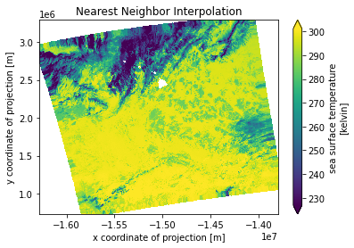
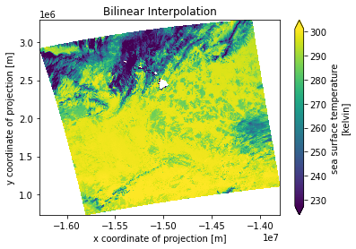
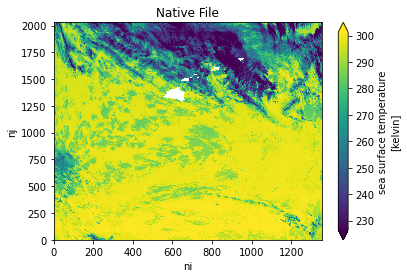
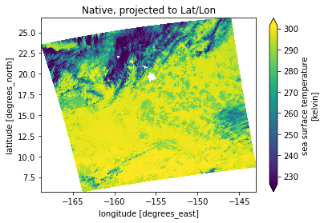
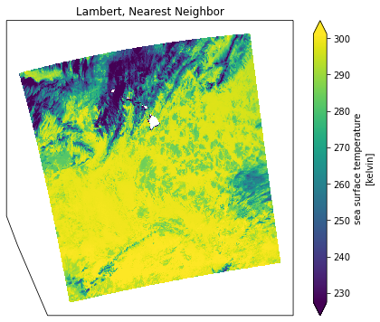

# Harmony API Introduction

This notebook provides an overview of the capabilities offered through the Harmony API and SWOT L2 Reproject tool. While written for SWOT L2 data, it works with most any level 2 data for projecting to a normal grid. In this tutorial we will use MODIS L2 data to show the native file projected to equal-area-cylindracal projection using both Nearest Neighbor and Bi-linear interpolation.

Standing on the shoulders of previous authors: Amy Steiker, Patrick Quinn

## Import packages

Most packages below should be included natively with the Anaconda Python distribution, for example, but some may need to install packages like `rasterio` manually using the following example:


```python
# Install prerequisite packages
import sys
!{sys.executable} -m pip install rasterio # Install a pip package in the current Jupyter kernel
!{sys.executable} -m pip install requests # Install a pip package in the current Jupyter kernel
```

    Looking in indexes: https://podaac-ci.jpl.nasa.gov:8443/artifactory/api/pypi/pypi/simple, https://pypi.org/simple
    Requirement already satisfied: rasterio in /Users/gangl/miniconda3/envs/notebooks/lib/python3.8/site-packages (1.1.4)
    Requirement already satisfied: affine in /Users/gangl/miniconda3/envs/notebooks/lib/python3.8/site-packages (from rasterio) (2.3.0)
    Requirement already satisfied: cligj>=0.5 in /Users/gangl/miniconda3/envs/notebooks/lib/python3.8/site-packages (from rasterio) (0.5.0)
    Requirement already satisfied: click<8,>=4.0 in /Users/gangl/miniconda3/envs/notebooks/lib/python3.8/site-packages (from rasterio) (7.1.2)
    Requirement already satisfied: attrs in /Users/gangl/miniconda3/envs/notebooks/lib/python3.8/site-packages (from rasterio) (19.3.0)
    Requirement already satisfied: snuggs>=1.4.1 in /Users/gangl/miniconda3/envs/notebooks/lib/python3.8/site-packages (from rasterio) (1.4.7)
    Requirement already satisfied: click-plugins in /Users/gangl/miniconda3/envs/notebooks/lib/python3.8/site-packages (from rasterio) (1.1.1)
    Requirement already satisfied: numpy in /Users/gangl/miniconda3/envs/notebooks/lib/python3.8/site-packages (from rasterio) (1.18.4)
    Requirement already satisfied: pyparsing>=2.1.6 in /Users/gangl/miniconda3/envs/notebooks/lib/python3.8/site-packages (from snuggs>=1.4.1->rasterio) (2.4.7)
    Looking in indexes: https://podaac-ci.jpl.nasa.gov:8443/artifactory/api/pypi/pypi/simple, https://pypi.org/simple
    Requirement already satisfied: requests in /Users/gangl/miniconda3/envs/notebooks/lib/python3.8/site-packages (2.23.0)
    Requirement already satisfied: urllib3!=1.25.0,!=1.25.1,<1.26,>=1.21.1 in /Users/gangl/miniconda3/envs/notebooks/lib/python3.8/site-packages (from requests) (1.25.9)
    Requirement already satisfied: certifi>=2017.4.17 in /Users/gangl/miniconda3/envs/notebooks/lib/python3.8/site-packages (from requests) (2020.4.5.1)
    Requirement already satisfied: chardet<4,>=3.0.2 in /Users/gangl/miniconda3/envs/notebooks/lib/python3.8/site-packages (from requests) (3.0.4)
    Requirement already satisfied: idna<3,>=2.5 in /Users/gangl/miniconda3/envs/notebooks/lib/python3.8/site-packages (from requests) (2.9)


```python
from urllib import request, parse
from http.cookiejar import CookieJar
import getpass
import netrc
import os
import requests
import json
import pprint
from osgeo import gdal
import matplotlib.pyplot as plt
import matplotlib.image as mpimg
import rasterio
from rasterio.plot import show
import numpy as np
import os
import time
from netCDF4 import Dataset
%matplotlib inline
```

## Earthdata Login Authentication

An Earthdata Login account is required to access data from NASA EOSDIS. In order to access data from the Harmony API, you will need to create an account in the Earthdata Login UAT environment. Please visit https://uat.urs.earthdata.nasa.gov to set up an account in this test environment. These accounts, as all Earthdata Login accounts, are free to create and only take a moment to set up.


We need some boilerplate up front to log in to Earthdata Login.  The function below will allow Python scripts to log into any Earthdata Login application programmatically.  To avoid being prompted for
credentials every time you run and also allow clients such as curl to log in, you can add the following
to a `.netrc` (`_netrc` on Windows) file in your home directory:

```
machine uat.urs.earthdata.nasa.gov
    login <your username>
    password <your password>
```

Make sure that this file is only readable by the current user or you will receive an error stating
"netrc access too permissive."

`$ chmod 0600 ~/.netrc` 


```python
def setup_earthdata_login_auth(endpoint):
    """
    Set up the request library so that it authenticates against the given Earthdata Login
    endpoint and is able to track cookies between requests.  This looks in the .netrc file 
    first and if no credentials are found, it prompts for them.

    Valid endpoints include:
        uat.urs.earthdata.nasa.gov - Earthdata Login UAT (Harmony's current default)
        urs.earthdata.nasa.gov - Earthdata Login production
    """
    try:
        username, _, password = netrc.netrc().authenticators(endpoint)
    except (FileNotFoundError, TypeError):
        # FileNotFound = There's no .netrc file
        # TypeError = The endpoint isn't in the netrc file, causing the above to try unpacking None
        print('Please provide your Earthdata Login credentials to allow data access')
        print('Your credentials will only be passed to %s and will not be exposed in Jupyter' % (endpoint))
        username = input('Username:')
        password = getpass.getpass()

    manager = request.HTTPPasswordMgrWithDefaultRealm()
    manager.add_password(None, endpoint, username, password)
    auth = request.HTTPBasicAuthHandler(manager)

    jar = CookieJar()
    processor = request.HTTPCookieProcessor(jar)
    opener = request.build_opener(auth, processor)
    request.install_opener(opener)
```

Now call the above function to set up Earthdata Login for subsequent requests


```python
setup_earthdata_login_auth('uat.urs.earthdata.nasa.gov')
```

## Identify a data collection of interest

A CMR collection ID is needed to request services through Harmony. The collection ID can be determined using the [CMR API](https://cmr.earthdata.nasa.gov/search/site/docs/search/api.html). We will query the corresponding ID of a known collection short name, `harmony_example`, which is a Level 3 test collection with transformation services available through Harmony.


```python
params = {
    'short_name': 'MODIS_A-JPL-L2P-v2019.0',
    'provider_id': 'POCLOUD'
} # parameter dictionary with known CMR short_name

cmr_collections_url = 'https://cmr.uat.earthdata.nasa.gov/search/collections.json'
cmr_response = requests.get(cmr_collections_url, params=params)
cmr_results = json.loads(cmr_response.content) # Get json response from CMR collection metadata

collectionlist = [el['id'] for el in cmr_results['feed']['entry']]
harmony_collection_id = collectionlist[0]
print(harmony_collection_id)
```

    C1234724470-POCLOUD


We can also view the `MODIS_A-JPL-L2P-v2019.0` collection metadata to glean more information about the collection:


```python
pprint.pprint(cmr_results)
```

    {'feed': {'entry': [{'archive_center': 'NASA/JPL/PODAAC',
                         'boxes': ['-90 -180 90 180'],
                         'browse_flag': False,
                         'coordinate_system': 'CARTESIAN',
                         'data_center': 'POCLOUD',
                         'dataset_id': 'GHRSST Level 2P Global Sea Surface Skin '
                                       'Temperature from the Moderate Resolution '
                                       'Imaging Spectroradiometer (MODIS) on the '
                                       'NASA Aqua satellite (GDS2)',
                         'has_formats': False,
                         'has_spatial_subsetting': False,
                         'has_temporal_subsetting': False,
                         'has_transforms': False,
                         'has_variables': False,
                         'id': 'C1234724470-POCLOUD',
                         'links': [{'href': 'https://data.nodc.noaa.gov/ghrsst/GDS2/L2P/MODIS_A/JPL/v2019.0',
                                    'hreflang': 'en-US',
                                    'length': '0.0KB',
                                    'rel': 'http://esipfed.org/ns/fedsearch/1.1/data#'},
                                   {'href': 'https://podaac-tools.jpl.nasa.gov/drive/files/allData/ghrsst/data/GDS2/L2P/MODIS_A/JPL/v2019.0',
                                    'hreflang': 'en-US',
                                    'length': '0.0KB',
                                    'rel': 'http://esipfed.org/ns/fedsearch/1.1/data#'},
                                   {'href': 'https://oceancolor.gsfc.nasa.gov/atbd/sst4/',
                                    'hreflang': 'en-US',
                                    'rel': 'http://esipfed.org/ns/fedsearch/1.1/documentation#'},
                                   {'href': 'https://podaac.jpl.nasa.gov/ws/search/granule/?datasetId=PODAAC-GHMDA-2PJ19',
                                    'hreflang': 'en-US',
                                    'length': '0.0KB',
                                    'rel': 'http://esipfed.org/ns/fedsearch/1.1/data#'},
                                   {'href': '/data/export/web/thumbnails',
                                    'hreflang': 'en-US',
                                    'rel': 'http://esipfed.org/ns/fedsearch/1.1/documentation#'},
                                   {'href': 'https://oceancolor.gsfc.nasa.gov/reprocessing/r2019/sst/',
                                    'hreflang': 'en-US',
                                    'rel': 'http://esipfed.org/ns/fedsearch/1.1/documentation#'},
                                   {'href': 'http://www.ghrsst.org',
                                    'hreflang': 'en-US',
                                    'rel': 'http://esipfed.org/ns/fedsearch/1.1/metadata#'},
                                   {'href': 'https://podaac.jpl.nasa.gov/forum/viewforum.php?f=18&sid=e2d67e5a01815fc6e39fcd2087ed8bc8',
                                    'hreflang': 'en-US',
                                    'rel': 'http://esipfed.org/ns/fedsearch/1.1/documentation#'},
                                   {'href': 'http://ghrsst.jpl.nasa.gov',
                                    'hreflang': 'en-US',
                                    'rel': 'http://esipfed.org/ns/fedsearch/1.1/documentation#'},
                                   {'href': 'https://podaac-tools.jpl.nasa.gov/drive/files/OceanTemperature/ghrsst/docs/GDS20r5.pdf',
                                    'hreflang': 'en-US',
                                    'rel': 'http://esipfed.org/ns/fedsearch/1.1/documentation#'},
                                   {'href': 'https://podaac-tools.jpl.nasa.gov/soto/',
                                    'hreflang': 'en-US',
                                    'rel': 'http://esipfed.org/ns/fedsearch/1.1/metadata#'},
                                   {'href': 'https://oceancolor.gsfc.nasa.gov/atbd/sst/flag/',
                                    'hreflang': 'en-US',
                                    'rel': 'http://esipfed.org/ns/fedsearch/1.1/documentation#'},
                                   {'href': 'https://modis.gsfc.nasa.gov/data/atbd/atbd_mod25.pdf',
                                    'hreflang': 'en-US',
                                    'rel': 'http://esipfed.org/ns/fedsearch/1.1/documentation#'},
                                   {'href': 'https://podaac-tools.jpl.nasa.gov/hitide/',
                                    'hreflang': 'en-US',
                                    'rel': 'http://esipfed.org/ns/fedsearch/1.1/metadata#'},
                                   {'href': 'https://oceancolor.gsfc.nasa.gov/atbd/sst/',
                                    'hreflang': 'en-US',
                                    'rel': 'http://esipfed.org/ns/fedsearch/1.1/documentation#'},
                                   {'href': 'https://podaac-tools.jpl.nasa.gov/drive/files/allData/ghrsst/sw/generic_nc_readers/',
                                    'hreflang': 'en-US',
                                    'rel': 'http://esipfed.org/ns/fedsearch/1.1/metadata#'},
                                   {'href': 'https://doi.org/10.5067/GHMDA-2PJ19',
                                    'hreflang': 'en-US',
                                    'rel': 'http://esipfed.org/ns/fedsearch/1.1/metadata#'},
                                   {'href': 'https://podaac-opendap.jpl.nasa.gov/opendap/allData/ghrsst/data/GDS2/L2P/MODIS_A/JPL/v2019.0/',
                                    'hreflang': 'en-US',
                                    'rel': 'http://esipfed.org/ns/fedsearch/1.1/documentation#'}],
                         'online_access_flag': True,
                         'orbit_parameters': {},
                         'organizations': ['NASA/JPL/PODAAC',
                                           'Rosenstiel School of Marine and '
                                           'Atmospheric Science',
                                           'Physical Oceanography Distributed '
                                           'Active Archive Center, Jet Propulsion '
                                           'Laboratory, N',
                                           'Jet Propulsion Laboratory'],
                         'original_format': 'ECHO10',
                         'processing_level_id': '2',
                         'short_name': 'MODIS_A-JPL-L2P-v2019.0',
                         'summary': 'NASA produces skin sea surface temperature '
                                    '(SST) products from the Infrared (IR) '
                                    'channels of the Moderate-resolution Imaging '
                                    'Spectroradiometer (MODIS) onboard the Aqua '
                                    'satellite. Aqua was launched by NASA on May '
                                    '4, 2002, into a sun synchronous, polar orbit '
                                    'with a daylight ascending node at 1:30 pm, '
                                    'formation flying in the A-train with other '
                                    'Earth Observation Satellites (EOS), to study '
                                    'the global dynamics of the Earth atmosphere, '
                                    'land and oceans. MODIS captures data in 36 '
                                    'spectral bands at a variety of spatial '
                                    'resolutions.  Two SST products can be present '
                                    'in these files. The first is a skin SST '
                                    'produced for both day and night (NSST) '
                                    'observations, derived from the long wave IR '
                                    '11 and 12 micron wavelength channels, using a '
                                    'modified nonlinear SST algorithm intended to '
                                    'provide continuity of SST derived from '
                                    'heritage and current NASA sensors. At night, '
                                    'a second SST product is generated using the '
                                    'mid-infrared 3.95 and 4.05 micron  wavelength '
                                    'channels which are unique to MODIS; the SST '
                                    'derived from these measurements is identified '
                                    'as SST4. The SST4 product has lower '
                                    'uncertainty, but due to sun glint can only be '
                                    'used at night. MODIS L2P SST data have a 1 km '
                                    'spatial resolution at nadir and are stored in '
                                    '288 five minute granules per day. Full global '
                                    'coverage is obtained every two days, with '
                                    'coverage poleward of 32.3 degree being '
                                    'complete each day.  The production of MODIS '
                                    'L2P SST files is part of the Group for High '
                                    'Resolution Sea Surface Temperature (GHRSST) '
                                    'project and is a joint collaboration between '
                                    'the NASA Jet Propulsion Laboratory (JPL), the '
                                    'NASA Ocean Biology Processing Group (OBPG), '
                                    'and the Rosenstiel School of Marine and '
                                    'Atmospheric Science (RSMAS). Researchers at '
                                    'RSMAS are responsible for SST algorithm '
                                    'development, error statistics and quality '
                                    'flagging, while the OBPG, as the NASA ground '
                                    'data system, is responsible for the '
                                    'production of daily MODIS ocean products. JPL '
                                    'acquires MODIS ocean granules from the OBPG '
                                    'and reformats them to the GHRSST L2P netCDF '
                                    'specification with complete metadata and '
                                    'ancillary variables, and distributes the data '
                                    'as the official Physical Oceanography Data '
                                    'Archive (PO.DAAC) for SST.  The R2019.0 '
                                    'supersedes the previous R2014.0 datasets '
                                    'which can be found '
                                    'athttps://doi.org/10.5067/GHMDA-2PJ02',
                         'time_start': '2002-07-04T00:00:00.000Z',
                         'title': 'GHRSST Level 2P Global Sea Surface Skin '
                                  'Temperature from the Moderate Resolution '
                                  'Imaging Spectroradiometer (MODIS) on the NASA '
                                  'Aqua satellite (GDS2)',
                         'updated': '2019-12-02T22:59:24.849Z',
                         'version_id': '2019.0'}],
              'id': 'https://cmr.uat.earthdata.nasa.gov:443/search/collections.json?short_name=MODIS_A-JPL-L2P-v2019.0&provider_id=POCLOUD',
              'title': 'ECHO dataset metadata',
              'updated': '2020-05-29T19:56:49.684Z'}}


## Access reprojected data

The Harmony API accepts reprojection requests with a given coordinate reference system using the `outputCrs` keyword. According to the Harmony API documentation, this keyword "recognizes CRS types that can be inferred by gdal, including EPSG codes, Proj4 strings, and OGC URLs (http://www.opengis.net/def/crs/...) ". Two examples below demonstrate inputting an EPSG code and Proj4 string using the global test granule from previous examples. First, let's view the projection information of the granule in the native projection, using the variable subset example:

## Access Level 2 swath regridded data

Moving outside of the `harmony/gdal` service, we will now request regridding from the `sds/swot-reproject` service using the `C1234724470-POCLOUD`, or Harmony L2 swath example, collection provided in NetCDF format. 


The Harmony API accepts several query parameters related to regridding and interpolation in addition to the reprojection parameters above: 

`interpolation=<String>` - Both `near` and `bilinear` are valid options

`scaleSize=x,y` - 2 comma separated numbers as floats

`scaleExtent=xmin,ymin,xmax,ymax` - 4 comma separated numbers as floats

`width=<Float>`  

`height=<Float>` 

An error is returned if both `scaleSize` and `width`/`height` parameters are both provided (only one or the other can be used).

Request reprojection to [Europe Lambert Conformal Conic](https://epsg.io/102014) with a new scale extent and nearest neighbor interpolation:


```python
harmony_root = 'https://harmony.uat.earthdata.nasa.gov'

# URL encode string using urllib parse package
proj_string = '+proj=cea +lon_0=0 +lat_ts=30 +x_0=0 +y_0=0 +ellps=WGS84 +towgs84=0,0,0,0,0,0,0 +units=m +no_defs' # proj4 of WGS 84 / NSIDC EASE-Grid 2.0 Global projection
#l2proj_string = '+proj=laea +lat_0=52 +lon_0=10 +x_0=4321000 +y_0=3210000 +ellps=GRS80 +towgs84=0,0,0,0,0,0,0 +units=m +no_defs'
l2proj_encode = parse.quote(proj_string)

harmony_root = 'https://harmony.uat.earthdata.nasa.gov'

regridConfig = {
    'l2collection_id': 'C1234724470-POCLOUD',
    'ogc-api-coverages_version': '1.0.0',
    'variable': 'all',
    'granuleid': 'G1234734747-POCLOUD',
    'outputCrs': l2proj_encode,
    'interpolation': 'near',
    'width': 1000,
    'height': 1000
}

regrid_url = harmony_root+'/{l2collection_id}/ogc-api-coverages/{ogc-api-coverages_version}/collections/{variable}/coverage/rangeset?&granuleid={granuleid}&outputCrs={outputCrs}&interpolation={interpolation}&height={height}&width={width}'.format(**regridConfig)
print('Request URL', regrid_url)
regrid_response = request.urlopen(regrid_url)
regrid_results = regrid_response.read()
```

    Request URL https://harmony.uat.earthdata.nasa.gov/C1234724470-POCLOUD/ogc-api-coverages/1.0.0/collections/all/coverage/rangeset?&granuleid=G1234734747-POCLOUD&outputCrs=%2Bproj%3Dcea%20%2Blon_0%3D0%20%2Blat_ts%3D30%20%2Bx_0%3D0%20%2By_0%3D0%20%2Bellps%3DWGS84%20%2Btowgs84%3D0%2C0%2C0%2C0%2C0%2C0%2C0%20%2Bunits%3Dm%20%2Bno_defs&interpolation=near&height=1000&width=1000


This reprojected and regridded output is downloaded to the Harmony outputs directory and we can inspect a variable to check for projection and grid dimension:


```python
regrid_file_name = 'regrid-near.nc'
regrid_filepath = str(regrid_file_name)
file_ = open(regrid_filepath, 'wb')
file_.write(regrid_results)
file_.close()
```


```python
harmony_root = 'https://harmony.uat.earthdata.nasa.gov'

# URL encode string using urllib parse package
proj_string = '+proj=cea +lon_0=0 +lat_ts=30 +x_0=0 +y_0=0 +ellps=WGS84 +towgs84=0,0,0,0,0,0,0 +units=m +no_defs' # proj4 of WGS 84 / NSIDC EASE-Grid 2.0 Global projection
#l2proj_string = '+proj=laea +lat_0=52 +lon_0=10 +x_0=4321000 +y_0=3210000 +ellps=GRS80 +towgs84=0,0,0,0,0,0,0 +units=m +no_defs'
l2proj_encode = parse.quote(proj_string)

harmony_root = 'https://harmony.uat.earthdata.nasa.gov'

regridConfig = {
    'l2collection_id': 'C1234724470-POCLOUD',
    'ogc-api-coverages_version': '1.0.0',
    'variable': 'all',
    'granuleid': 'G1234734747-POCLOUD',
    'outputCrs': l2proj_encode,
    'interpolation': 'bilinear',
    'width': 1000,
    'height': 1000
}

regrid_bi_url = harmony_root+'/{l2collection_id}/ogc-api-coverages/{ogc-api-coverages_version}/collections/{variable}/coverage/rangeset?&granuleid={granuleid}&outputCrs={outputCrs}&interpolation={interpolation}&height={height}&width={width}'.format(**regridConfig)
print('Request URL', regrid_bi_url)
regrid_bi_response = request.urlopen(regrid_bi_url)
regrid_bi_results = regrid_bi_response.read()
```

    Request URL https://harmony.uat.earthdata.nasa.gov/C1234724470-POCLOUD/ogc-api-coverages/1.0.0/collections/all/coverage/rangeset?&granuleid=G1234734747-POCLOUD&outputCrs=%2Bproj%3Dcea%20%2Blon_0%3D0%20%2Blat_ts%3D30%20%2Bx_0%3D0%20%2By_0%3D0%20%2Bellps%3DWGS84%20%2Btowgs84%3D0%2C0%2C0%2C0%2C0%2C0%2C0%20%2Bunits%3Dm%20%2Bno_defs&interpolation=bilinear&height=1000&width=1000


```python
regrid_bi_file_name = 'regrid-bi.nc'
regrid_bi_filepath = str(regrid_bi_file_name)
file_ = open(regrid_bi_filepath, 'wb')
file_.write(regrid_bi_results)
file_.close()
```

Print the x and y dimensions to confirm that the output matches the requested scale extent in meters:


```python
import xarray as xa
reproject_ds = xa.open_dataset(regrid_filepath, drop_variables='time')
print(reproject_ds)
```

    <xarray.Dataset>
    Dimensions:                         (time: 1, x: 1000, y: 1000)
    Coordinates:
      * x                               (x) float64 -1.628e+07 ... -1.38e+07
      * y                               (y) float64 7.339e+05 ... 3.291e+06
    Dimensions without coordinates: time
    Data variables:
        dt_analysis                     (time, y, x) float32 ...
        lambert_cylindrical_equal_area  |S1 ...
        sea_surface_temperature         (time, y, x) float32 ...
        l2p_flags                       (time, y, x) int16 ...
        quality_level                   (time, y, x) float32 ...
        sses_bias                       (time, y, x) float32 ...
        wind_speed                      (time, y, x) float32 ...
        sses_standard_deviation         (time, y, x) float32 ...
        sst_dtime                       (time, y, x) timedelta64[ns] ...
    Attributes:
        Conventions:                CF-1.7, ACDD-1.3
        title:                      MODIS Aqua L2P SST
        summary:                    Sea surface temperature retrievals produced a...
        references:                 GHRSST Data Processing Specification v2r5
        institution:                NASA/JPL/OBPG/RSMAS
        history:                    MODIS L2P created at JPL PO.DAAC
        comment:                    L2P Core without DT analysis or other ancilla...
        license:                    GHRSST and PO.DAAC protocol allow data use as...
        id:                         MODIS_A-JPL-L2P-v2019.0
        naming_authority:           org.ghrsst
        product_version:            2019.0
        uuid:                       f6e1f61d-c4a4-4c17-8354-0c15e12d688b
        gds_version_id:             2.0
        netcdf_version_id:          4.1
        date_created:               20200330T181054Z
        file_quality_level:         3
        spatial_resolution:         1km
        start_time:                 20200131T234501Z
        time_coverage_start:        20200131T234501Z
        stop_time:                  20200131T234959Z
        time_coverage_end:          20200131T234959Z
        northernmost_latitude:      26.74
        southernmost_latitude:      5.75245
        easternmost_longitude:      -142.983
        westernmost_longitude:      -168.75
        source:                     MODIS sea surface temperature observations fo...
        platform:                   Aqua
        sensor:                     MODIS
        metadata_link:              http://podaac.jpl.nasa.gov/ws/metadata/datase...
        keywords:                   Oceans > Ocean Temperature > Sea Surface Temp...
        keywords_vocabulary:        NASA Global Change Master Directory (GCMD) Sc...
        standard_name_vocabulary:   NetCDF Climate and Forecast (CF) Metadata Con...
        geospatial_lat_units:       degrees_north
        geospatial_lat_resolution:  0.01
        geospatial_lon_units:       degrees_east
        geospatial_lon_resolution:  0.01
        acknowledgment:             The MODIS L2P sea surface temperature data ar...
        creator_name:               Ed Armstrong, JPL PO.DAAC
        creator_email:              edward.m.armstrong@jpl.nasa.gov
        creator_url:                http://podaac.jpl.nasa.gov
        project:                    Group for High Resolution Sea Surface Tempera...
        publisher_name:             The GHRSST Project Office
        publisher_url:              http://www.ghrsst.org
        publisher_email:            ghrsst-po@nceo.ac.uk
        processing_level:           L2P
        cdm_data_type:              swath
        startDirection:             Ascending
        endDirection:               Ascending
        day_night_flag:             Day


```python
import xarray as xa
reproject_bi_ds = xa.open_dataset(regrid_bi_filepath, drop_variables='time')
print(reproject_bi_ds)
```

    <xarray.Dataset>
    Dimensions:                         (time: 1, x: 1000, y: 1000)
    Coordinates:
      * x                               (x) float64 -1.628e+07 ... -1.38e+07
      * y                               (y) float64 7.339e+05 ... 3.291e+06
    Dimensions without coordinates: time
    Data variables:
        sst_dtime                       (time, y, x) timedelta64[ns] ...
        lambert_cylindrical_equal_area  |S1 ...
        quality_level                   (time, y, x) float32 ...
        dt_analysis                     (time, y, x) float32 ...
        sses_bias                       (time, y, x) float32 ...
        wind_speed                      (time, y, x) float32 ...
        sea_surface_temperature         (time, y, x) float32 ...
        sses_standard_deviation         (time, y, x) float32 ...
        l2p_flags                       (time, y, x) int16 ...
    Attributes:
        Conventions:                CF-1.7, ACDD-1.3
        title:                      MODIS Aqua L2P SST
        summary:                    Sea surface temperature retrievals produced a...
        references:                 GHRSST Data Processing Specification v2r5
        institution:                NASA/JPL/OBPG/RSMAS
        history:                    MODIS L2P created at JPL PO.DAAC
        comment:                    L2P Core without DT analysis or other ancilla...
        license:                    GHRSST and PO.DAAC protocol allow data use as...
        id:                         MODIS_A-JPL-L2P-v2019.0
        naming_authority:           org.ghrsst
        product_version:            2019.0
        uuid:                       f6e1f61d-c4a4-4c17-8354-0c15e12d688b
        gds_version_id:             2.0
        netcdf_version_id:          4.1
        date_created:               20200330T181054Z
        file_quality_level:         3
        spatial_resolution:         1km
        start_time:                 20200131T234501Z
        time_coverage_start:        20200131T234501Z
        stop_time:                  20200131T234959Z
        time_coverage_end:          20200131T234959Z
        northernmost_latitude:      26.74
        southernmost_latitude:      5.75245
        easternmost_longitude:      -142.983
        westernmost_longitude:      -168.75
        source:                     MODIS sea surface temperature observations fo...
        platform:                   Aqua
        sensor:                     MODIS
        metadata_link:              http://podaac.jpl.nasa.gov/ws/metadata/datase...
        keywords:                   Oceans > Ocean Temperature > Sea Surface Temp...
        keywords_vocabulary:        NASA Global Change Master Directory (GCMD) Sc...
        standard_name_vocabulary:   NetCDF Climate and Forecast (CF) Metadata Con...
        geospatial_lat_units:       degrees_north
        geospatial_lat_resolution:  0.01
        geospatial_lon_units:       degrees_east
        geospatial_lon_resolution:  0.01
        acknowledgment:             The MODIS L2P sea surface temperature data ar...
        creator_name:               Ed Armstrong, JPL PO.DAAC
        creator_email:              edward.m.armstrong@jpl.nasa.gov
        creator_url:                http://podaac.jpl.nasa.gov
        project:                    Group for High Resolution Sea Surface Tempera...
        publisher_name:             The GHRSST Project Office
        publisher_url:              http://www.ghrsst.org
        publisher_email:            ghrsst-po@nceo.ac.uk
        processing_level:           L2P
        cdm_data_type:              swath
        startDirection:             Ascending
        endDirection:               Ascending
        day_night_flag:             Day


```python
original_ds = xa.open_dataset('20200131234501-JPL-L2P_GHRSST-SSTskin-MODIS_A-D-v02.0-fv01.0.nc')
print(original_ds)
```

    <xarray.Dataset>
    Dimensions:                  (ni: 1354, nj: 2030, time: 1)
    Coordinates:
        lat                      (nj, ni) float32 ...
        lon                      (nj, ni) float32 ...
      * time                     (time) datetime64[ns] 2020-01-31T23:45:01
    Dimensions without coordinates: ni, nj
    Data variables:
        sea_surface_temperature  (time, nj, ni) float32 ...
        sst_dtime                (time, nj, ni) timedelta64[ns] ...
        quality_level            (time, nj, ni) float32 ...
        sses_bias                (time, nj, ni) float32 ...
        sses_standard_deviation  (time, nj, ni) float32 ...
        l2p_flags                (time, nj, ni) int16 ...
        wind_speed               (time, nj, ni) float32 ...
        dt_analysis              (time, nj, ni) float32 ...
    Attributes:
        Conventions:                CF-1.7, ACDD-1.3
        title:                      MODIS Aqua L2P SST
        summary:                    Sea surface temperature retrievals produced a...
        references:                 GHRSST Data Processing Specification v2r5
        institution:                NASA/JPL/OBPG/RSMAS
        history:                    MODIS L2P created at JPL PO.DAAC
        comment:                    L2P Core without DT analysis or other ancilla...
        license:                    GHRSST and PO.DAAC protocol allow data use as...
        id:                         MODIS_A-JPL-L2P-v2019.0
        naming_authority:           org.ghrsst
        product_version:            2019.0
        uuid:                       f6e1f61d-c4a4-4c17-8354-0c15e12d688b
        gds_version_id:             2.0
        netcdf_version_id:          4.1
        date_created:               20200330T181054Z
        file_quality_level:         3
        spatial_resolution:         1km
        start_time:                 20200131T234501Z
        time_coverage_start:        20200131T234501Z
        stop_time:                  20200131T234959Z
        time_coverage_end:          20200131T234959Z
        northernmost_latitude:      26.74
        southernmost_latitude:      5.75245
        easternmost_longitude:      -142.983
        westernmost_longitude:      -168.75
        source:                     MODIS sea surface temperature observations fo...
        platform:                   Aqua
        sensor:                     MODIS
        metadata_link:              http://podaac.jpl.nasa.gov/ws/metadata/datase...
        keywords:                   Oceans > Ocean Temperature > Sea Surface Temp...
        keywords_vocabulary:        NASA Global Change Master Directory (GCMD) Sc...
        standard_name_vocabulary:   NetCDF Climate and Forecast (CF) Metadata Con...
        geospatial_lat_units:       degrees_north
        geospatial_lat_resolution:  0.01
        geospatial_lon_units:       degrees_east
        geospatial_lon_resolution:  0.01
        acknowledgment:             The MODIS L2P sea surface temperature data ar...
        creator_name:               Ed Armstrong, JPL PO.DAAC
        creator_email:              edward.m.armstrong@jpl.nasa.gov
        creator_url:                http://podaac.jpl.nasa.gov
        project:                    Group for High Resolution Sea Surface Tempera...
        publisher_name:             The GHRSST Project Office
        publisher_url:              http://www.ghrsst.org
        publisher_email:            ghrsst-po@nceo.ac.uk
        processing_level:           L2P
        cdm_data_type:              swath
        startDirection:             Ascending
        endDirection:               Ascending
        day_night_flag:             Day


```python
g = reproject_ds.sea_surface_temperature.plot(robust=True)
g.axes.set_title("Nearest Neighbor Interpolation")
```


    Text(0.5, 1.0, 'Nearest Neighbor Interpolation')





```python
g= reproject_bi_ds.sea_surface_temperature.plot(robust=True)
g.axes.set_title("Bilinear Interpolation")
```


    Text(0.5, 1.0, 'Bilinear Interpolation')





```python
g = original_ds.sea_surface_temperature.plot(robust=True)
g.axes.set_title("Native File")

```


    Text(0.5, 1.0, 'Native File')





```python
g= original_ds.sea_surface_temperature.plot(x="lon", y="lat", robust=True)
g.axes.set_title("Native, projected to Lat/Lon")
```


    Text(0.5, 1.0, 'Native, projected to Lat/Lon')





```python

harmony_root = 'https://harmony.uat.earthdata.nasa.gov'

# URL encode string using urllib parse package
proj_string = '+proj=lcc +lon_0=-90 +lat_1=33 +lat_2=45'
l2proj_encode = parse.quote(proj_string)

harmony_root = 'https://harmony.uat.earthdata.nasa.gov'

regridConfig = {
    'l2collection_id': 'C1234724470-POCLOUD',
    'ogc-api-coverages_version': '1.0.0',
    'variable': 'all',
    'granuleid': 'G1234734747-POCLOUD',
    'outputCrs': l2proj_encode,
    'interpolation': 'near',
    'width': 1000,
    'height': 1000
}

regrid_url = harmony_root+'/{l2collection_id}/ogc-api-coverages/{ogc-api-coverages_version}/collections/{variable}/coverage/rangeset?&granuleid={granuleid}&outputCrs={outputCrs}&interpolation={interpolation}&height={height}&width={width}'.format(**regridConfig)
print('Request URL', regrid_url)
regrid_response = request.urlopen(regrid_url)
regrid_results = regrid_response.read()
```

    Request URL https://harmony.uat.earthdata.nasa.gov/C1234724470-POCLOUD/ogc-api-coverages/1.0.0/collections/all/coverage/rangeset?&granuleid=G1234734747-POCLOUD&outputCrs=%2Bproj%3Dlcc%20%2Blon_0%3D-90%20%2Blat_1%3D33%20%2Blat_2%3D45&interpolation=near&height=1000&width=1000


```python
regrid_lambert_file_name = 'regrid-lambert.nc'
file_ = open(regrid_lambert_file_name, 'wb')
file_.write(regrid_bi_results)
file_.close()
```


```python
import xarray as xa
reproject_lambert_ds = xa.open_dataset(regrid_lambert_file_name, drop_variables='time')
print(reproject_lambert_ds)
```

    <xarray.Dataset>
    Dimensions:                         (time: 1, x: 1000, y: 1000)
    Coordinates:
      * x                               (x) float64 -1.628e+07 ... -1.38e+07
      * y                               (y) float64 7.339e+05 ... 3.291e+06
    Dimensions without coordinates: time
    Data variables:
        sst_dtime                       (time, y, x) timedelta64[ns] ...
        lambert_cylindrical_equal_area  |S1 ...
        quality_level                   (time, y, x) float32 ...
        dt_analysis                     (time, y, x) float32 ...
        sses_bias                       (time, y, x) float32 ...
        wind_speed                      (time, y, x) float32 ...
        sea_surface_temperature         (time, y, x) float32 ...
        sses_standard_deviation         (time, y, x) float32 ...
        l2p_flags                       (time, y, x) int16 ...
    Attributes:
        Conventions:                CF-1.7, ACDD-1.3
        title:                      MODIS Aqua L2P SST
        summary:                    Sea surface temperature retrievals produced a...
        references:                 GHRSST Data Processing Specification v2r5
        institution:                NASA/JPL/OBPG/RSMAS
        history:                    MODIS L2P created at JPL PO.DAAC
        comment:                    L2P Core without DT analysis or other ancilla...
        license:                    GHRSST and PO.DAAC protocol allow data use as...
        id:                         MODIS_A-JPL-L2P-v2019.0
        naming_authority:           org.ghrsst
        product_version:            2019.0
        uuid:                       f6e1f61d-c4a4-4c17-8354-0c15e12d688b
        gds_version_id:             2.0
        netcdf_version_id:          4.1
        date_created:               20200330T181054Z
        file_quality_level:         3
        spatial_resolution:         1km
        start_time:                 20200131T234501Z
        time_coverage_start:        20200131T234501Z
        stop_time:                  20200131T234959Z
        time_coverage_end:          20200131T234959Z
        northernmost_latitude:      26.74
        southernmost_latitude:      5.75245
        easternmost_longitude:      -142.983
        westernmost_longitude:      -168.75
        source:                     MODIS sea surface temperature observations fo...
        platform:                   Aqua
        sensor:                     MODIS
        metadata_link:              http://podaac.jpl.nasa.gov/ws/metadata/datase...
        keywords:                   Oceans > Ocean Temperature > Sea Surface Temp...
        keywords_vocabulary:        NASA Global Change Master Directory (GCMD) Sc...
        standard_name_vocabulary:   NetCDF Climate and Forecast (CF) Metadata Con...
        geospatial_lat_units:       degrees_north
        geospatial_lat_resolution:  0.01
        geospatial_lon_units:       degrees_east
        geospatial_lon_resolution:  0.01
        acknowledgment:             The MODIS L2P sea surface temperature data ar...
        creator_name:               Ed Armstrong, JPL PO.DAAC
        creator_email:              edward.m.armstrong@jpl.nasa.gov
        creator_url:                http://podaac.jpl.nasa.gov
        project:                    Group for High Resolution Sea Surface Tempera...
        publisher_name:             The GHRSST Project Office
        publisher_url:              http://www.ghrsst.org
        publisher_email:            ghrsst-po@nceo.ac.uk
        processing_level:           L2P
        cdm_data_type:              swath
        startDirection:             Ascending
        endDirection:               Ascending
        day_night_flag:             Day


```python
import cartopy.crs as ccrs

f, ax1 = plt.subplots(1, 1, figsize=(8, 6), subplot_kw={'projection': ccrs.LambertConformal()})

g=reproject_lambert_ds.sea_surface_temperature.plot(ax=ax1,  robust=True )
ax1.set_title("Lambert, Nearest Neighbor")
#ax1.set_extent([-160, -150,30, 50])
#ax1.coastlines()

```


    Text(0.5, 1.0, 'Lambert, Nearest Neighbor')





```python

```
